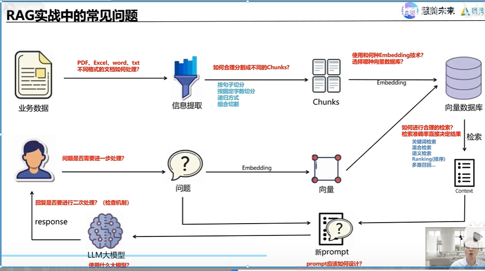

## MCP 是什么
MCP(大模型上下文协议)
MCP就像给所有工具装上统一接口(类似USB-C口)，让万能遥控器通过一个标准协议，无需定制适配，就能直接操作所有设备
1.传统方式
就像你买了个新家电(比如扫地机器人)，每次都要重新学习怎么用遥控器，特别麻烦。
2.MCP方式:
现在所有家电(工具)都配了统一遥控器(MCP协议)--AI只要按"开始"键，就能直接指挥扫地机器人、空调、电视一起干活

Smithery 、阿里云百炼，有h嗯多MCP的工具，比如github, googleCalendar,高德地图、钉钉
MCP服务接入大模型，大模型除了自身的功能之外，会越来越灵活

使用示例：
左边的扩展工具添加 Cline, 右上角MCP Server查询或添加

RAG中常见的问题

## 使用，建一个项目
第一步：帮我实现一个ERP系统，基于python语言实现，先输出README.md需求文档，和plan.md开发计划
第二步：参考README.md和plan.md文档，输出python代码，不要连接数据库，使用本地sqlite本地数据库文件即可，要求项目可以正常运行