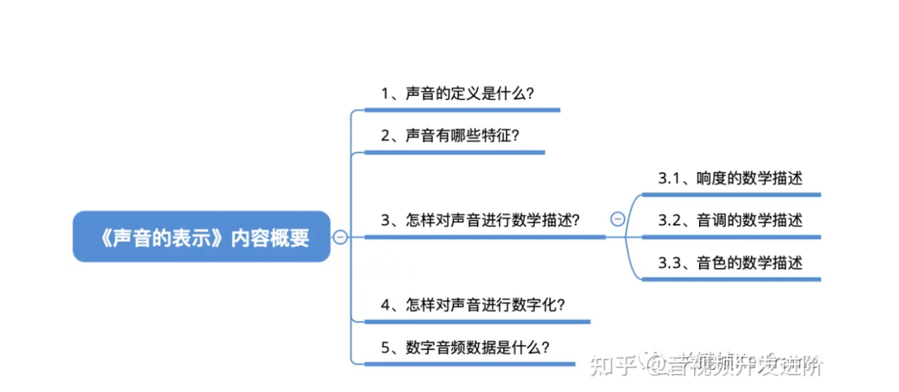
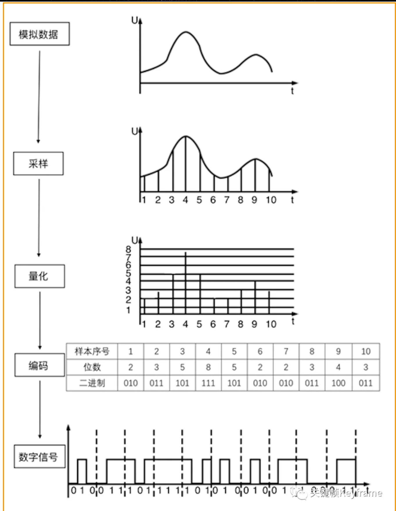
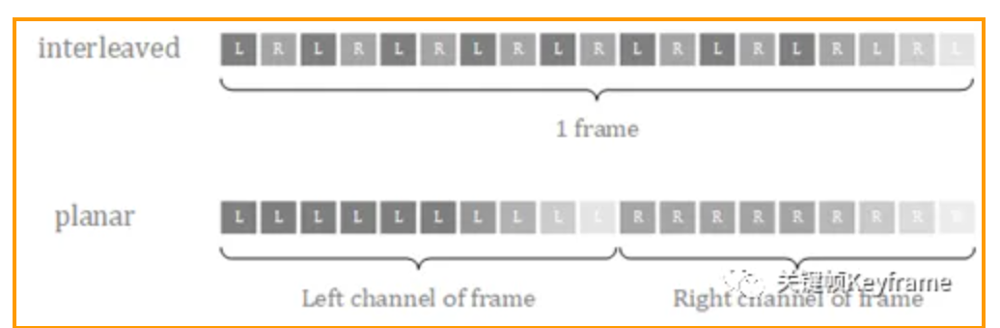
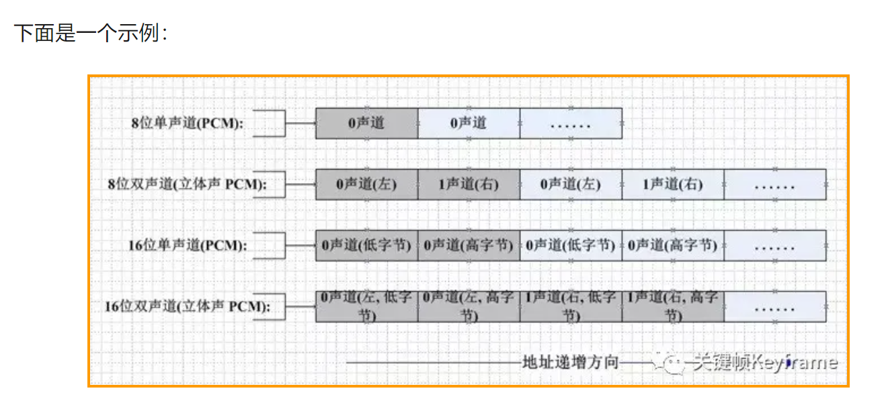
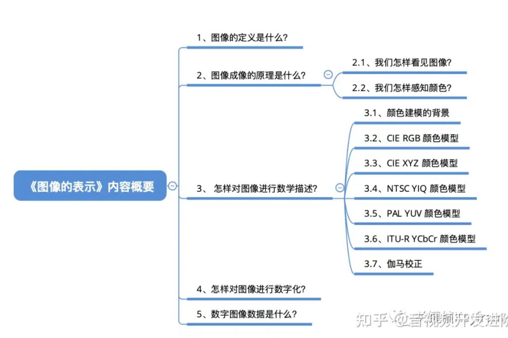
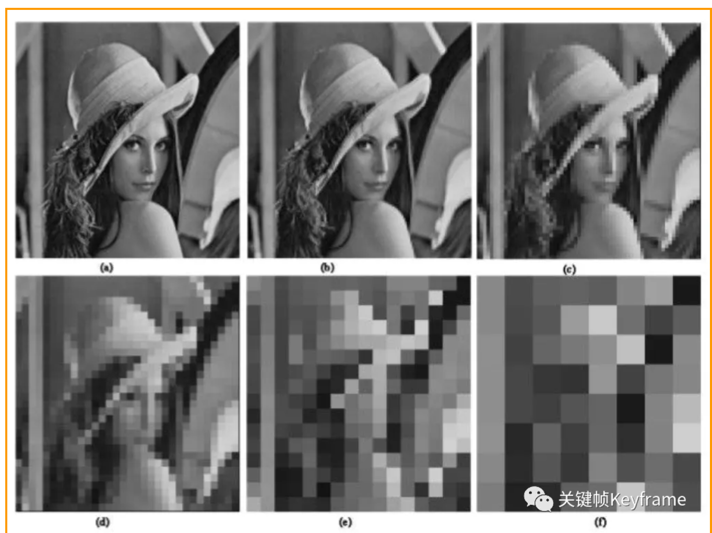
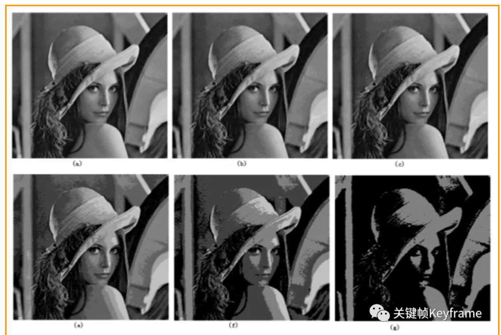

# 第一部分：
```js
├── 音视频基础知识
│   ├── 声音与图像的基本原理
│   ├── 数字信号处理基础
│   ├── 采样率、比特率、帧率、分辨率等概念
```


## 1.1 声音

### 怎么对声音进行数字化？
- 采样（以一定采样率在时域内获取离散信号）
- 量化（每个采样点幅度的数字化表示）
- 编码（以一定格式存储数据）

声音的数字化过程是将模拟信号（连续时间信号）转化为数字信号（离散时间信号）的过程，



### 数字音频数据是什么？
我们在手机、电脑上处理的声音数据，就是声音经过数字化后的数据，也就是数字音频数据，其中最常见的格式是 PCM（Pulse Code Modulation），即脉冲编码调制格式。

在计算机应用中，PCM 是能达到音频最高保真水平的格式，它被广泛用于素材保存及音乐欣赏，PCM 也因此被称为无损编码格式。但这并不意味着 PCM 就能够确保信号绝对保真，它只能做到最大程度的无限接近原始声音。要计算一个 PCM 音频流的码率需要数字音频的三要素信息即可：码率 = 采样率 × 量化位深 × 声道数。


在处理 PCM 数据时，对于音频不同声道的数据，有两种不同的存储格式：
交错格式：不同声道的数据交错排列。
平坦格式：相同声道的数据聚集排列。




此外，在处理 PCM 数据时，还需要注意大小端字节序类型。

由于 PCM 编码是无损编码，且广泛应用，所以我们通常可以认为音频的裸数据格式就是 PCM 的。但为了节省存储空间以及传输成本，通常我们会对音频 PCM 数据进行压缩，这也就是音频编码，比如 MP3、AAC、OPUS 都是我们常见的音频编码格式。

## 1.2 图像


其实图像的数字化跟声音的数字化也类似，最终都是要把模拟信号转换为数字信号，这种转换包括两种处理过程：采样和量化。

### 经过数字化处理后的图像包含如下几个基本属性：
- 图像分辨率
- 像素深度

#### 1）图像分辨率

我们经常听到的一种图像分辨率的说法是：这张图片分辨率是 1024 x 1024 像素。但图像大小本身其实并不能告诉我们全部内容，如果没有规定图像包含的空间维度信息，这种说法意义不大。

图像空间分辨率的度量必须针对空间单位来规定才有意义，所以这里探讨的图像分辨率也称为空间分辨率，表示图像中可辨别的最小细节的度量。空间分辨率有很多方法来说明，其中最通用的是单位距离线对数和单位距离点数（像素数）。

单位距离线对数可以这样来理解：假设我们用交替的黑色和白色垂直线来构造一幅图像，如果一条线宽是 0.1 mm，每单位距离（mm）就有 5 个线对（10 条黑白交替的线）。

单位距离点数是印刷和出版业中常用的图像分辨率的度量。在美国，这一度量常用每英寸点数（dpi）来表示，比如，报纸用 75 dpi 的分辨率来印刷，书页用 2044 dpi 印刷。

单位距离像素数常用在电子设备上。比如我们常常会听到用每英寸像素数（ppi）来衡量显示屏的成像分辨率，比如 iPhone 4 使用 326 ppi 的屏幕，iPhone 13 Pro Max 则使用 458 ppi 的屏幕。

下图是图像使用不同空间分辨率时的展示效果：


#### 2）像素深度

像素深度决定了图像每个像素的颜色级数。对于灰度图像，则决定了每个像素的灰度级数。像素深度通常是 2 的整数次幂，比如，当像素深度为 24 位时，那么每个像素的颜色可以是 16777216（224）种颜色中的一种。

提高像素深度，每个像素能显示的颜色种类也就更多了，图像也就更细腻自然。但受到人眼分辨率的限制，像素深度不一定要特别大，人类眼睛感知的颜色种类的上限大概是 1000 万种颜色，24 位的颜色深度已经完全够用。

下图是灰度图像使用不同灰度级数时的展示效果：


### 数字图像数据是什么？

我们在手机、电脑上处理的图像数据，也就是经过数字化处理后的数字图像数据。

在音视频开发中，处理最多的图像数据其实是 RGB、YCbCr 数据，RGB 数据主要是用于屏幕显示，YCbCr 数据则由于较好的压缩性，则主要用于图像数据处理、编码、传输。

提到数字图像数据的格式，我们还经常听到的是 PNG、JPEG、GIF 等名词，这些是图像的文件存储格式，它们是对数字图像数据进行编码后进行存储。