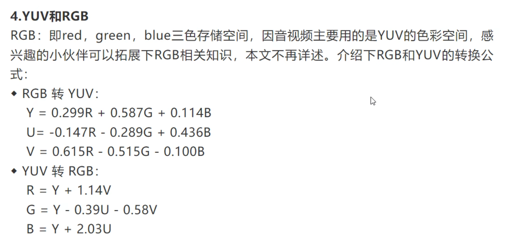
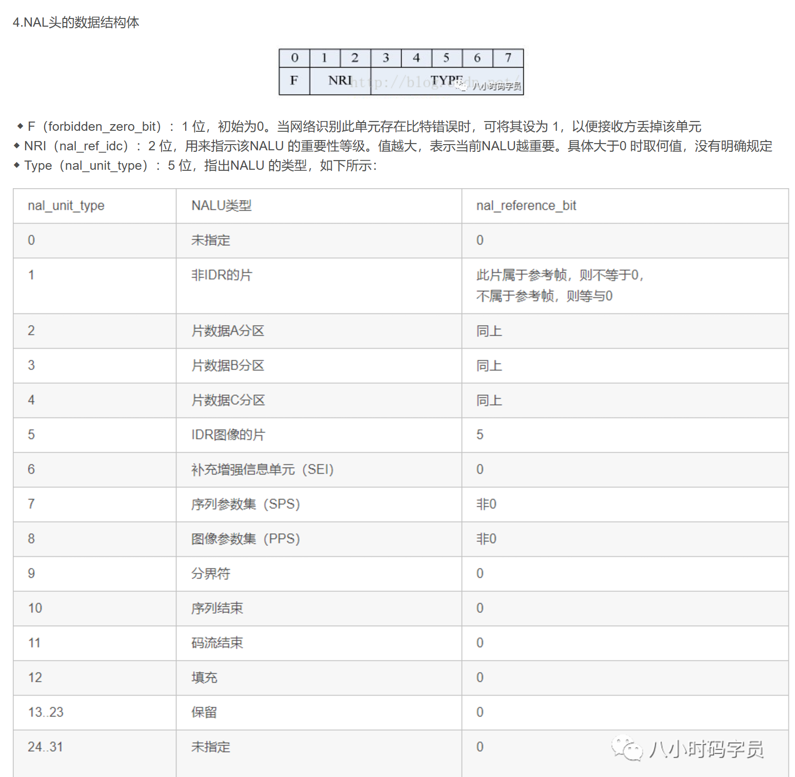
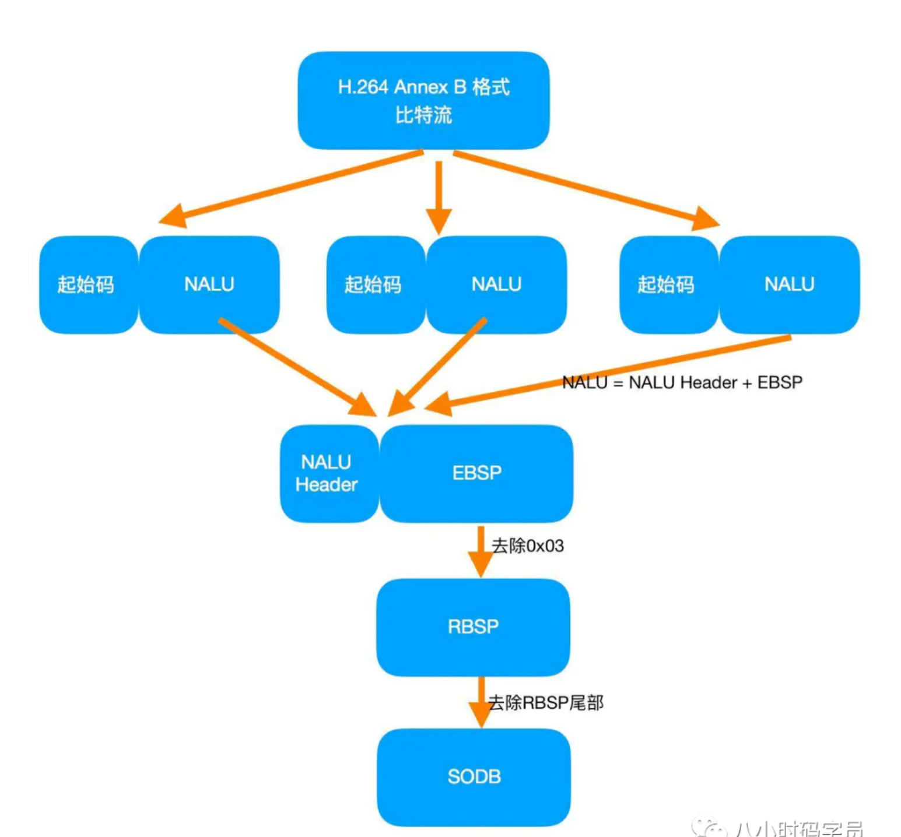
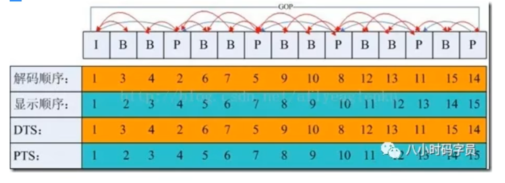
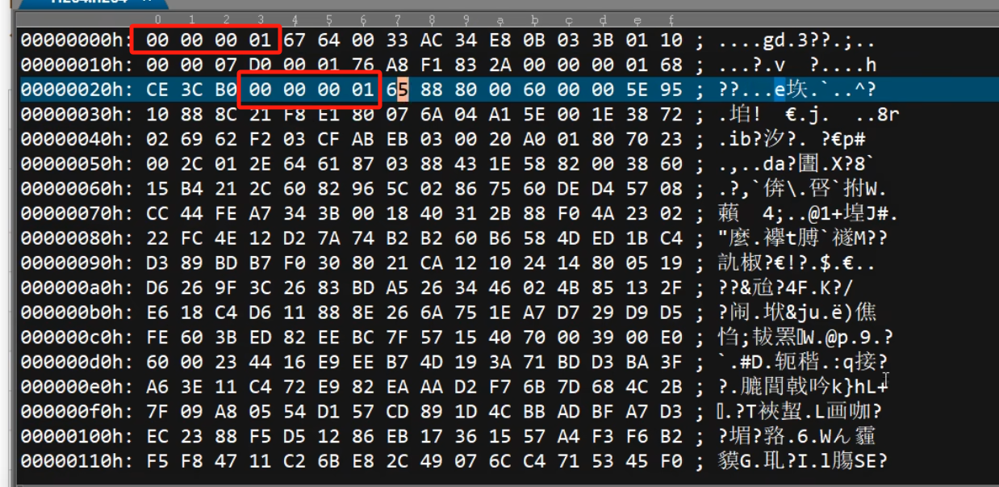

内容来自：https://blog.csdn.net/fly_C_

## 音视频原理
解协议
  |
解封装
  |
解码
  |
音视频同步
  |
播放

（如果是本地播放，没有接协议这步）

## 图像篇
### YUV 空间-间 划分

相邻的4个像素点理解为一个整体，共享1个v和1个u，所以比例为4：1：1

YUV444 1:1:1
YUV422 2:1:1
YUV420 4:1:1 

为什么用444而不是像素比111或者221呢，因为YUV420的比例

### YUV 空间-内 划分

ps： uv顺序可变

针对上图中的NV12、NV21、NV16、NV61说明:
- NV:NV系列都属于semi-plane系列，“12”、“16"代表先U后V，“21”、“61"代表先V后U
- 12、16:代表一个像素占的位数

Y占8比特， 
YUV422: Y 8 U 4 V 4 = 16
YUV420： Y 8 U 2 V 2 = 12

## H.264
### 高度压缩数字视频编解码器标准。

### H.264的数据格式是怎样的?
H.264由视频编码层(VCL)和网络适配层(NAL)组成。
- VCL:H264编码/压缩的核心，主要负责将视频数据编码/压缩，再切分
- NALU = NALU header + NALU payload

### VCL是如何管理H264视频数据？
1、 压缩：预测（帧内预测和帧间预测）-> DCT变化和量化 -> 比特流编码；
2、 切分数据，主要为了第三步。"切片(slice)"、“宏块(macroblock)"是在VCL中的概念，一方面提高编码效率和降低误码率、另一方面提高网络传输的灵活性。
3、 包装成『NAL』。
4、『VCL』最后会被包装成『NAL』

### 码流结构
H264 = start_code(0000 0001 或 000 001) + NALU

◆ 每个NAL前有一个起始码 0x00 00 01（或者0x00 00 00 01），解码器检测每个起始码，作为一个NAL的起始标识，当检测到下一个起始码时，当前NAL结束。
◆ 同时H.264规定，当检测到0x000000时，也可以表征当前NAL的结束。那么NAL中数据出现0x000001或0x000000时怎么办？H.264引入了防止竞争机制，如果编码器检测到NAL数据存在0x000001或0x000000时，编码器会在最后个字节前插入一个新的字节0x03，这样：
0x000000－>0x00000300
0x000001－>0x00000301
0x000002－>0x00000302
0x000003－>0x00000303 

### IPB帧、GOP
- I帧（Intra-coded picture，帧内编码图像帧），表示关键帧,
    不做其他参考，独立的
- P帧（Predictive-coded picture，前向预测编码图像帧），
    表示的是跟之前的一个关键帧或P帧的差别，P帧是参考帧，它可能造成解码错误的扩散；
    参考前I，（只存与前I不同的）
- B帧（Bidirectionally predicted picture，双向预测编码图像帧）
    本帧与前后帧（I或P帧）的差别，B帧压缩率高，但解码耗费CPU；
- IDR帧（Instantaneous Decoding Refresh，即时解码刷新）：
  首个I帧，是立刻刷新,使错误不致传播，
  IDR导致DPB（DecodedPictureBuffer参考帧列表——这是关键所在）清空；
  在IDR帧之后的所有帧都不能引用任何IDR帧之前的帧的内容；
  IDR具有随机访问的能力，播放器可以从一个IDR帧播放。
- GOP（Group Of Picture，图像序列）：两个I帧之间是一个图像序列，一个GOP包含一个I帧

7.解码时间戳和显示时间戳
当然，H.264中还有两个重要的概念：DTS和PTS
- DTS（Decoding Time Stamp，解码时间戳解）：读入内存中的比特流在什么时候开始送入解码器中进行解码
- PTS（Presentation Time Stamp，显示时间戳）：解码后的视频帧什么时候被显示出来

解码先I，然后后面的第一个P,再返回解I,再解P，再返回解I
∵ P是前向预测，B是双向预测，参考了前I后P
∴ 解码按照 I P B,显示还是I B P

### 示例：

0  1 2  3 4 5 6 7 
F|NRI |  TYPE    |

00 00 00 01为开始头，67的二进制： 0110 0111
上面的nalu结构体：
0  11   00111   = 7： 7 的类型是序列参数集 SPS
还有一段 65： 0110 0101
0 11 00101   =  5  ： IDR
