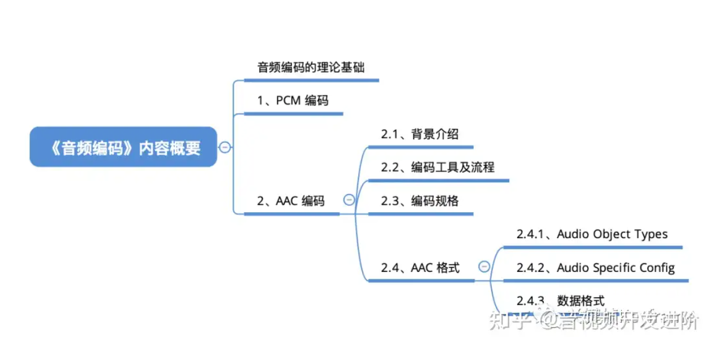
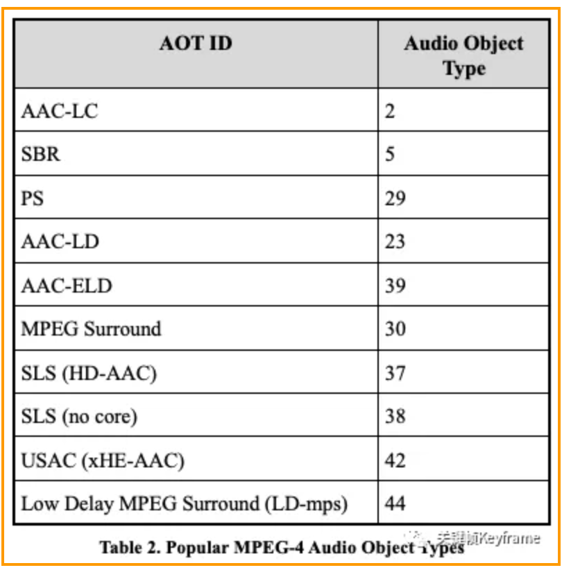

# 第二部分：
```js
├── 音视频编码与解码
│   ├── 常见音频编码格式（MP3、AAC等）
│   ├── 常见视频编码格式（H.264、H.265等）
│   ├── 音视频编码标准和协议
```

音频编码的理论基础 → PCM 编码 → AAC 编码工具集、编码流程、编码规格和数据格式

## 2.1 音视频编码PCM和ACC


对音频或视频进行编码最重要目的就是为了进行数据压缩，以此来降低数据传输和存储的成本。

拿音频来举例，一路采样率为 44100 Hz，量化位深为 16 bit，声道数为 2 的声音，如果不进行编码压缩，对应的码率是：441000 Hz * 16 bit * 2 = 1411200 bps = 1.346 Mbps。一分钟的时间所需要的数据量是：1.346 Mbps * 60 s = 80.75 Mb = 10.09 MB。

### 对音频进行编码常见的格式有：
- PCM，无压缩。一种将模拟信号的数字化方法，无损编码。
- WAV，无压缩。有多种实现方式，但是都不会进行压缩操作。其中一种实现就是在 PCM 数据格式的前面加上 44 字节，分别用来描述 PCM 的采样率、声道数、数据格式等信息。音质非常好，大量软件都支持。
- MP3，有损压缩。音质在 128 Kbps 以上表现还不错，压缩比比较高，大量软件和硬件都支持，兼容性好。
- AAC，有损压缩。在小于 128 Kbps 的码率下表现优异，并且多用于视频中的音频编码。
- OPUS，有损压缩。可以用比 MP3 更小的码率实现比 MP3 更好的音质，高中低码率下均有良好的表现，兼容性不够好，流媒体特性不支持。适用于语音聊天的音频消息场景。

PCM 是音频原始数据的基础格式；AAC 则在短视频和直播场景广泛使用。

### PCM编码
见1.md  1.1 声音


### ACC编码
参考：
https://mp.weixin.qq.com/s?__biz=MjM5MTkxOTQyMQ==&mid=2257484452&idx=1&sn=3b5fdd120be300b62a5334c073a9fcbf&scene=21#wechat_redirect

AAC，英文全称 Advanced Audio Coding，

#### ACC格式
Audio Object Types：
MPEG-4 标准包含了多种 AAC 的版本，像上面提到的 AAC-LC、HE-AAC、AAC-LD 等等，在标准中定义了编解码工具模块、音频对象类型（Audio Object Types）、编码规格（Profiles）来指定编码器。其中音频对象类型（Audio Object Types）是最主要的标记编码器的方式。下图是常用的 MPEG-4 音频对象类型：


..... 未完，看不懂，内容来自以上参考


