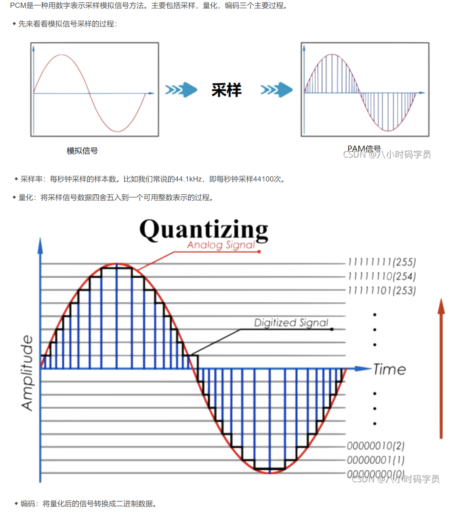
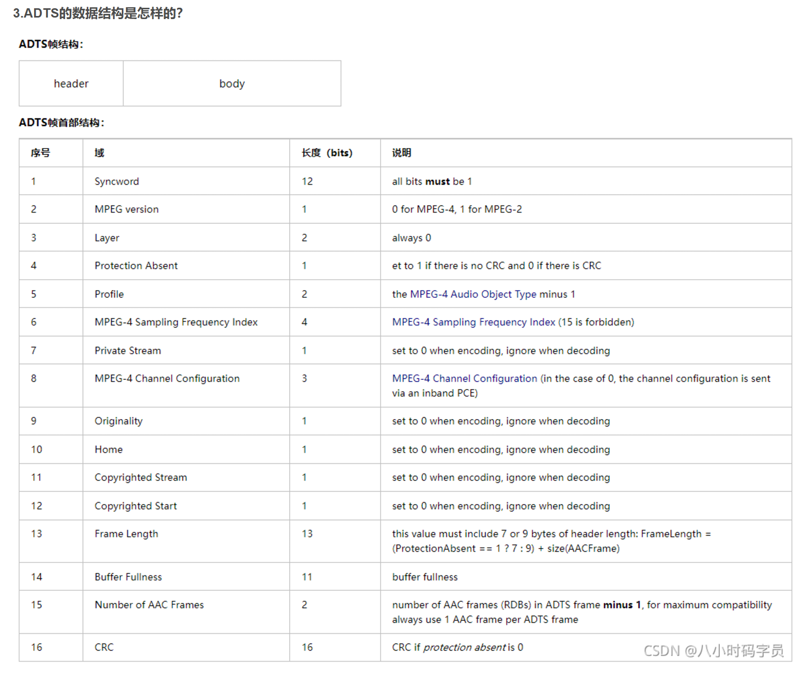
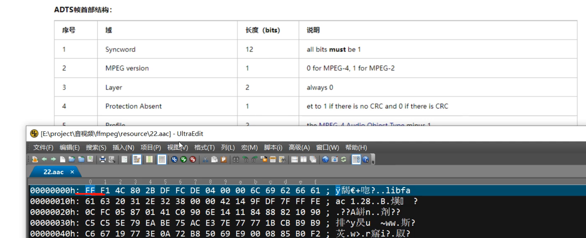

## 音频篇
- 采集到的原始音频数据： PCM
- 压缩后的音频数据：ACC

(音频的压缩不像视频的压缩那么夸张)
### PCM
PCM(Pulse Code Modulation，脉冲编码调制)音频数据是未经压缩的音频采样数据裸流，它是由模拟信号经过采样、量化、编码转换成的标准数字音频数据。

3.描述PCM数据的6个参数：
◆ Sample Rate : 采样频率。8kHz(电话)、44.1kHz(CD)、48kHz(DVD)。
◆ Sample Size : 量化位数。常见值为8-bit、16-bit。
◆ Number of Channels : 通道个数。常见的音频有立体声(stereo)和单声道(mono)两种类型，立体声包含左声道和右声道。另外还有环绕立体声等其它不太常用的类型。
◆ Sign : 表示样本数据是否是有符号位，比如用一字节表示的样本数据，有符号的话表示范围为-128 ~ 127，无符号是0 ~ 255。
◆ Byte Ordering : 字节序。字节序是little-endian还是big-endian。通常均为little-endian。
◆ Integer Or Floating Point : 整形或浮点型。大多数格式的PCM样本数据使用整形表示，而在一些对精度要求高的应用方面，使用浮点类型表示PCM样本数据。

### ACC
AAC(Advanced Audio Coding，高级音频编码)是一种声音数据的文件压缩格式。AAC分为ADIF和ADTS两种文件格式。

- ADIF  ADIF：Audio Data Interchange Format 音频数据交换格式。这种格式的特征是可以确定的找到这个音频数据的开始，不需进行在音频数据流中间开始的解码，即它的解码必须在明确定义的开始处进行。故这种格式常用在磁盘文件中。
- ADTS：Audio Data Transport Stream 音频数据传输流。这种格式的特征是它是一个有同步字的比特流，解码可以在这个流中任何位置开始。

#### ADTS:

一个字节 = 8bits
序号1：  12 bits = 一个半字节，UE就是前3位 FFF
序号2 3 4，对应 1 为 0001， 所以序号2： 0 MPEG-4， 序号4： 没CRC 

