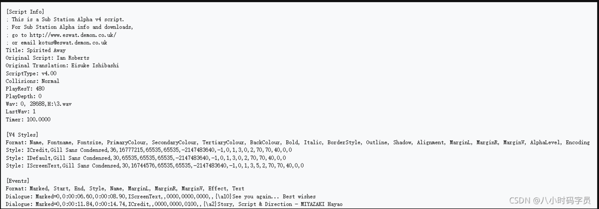

常见的srt,ass,ssa
## 字幕篇 SSA ASS
-  SSA（SubStation Alpha），是由CS Low（亦称Kotus）创建，比传统字幕格式（如SRT）功能更加先进的字幕文件格式。 
   -  该格式字幕的外挂文件以*.ssa作为后缀。
-  ASS（Advanced SubStation Alpha），是一种比SSA更为高级的字幕格式, 其实质版本是SSA v4.00+，它是基于SSA 4.00+编码构建的。
   -  ASS的主要变化就是在SSA编写风格的基础上增添更多的特效和指令。
   -  该格式字幕的外挂文件以*.ass作为后缀。

### .SSA/ASS的基本结构
SSA/ASS字幕是一种类ini风格纯文本文件；包含五个section：[Script Info]、[v4+ Styles]、[Events]、[Fonts]、[Graphics]。
◆ [Script Info]：包含了脚本的头部和总体信息。[Script Info] 必须是 v4 版本脚本的第一行。
◆ [v4 Styles]：包含了所有样式的定义。每一个被脚本使用的样式都应该在这里定义。ASS 使用 [v4+ Styles]。
◆ [Events]：包含了所有脚本的事件，有字幕、注释、图片、声音、影像和命令。基本上，所有在屏幕上看到的内容都在这一部分。
◆ [Fonts]：包含了脚本中内嵌字体的信息。
◆ [Graphics]：包含了脚本中内嵌图片的信息。

### SSA示例

参考：https://wiki.multimedia.cx/index.php/SubStation_Alpha