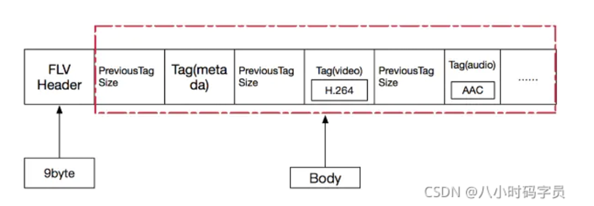
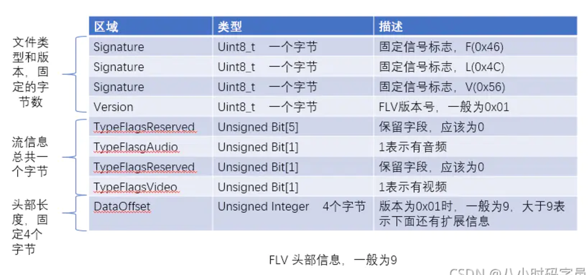
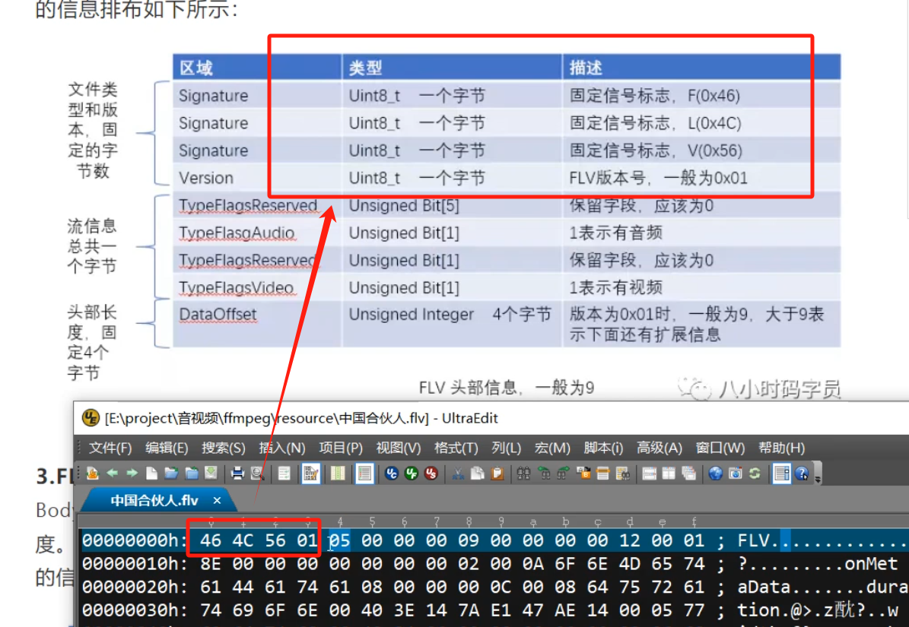
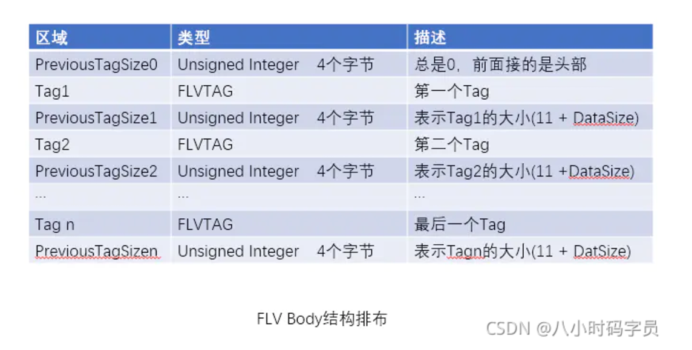
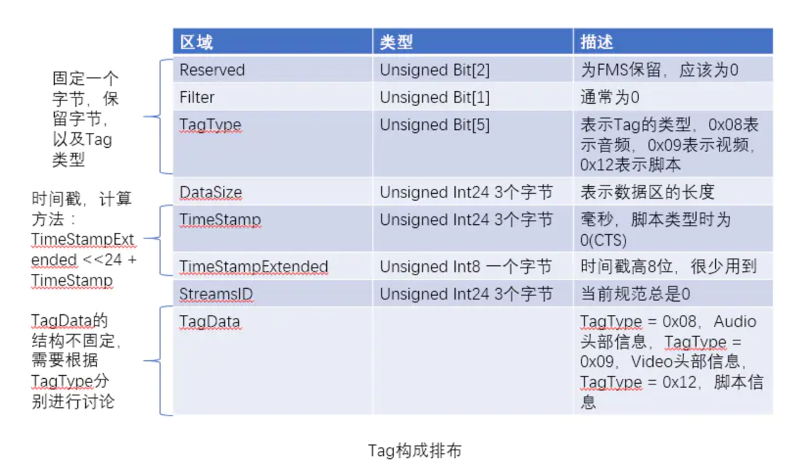
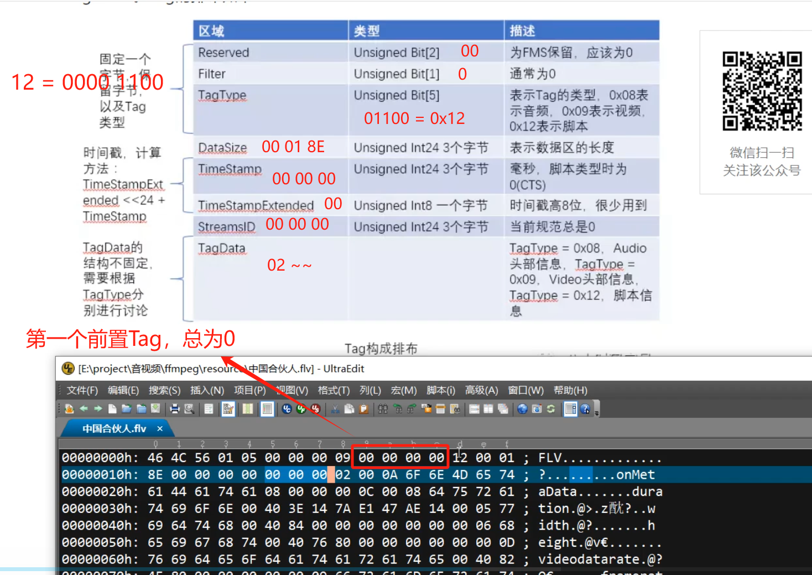
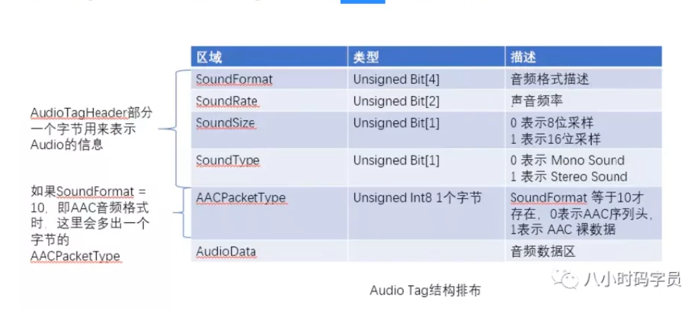
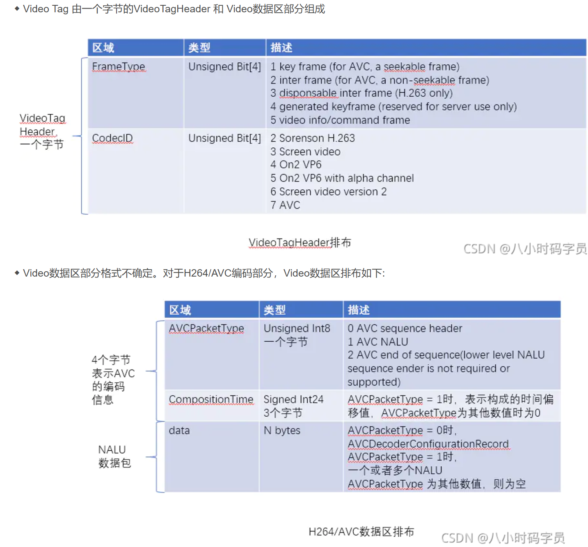

封装格式--FLV TS MP4

将图像、音频、字幕封装在一起，就形成了我们常见的视频。本篇文章主要介绍下FLV（后文中将介绍TS和MP4）视频封装格式。

## FLV
1.FLV的封装格式
FLV（Flash Video），Adobe公司设计开发的一种流行的流媒体格式，
- 由于其视频文件体积轻巧、封装简单等特点，使其很适合在互联网上进行应用。
- 除了播放视频，在直播时也可以使用。
- 采用FLV格式封装的文件后缀为.flv，格式如下（FLV = FLV Header + Body）：

### FLV header
Header 部分记录了FLV的类型、版本、流信息、Header 长度等。一般整个Header占用9个字节，大于9个字节则表示头部信息在这基础之上还存在扩展数据。FLV Header 的信息排布如下所示：

流信息： 05： 0101 表示有音频有视频
头部DataOffset 4个字节： 00 00 00 09 ，前面版本正是0x01,是9 表示没有扩展信息（大于9有扩展）

### FLV body
Body 是由一个个Tag组成的，每个Tag下面有一块4个字节的空间，用来记录这个Tag 的长度。这个后置的PreviousTagSize用于逆向读取处理，表示的是前面的Tag的大小。FLV Body 的信息排布如下：

### FLV Tag
每个Tag 也是由两部分组成的：Tag Header 和 Tag Data。Tag Header 存放了当前Tag的类型，数据长度、时间戳、时间戳扩展、StreamsID等信息，然后再接着数据区Tag Data。Tag的排布如下：

## Tag Data 音频（Audio）、视频（video）、脚本（script）

### Audio Tag Data = AudioTagHeader + Data

### Video Tag Data = videoTagHeader + data
