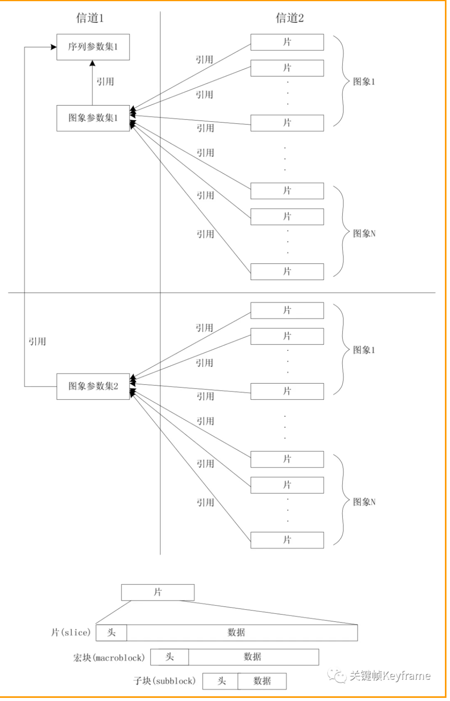

# H.264编码

## 1.1 基本概念

### 1.1.1 句法元素分层结构
句法元素分为5个模块：序列、图像、片、宏块、子宏块

在 H.264 中，分层结构相较之前最大的不同是取消了序列层和图像层，并将原本属于序列和图像头部的大部分句法元素游离出来形成序列和图像两级参数集，其余的部分则放入片层。在这种机制下，由于参数集是独立的，可以被多次重发或者采用特殊技术加以保护。参数集与参数集外部的句法元素处于不同信道中，这是 H.264 的一个建议，我们可以使用更安全但成本更昂贵的通道来传输参数集。

### 1.1.2、软件和硬件编解码
编解码分为软编软解和硬编硬解：

|        |  处理位置  |优点         | 缺点        |
|:-----------:|:-------------:|:-------------|:-------------|
| 软编/软解 | CPU  | 1、调节能力比较强,可以通过参数调整可以在同一码率下编码出清晰度更高的视频  2、兼容性好，可适配所有设备 |  性能可能较差，不如硬解功耗低
| 硬编/硬解 | 使用显卡 GPU、专用 SDP 等其它芯片硬件处理  | 功耗低 |

使用场景：
1、目前移动应用大部分业务场景采用的编码策略是：（硬编再软编）
- 手机端尽量采用硬编编码出一路高清的视频，将高清视频发送给服务器，
- 由服务器再进行软编转码为多路码率的视频，再通过 CDN 分发给观看端。

2、（硬件支持不完善，软编）另外，安卓的一些低端机可能由于硬件问题对硬编支持不完善，这时候可以使用软编，或者硬编出错的情况可以切换为软编来兜底。
3、对于一些性能优越的高端机型或者编码时长不多的业务场景也可以优先用软编，例如录制 15 秒短视频的场景，首先时间比较短并且机器性能高不怕 CPU 消耗，这样相同码率可以再提高清晰度。

4、对于大部分的应用场景的解码策略则主要采用硬解，用软解作为兜底。此外，对于一些硬解不支持的编码类型，可以使用软解，比如有的机型不支持 H.265 解码，则只能使用软解。

### 1.1.3、序列
H.264 编码的方式可以这样理解：在视频中，一段时间内相邻的图像的像素、亮度与色温的差别通常很小。所以没必要去对一段时间内的每一幅图像都进行完整一帧的编码，而是可以选取这段时间的第一帧图像进行完整编码，而下一幅图像只记录与第一帧完整编码图像的像素、亮度与色温等特征的差别即可，以此类推循环下去。
 
什么叫序列呢？上述的这段时间内图像变化不大的图像集就可以称之为一个序列。但是如果某个图像与之前的图像变换很大，很难参考之前的帧来生成新的帧，那么就结束上一个序列，开始下一个序列。重复上述做法，生成新的一段序列。

### 1.1.4、帧类型
H.264 结构中，一幅视频图像编码后的数据叫做一帧，一帧由一个片（slice）或多个片组成，一个片由一个或多个宏块（MB）组成，一个宏块由 16x16 的 YUV 数据组成。宏块是 H.264 编码的基本单位。

在 H.264 协议内定义了三种帧，分别是 I 帧、B 帧与 P 帧。

### 1.1.5、DTS 和 PTS

### 1.1.6、GOP

### 1.1.7、IDR 帧

### 1.1.8、压缩方式

## 1.2、分层结构

## 1.3、编码工具

### 1.3.1、帧内预测

### 1.3.2、帧间预测

### 1.3.3、变换和量化

### 1.3.4、熵编码

## 1.4、码流结构

### 1.4.1、原始码流

### 1.4.2、NAL 单元

### 1.4.3、RBSP

### 1.4.4、NAL 单元的不同类型