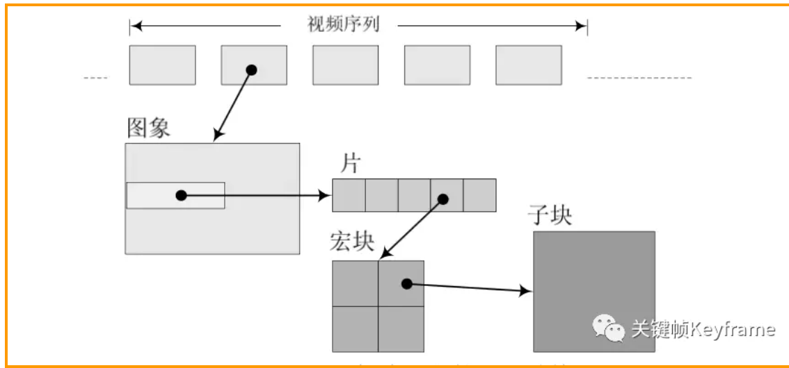
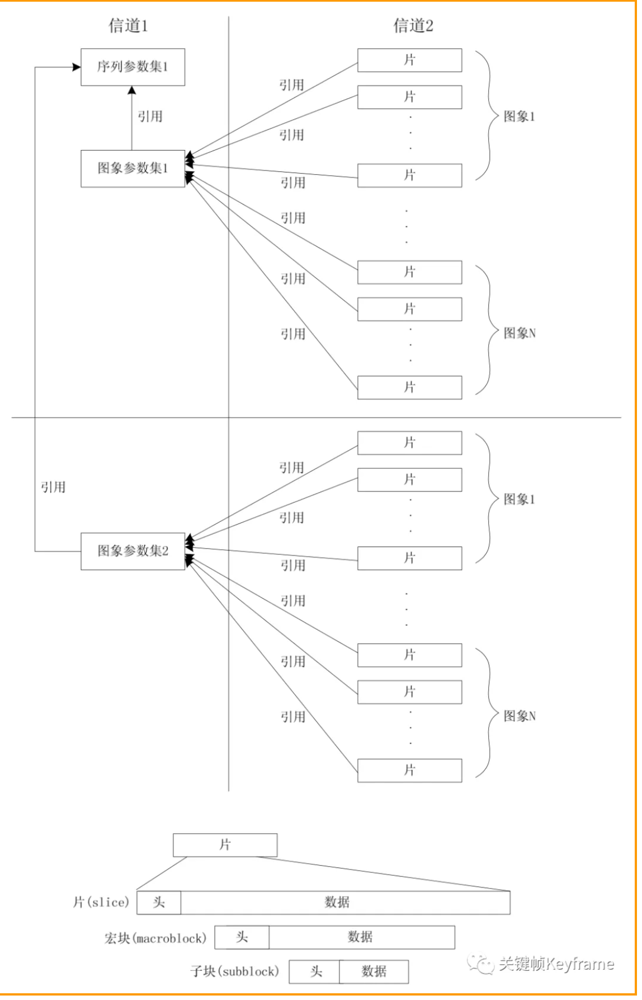
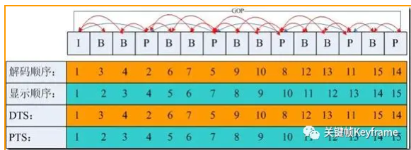
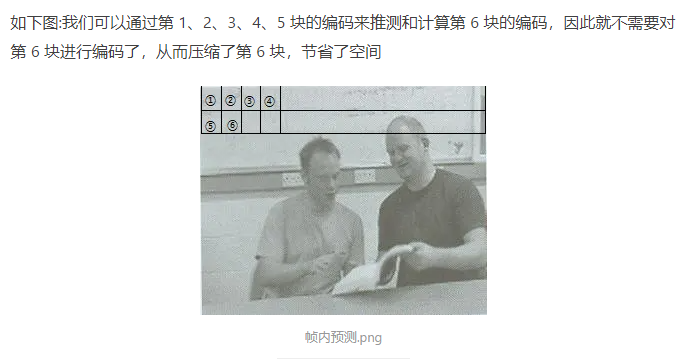
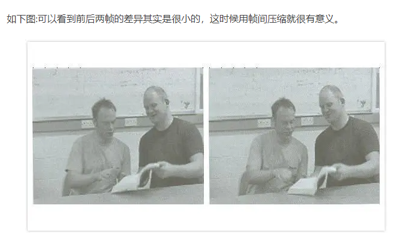

# H.264编码

## 1.1 基本概念

### 1.1.1 句法元素分层结构
句法元素分为5个模块：序列、图像、片、宏块、子宏块


在 H.264 中，分层结构相较之前最大的不同是取消了序列层和图像层，并将原本属于序列和图像头部的大部分句法元素游离出来形成序列和图像两级参数集，其余的部分则放入片层。在这种机制下，由于参数w集是独立的，可以被多次重发或者采用特殊技术加以保护。参数集与参数集外部的句法元素处于不同信道中，这是 H.264 的一个建议，我们可以使用更安全但成本更昂贵的通道来传输参数集。



### 1.1.2、软件和硬件编解码
编解码分为软编软解和硬编硬解：

|        |  处理位置  |优点         | 缺点        |
|:-----------:|:-------------:|:-------------|:-------------|
| 软编/软解 | CPU  | 1、调节能力比较强,可以通过参数调整可以在同一码率下编码出清晰度更高的视频<br/> 2、兼容性好，可适配所有设备 |  性能可能较差，不如硬解功耗低
| 硬编/硬解 | 使用显卡 GPU、专用 SDP 等其它芯片硬件处理  | 功耗低 |

使用场景：
1、目前移动应用大部分业务场景采用的编码策略是：（硬编再软编）
- 手机端尽量采用硬编编码出一路高清的视频，将高清视频发送给服务器，
- 由服务器再进行软编转码为多路码率的视频，再通过 CDN 分发给观看端。

2、（硬件支持不完善，软编）另外，安卓的一些低端机可能由于硬件问题对硬编支持不完善，这时候可以使用软编，或者硬编出错的情况可以切换为软编来兜底。
3、对于一些性能优越的高端机型或者编码时长不多的业务场景也可以优先用软编，例如录制 15 秒短视频的场景，首先时间比较短并且机器性能高不怕 CPU 消耗，这样相同码率可以再提高清晰度。

4、对于大部分的应用场景的解码策略则主要采用硬解，用软解作为兜底。此外，对于一些硬解不支持的编码类型，可以使用软解，比如有的机型不支持 H.265 解码，则只能使用软解。


### 1.1.3、序列
H.264 编码的方式可以这样理解：在视频中，一段时间内相邻的图像的像素、亮度与色温的差别通常很小。所以没必要去对一段时间内的每一幅图像都进行完整一帧的编码，而是可以选取这段时间的第一帧图像进行完整编码，而下一幅图像只记录与第一帧完整编码图像的像素、亮度与色温等特征的差别即可，以此类推循环下去。
 
什么叫序列呢？上述的这段时间内图像变化不大的图像集就可以称之为一个序列。但是如果某个图像与之前的图像变换很大，很难参考之前的帧来生成新的帧，那么就结束上一个序列，开始下一个序列。重复上述做法，生成新的一段序列。


### 1.1.4、帧类型
H.264 结构中，一幅视频图像编码后的数据叫做一帧，一帧由一个片（slice）或多个片组成，一个片由一个或多个宏块（MB）组成，一个宏块由 16x16 的 YUV 数据组成。宏块是 H.264 编码的基本单位。

在 H.264 协议内定义了三种帧，分别是 I 帧、B 帧与 P 帧。

#### 1) I帧
***I 帧，即帧内编码图像帧，不参考其他图像帧，只利用本帧的信息进行编码。***

##### 第一帧，数据量较大，且一组只有一帧
I 帧的特点：
- 它是一个全帧压缩编码帧，将全帧图像信息进行压缩编码及传输；
- 解码时仅用 I 帧的数据就可重构完整图像；
- I 帧描述了图像背景和运动主体的详情；
- I 帧不需要参考其他画面而生成；
- I 帧是 P 帧和 B 帧的参考帧，其质量直接影响到同组中以后各帧的质量；
- 一般地，I 帧是图像组 GOP 的基础帧（第一帧），在一组中只有一个 I 帧；
- I 帧所占数据的信息量比较大。

I 帧编码流程：
- 进行帧内预测，决定所采用的帧内预测模式；
- 当前像素值减去预测值，得到残差；
- 对残差进行变换和量化；
- 变长编码和算术编码；
- 重构图像并滤波，得到的图像作为其它帧的参考帧。


#### 2）P 帧

P 帧，即预测编码图像帧，利用之前的 I 帧或 P 帧，采用运动预测的方式进行帧间预测编码。

P 帧的预测与重构：P 帧是以 I 帧为参考帧，在 I 帧中找出 P 帧『某点』的预测值和运动矢量，取预测差值和运动矢量一起传送。在接收端根据运动矢量从 I 帧中找出 P 帧『某点』的预测值并与差值相加以得到 P 帧『某点』样值，从而可得到完整的 P 帧。

P 帧特点：
- P 帧是 I 帧后面相隔 1-2 帧的编码帧；
- P 帧采用运动补偿的方法传送它与前面的 I 或 P 帧的差值及运动矢量（预测误差）；
- P 帧属于前向预测的帧间编码，它只参考前面最靠近它的 I 帧或 P 帧；
- P 帧可以是其后面 P 帧的参考帧，也可以是其前后的 B 帧的参考帧；
- 由于 P 帧是参考帧，它可能造成解码错误的扩散；
- 由于是差值传送，P 帧的压缩比较高。

P 帧编码的基本流程：
- 进行运动估计，计算采用帧间编码模式的率失真函数值。P 帧只参考前面的帧；
- 进行帧内预测，选取率失真函数值最小的帧内模式与帧间模式比较，确定采用哪种编码模式；
- 计算实际值和预测值的差值；
- 对残差进行变换和量化；
- 若编码，如果是帧间编码模式，编码运动矢量。

#### 3）B 帧

B 帧，即双向预测编码图像帧，提供最高的压缩比，它既需要之前的图像帧（I 帧或 P 帧），也需要后来的图像帧（P 帧），采用运动预测的方式进行帧间双向预测编码。

B 帧的预测与重构：B 帧以前面的 I 或 P 帧和后面的 P 帧为参考帧，找出 B 帧『某点』的预测值和两个运动矢量，并取预测差值和运动矢量传送。接收端根据运动矢量在两个参考帧中找出预测值并与差值求和，得到 B 帧『某点』样值，从而可得到完整的 B 帧。

B 帧特点：
- B 帧是由前面的 I 或 P 帧和后面的 P 帧来进行预测的；
- B 帧传送的是它与前面的 I 或 P 帧和后面的 P 帧之间的预测误差及运动矢量；
- B 帧是双向预测编码帧；
- B 帧压缩比最高，因为它只反映两参考帧间运动主体的变化情况，预测比较准确；
- B 帧不是参考帧，不会造成解码错误的扩散。

B 帧编码的基本流程：
- 进行运动估计，计算采用帧间编码模式的率失真函数值。B 帧可参考后面的帧；
- 进行帧内预测，选取率失真函数值最小的帧内模式与帧间模式比较，确定采用哪种编码模式；
- 计算实际值和预测值的差值；
- 对残差进行变换和量化；
- 若编码，如果是帧间编码模式，编码运动矢量。

怎么双向预测？跟P帧有什么区别？间隔多久会有这个B

> 率失真函数的相关简介：

> 有损压缩算法，性能由编码输出的比特率和失真共同决定。

> 编码的目的：就是在保证一定视频质量的条件下尽量减少编码比特率，或在一定编码比特率限制条件下尽量地减小编码失真。

> 编码器的工作：根据以上率失真准则找到最佳编码参数。

> 信息论中率失真概念：在允许一定程度失真的条件下，能够把信源信息压缩到什么程度，即最少需要多少比特数才能描述信源。由此得到率失真函数：R(D) = min I(X, Y)，它给出了限定失真条件下信息压缩允许的下界。但其在视频编码中难以应用，因为各种概率和条件概率未知，只能作为理论值。

> 视频编码中的率失真曲线：为了研究视频码率与视频质量的平衡。由于系统性，不能达到理论上的 R(D) 值，只能由不同的编码参数（如 QP 和选择的模式）得到有限的 (R, D) 可操作点，形成凸包络。

> 视频编码中的率失真优化（RDO）：遍历所有的参数候选模式对视频进行编码，满足码率限制的失真最小的一组参数集作为最优的视频编码参数。每一层级都找出，最终使整体系统性能最优。这里假设了无相关性的独立优化，如相关性较强则共同优化。


### 1.1.5、DTS 和 PTS
DTS、PTS 的概念如下所述：

***DTS（Decoding Time Stamp）：即解码时间戳***，这个时间戳的意义在于告诉播放器该在什么时候解码这一帧的数据。(解码的阶段用到)

***PTS（Presentation Time Stamp）：即显示时间戳***，这个时间戳用来告诉播放器该在什么时候显示这一帧的数据。

需要注意的是：虽然 DTS、PTS 是用于指导播放端的行为，但它们是在编码的时候由编码器生成的。

当视频流中没有 B 帧时，通常 DTS 和 PTS 的顺序是一致的。但如果有 B 帧时，就回到了我们前面说的问题：解码顺序和播放顺序不一致了。

比如一个视频中，帧的显示顺序是：I B B P，现在我们需要在解码 B 帧时知道 P 帧中信息，因此这几帧在视频流中的顺序可能是：I P B B，这时候就体现出每帧都有 DTS 和 PTS 的作用了。
DTS 告诉我们该按什么顺序解码这几帧图像，PTS 告诉我们该按什么顺序显示这几帧图像。顺序大概如下：

```js
Stream: I P B B
   DTS: 1 2 3 4
   PTS: 1 4 2 3
```

### 1.1.6、GOP

GOP（Group Of Pictures）是图像组的概念，它指的是***视频编码序列中两个 I 帧之间的距离***。通常意义上的 GOP 由 I 帧开始，到下一个 I 帧之前的帧结束。严格意义上讲，这个 I 帧是一个 IDR 帧。

H.264 使用的是封闭 GOP（Closed GOP），即在一个 GOP 中所有帧的解码不依赖该 GOP 外的其他帧，除了第一帧必须是 I 帧，其他帧可以是 P 帧或 B 帧。



上图中是一个 GOP 为 15 帧的例子，如果视频的帧率是 15 fps，那么这个 GOP 就是 1s 时长。

关键帧的间隔调节会影响 GOP 的长度，进而影响到读取 GOP 的速度，为防止运动变化，一个 GOP 组内帧数不宜取多。如果关键帧的间隔设置过大的话（GOP 长度过大），在必须用到关键帧的场合就可能被迫使用 B/P 帧来代替，这就会降低画面质量。

### 1.1.7、IDR 帧
***也是I帧，但不能跨帧*** 

IDR 帧全称叫做 Instantaneous Decoder Refresh，是 I 帧的一种。IDR 帧的作用是立刻刷新，重新算一个新的序列开始编码，使错误不致传播。I 帧有被跨帧参考的可能，但 IDR 帧不会。

比如：
> IDR1 P2 B3 B4 P5 B6 B7 I8 B9 B10 P11 B12 B13 P14 B15 B16

这里的 B9 可以跨过 I8 去参考 P7。

> IDR1 P2 B3 B4 P5 B6 B7 IDR8 B9 B10 P11 B12 B13 P14 B15 B16

这里的 B9 就不可以参考 IDR8 前面的帧。

H.264 引入 IDR 帧是为了解码的重同步，当解码器解码到 IDR 帧时，立即将参考帧队列清空，将已解码的数据全部输出或抛弃，重新查找参数集，开始一个新的序列。这样，如果前一个序列出现错误，在这里可以获得重新同步的机会，不会将错误传导下去。IDR 帧之后的帧永远不会使用 IDR 帧之前的帧来解码。

所以总结下来，IDR 帧有如下特性：
- IDR 帧一定是 I 帧，严格来说 I 帧不一定是 IDR 帧（但一般 I 帧就是 IDR 帧）；

- 对于 IDR 帧来说，在 IDR 帧之后的所有帧都不能引用任何 IDR 帧之前的帧的内容。与此相反，对于普通的 I 帧来说，位于其之后的 B 和 P 帧可以引用位于普通 I 帧之前的 I 帧（普通 I 帧有被跨帧参考的可能）；

- 播放器永远可以从一个 IDR 帧播放，因为在它之后没有任何帧引用之前的帧。因此，视频开头的 I 帧一定是 IDR 帧；一个封闭类 GOP 的开头的 I 帧也一定是 IDR 帧。

### 1.1.8、压缩方式

H.264 采用的核心算法是『帧内压缩』和『帧间压缩』，
- 帧内压缩是生成 I 帧的算法，
- 帧间压缩是生成 B 帧和 P 帧的算法。

#### 帧内压缩
帧内压缩也称为空间压缩。
当压缩一帧图像时，仅考虑本帧的数据而不考虑相邻帧之间的冗余信息，这实际上与静态图像压缩类似。
帧内一般采用有损压缩算法，
由于帧内压缩是编码一个完整的图像，所以可以独立的解码、显示。
帧内压缩一般达不到很高的压缩率，跟编码 JPEG 差不多。


####  帧间压缩 P和B的压缩方法
帧间压缩的原理是：
相邻几帧的数据有很大的相关性，或者说前后两帧信息变化很小的特点。也即连续的视频其相邻帧之间具有冗余信息，根据这一特性，压缩相邻帧之间的冗余量就可以进一步提高压缩量，减小压缩比。
帧间压缩也称为时间压缩，它通过比较时间轴上不同帧之间的数据进行压缩。
帧间压缩一般是无损的。
帧差值算法是一种典型的时间压缩法，它通过比较本帧与相邻帧之间的差异，仅记录本帧与其相邻帧的差值，这样可以大大减少数据量。



编码压缩的步骤大致如下：
- 分组，也就是将一系列变换不大的图像归为一个组，也就是一个序列，也就是 GOP；
- 定义帧，将每组的图像帧归分为 I 帧、P 帧和 B 帧三种类型；
- 预测帧，以 I 帧做为基础帧，以 I 帧预测 P 帧，再由 I 帧和 P 帧预测 B 帧；
- 数据传输，最后将 I 帧数据与预测的差值信息进行存储和传输。


