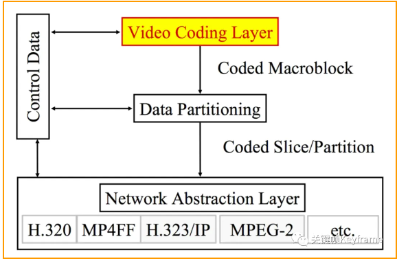

## 1.2、分层结构
H.264 的主要目标是为了有高的视频压缩比和良好的网络亲和性

为了达成这两个目标，将系统框架分为两个层面：『视频编码层面（VCL）』和『网络抽象层面（NAL）』

- 视频编码层（VCL），是对视频编码核心算法过程、子宏块、宏块、片等概念的定义。这层主要是为了***尽可能的独立于网络来高效的对视频内容进行编码***。编码完成后，输出的数据是 SODB（String Of Data Bits）。

- 网络适配层（NAL），是对图像序列、图像等片级别以上的概念的定义。这层负责将 VCL 产生的比特字符串适配到各种各样的网络和多元环境中。该层将 VCL 层输出的 SODB 数据打包成 RBSP（Raw Byte Sequence Payload）。***SODB 是编码后的原始数据，RBSP 是在原始编码数据后面添加了结尾比特，一个比特 1 和若干个比特 0，用于字节对齐***。 然后再在 RBSP 头部加上 NAL Header 来组成一个一个的 NAL 单元。

