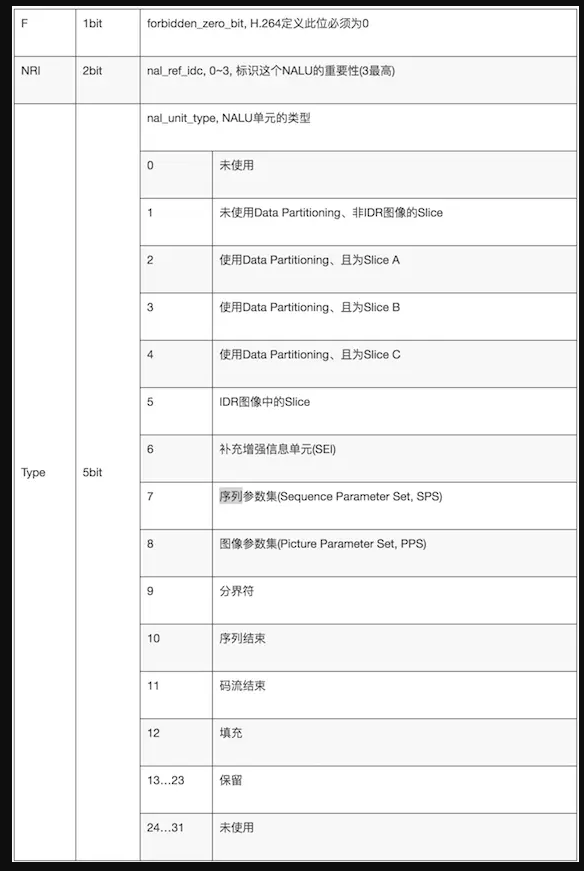
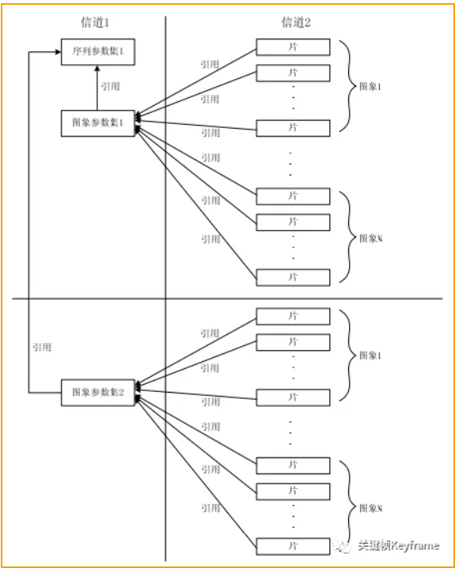

https://mp.weixin.qq.com/s?__biz=MjM5MTkxOTQyMQ==&mid=2257484471&idx=1&sn=421be18e5b591043f13996734c60780b&scene=21#wechat_redirect

## 1.4、码流结构

### 1.4.1、原始码流
H.264原始码流，即位裸流
是由一个接一个的NAL组成的，NAL = NAL Header + rbsp

### 1.4.2、NAL 单元

 0   1 2   3 4 5 6 7
|F | NRI |   TYPE   |

### 1.4.3、RBSP
从 SODB 到 RBSP 的生成过程：
- 如果 SODB 内容是空的，生成的 RBSP 也是空的。
- 否则，RBSP 由如下的方式生成：

    - 1）RBSP 的第一个字节直接取自 SODB 的第 1-8 个比特，（RBSP 字节内的比特按照从左到右对应为从高到低的顺序排列，most significant），以此类推，RBSP 其余的每个字节都直接取自 SODB 的相应比特。RBSP 的最后一个字节包含 SODB 的最后几个比特和 rbsp_trailing_bits()。

    - 2）rbsp_trailing_bits() 的第一个比特是 1，接下来填充 0，直到字节对齐。

    - 3）最后添加若干个 cabac_zero_word，其值等于 0x0000。

### 1.4.4、NAL 单元的不同类型
- SPS 序列参数集
- PPS 图像参数集

序列参数集、图像参数集与图像、片之间的关系：

#### 序列参数集SPS
SPS 中保存了一组编码后的图像序列的依赖的全局参数。

SPS 中的信息至关重要，如果其中的数据丢失，解码过程就可能失败。SPS 和 PPS 通常作为解码器的初始化参数。一般情况，SPS 和 PPS 所在的 NAL 单元位于整个码流的起始位置，但是在某些场景下，在码率中间也可能出现这两种结构：
- 解码器要在码流中间开始解码。比如，直播流。
- 编码器在编码过程中改变了码率的参数。比如，图像的分辨率。

##### SPS关键帧：
- num_ref_frames，指定参考帧队列可能达到的最大长度，解码器依照这个句法元素的值开辟存储区，这个存储区用于存放已解码的参考帧，H.264 规定最多可用 16 个参考帧，本句法元素的值最大为 16。值得注意的是这个长度以帧为单位，如果在场模式下，应该相应地扩展一倍。

- pic_width_in_mbs_minus1，本句法元素加 1 后指明图像宽度，以宏块为单位：frame_width = 16 * (pic_width_in_mbs_minus1 + 1)，宏块尺寸是 16x16。可得：
亮度分量以像素为单位的图像宽度：
PicWidthInSamplesL = PicWidthInMbs * 16，
色度分量以像素为单位的图像宽度：
PicWidthInSamplesC = PicWidthInMbs * 8。
H.264 将图像的大小在 SPS 中定义，意味着可以在通信过程中随着 SPS 动态地改变图像的大小，甚至可以将传送的图像剪裁后输出。

- pic_height_in_map_units_minus1，本句法元素加 1 后指明
图像高度：
PicHeightInMapUnits = pic_height_in_map_units_minus1 + 1，PicSizeInMapUnits = PicWidthInMbs * PicHeightInMapUnits。
图像的高度的计算要比宽度的计算复杂，因为一个图像可以是帧也可以是场，从这个句法元素可以在帧模式和场模式下分别计算出出亮度、色度的高。
值得注意的是，这里以 map_unit 为单位。

- frame_mbs_only_flag，本句法元素
等于 0 时表示本序列中所有图像的编码模式都是帧，没有其他编码模式存在；
等于 1 时 ，表示本序列中图像的编码模式可能是帧，也可能是场或帧场自适应，某个图像具体是哪一种要由其他句法元素决定。
结合 map_unit 的含义，这里给出上一个句法元素 
pic_height_in_map_units_minus1 的进一步解析步骤：
当 frame_mbs_only_flag 等于 1，pic_height_in_map_units_minus1 指的是一个 picture 中帧的高度；

当 frame_mbs_only_flag 等于 0，pic_height_in_map_units_minus1 指的是一个 picture 中场的高度。

所以可以得到如下以宏块为单位的图像高度：
FrameHeightInMbs = ( 2 – frame_mbs_only_flag ) * PicHeightInMapUnits。
PictureHeightInMbs= ( 2 – frame_mbs_only_flag ) * PicHeightInMapUnits。

#### PPS 图像参数集
PPS 中保存了每一帧编码后的图像所依赖的参数

1. num_ref_idx_l0_active_minus1, 加 1 后表示目前参考帧队列的长度，即有多少个参考帧（包括短期和长期）。
值得注意的是，当目前解码图像是场模式下，参考帧队列的长度应该是本句法元素再乘以 2，因为场模式下各帧必须被分解以场对形式存在。（这里所说的场模式包括图像的场及帧场自适应下的处于场模式的宏块对） 本句法元素的值有可能在片头被重载。

在序列参数集中有句法元素 num_ref_frames 也是跟参考帧队列有关，它们的区别是 num_ref_frames 表示参考帧队列的最大值，解码器用它的值来分配内存空间；num_ref_idx_l0_active_minus1 表示在这个队列中当前实际的、已存在的参考帧数目，这从它的名字 active 中也可以看出来。
这个句法元素是 H.264 中最重要的句法元素之一，编码器要通知解码器某个运动矢量所指向的是哪个参考图像时，并不是直接传送该图像的编号，而是传送该图像在参考帧队列中的序号。这个序号并不是在码流中传送的，而是编码器和解码器同步地、用相同的方法将参考图像放入队列，从而获得一个序号。这个队列在每解一个图像，甚至是每个片后都会动态地更新。
维护参考帧队列是编解码器十分重要的工作，而本句法元素是维护参考帧队列的重要依据。

