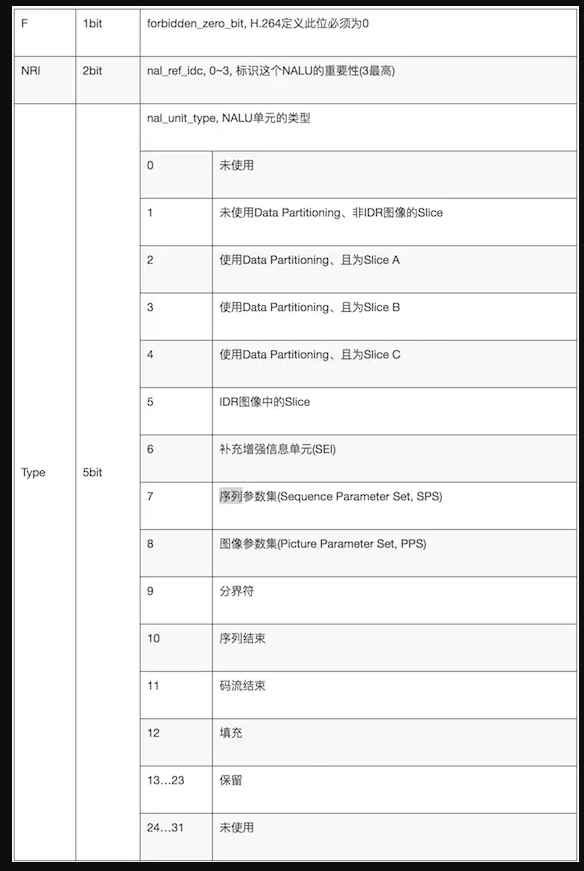

## 组成 [StartCode] [NALU Header] [NALU Payload]
一个原始的H.264 NALU 单元常由 [StartCode] [NALU Header] [NALU Payload] 三部分组成

## 限制：
- StartCode : Start Code 用于标示这是一个NALU 单元的开始，必须是”00 00 00 01” 或”00 00 01”

- NALU Header
下表为 NAL Header Type

## 怎么看：

1. startCode 是否是”00 00 00 01” 或”00 00 01”
2. NALU type,
 0   1 2   3 4 5 6 7
|F | NRI |   TYPE   |
 0   x2       7 -sps 8-pps 5 --IDR slice  1- 非IDR图像的Slice

后面的数据根据TYPE类型去解析了