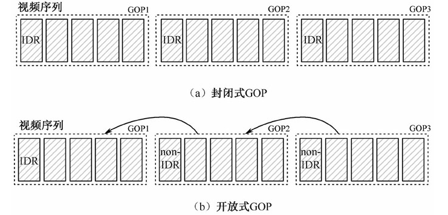
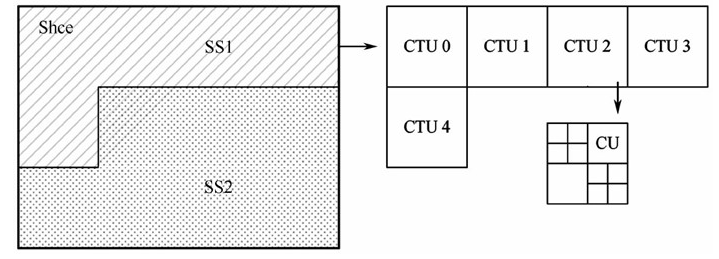
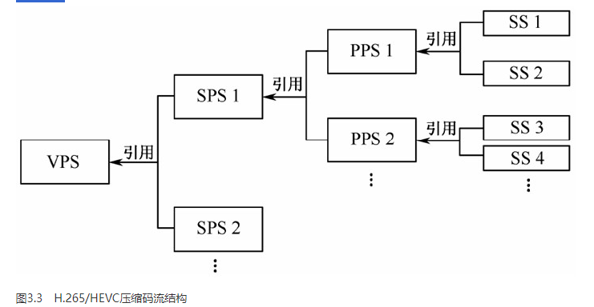

### 视频序列
视频序列由若干时间连续的图像构成，在对其进行压缩时，先将该视频序列分割为若干个小的图像组（Group Of Pictures，GOP）。

### GOP
在视频编码中，存在两种GOP类型：
封闭式GOP（Closed GOP）和开放式GOP（Open GOP），在封闭式GOP类型中，每一个GOP以IDR（Instantaneous Decoding Refresh）图像开始，各个GOP之间独立编解码。
在开放式GOP类型中，第一个GOP中的第一个帧内编码图像为IDR图像，后续GOP中的第一个帧内编码图像为non-IDR图像，也就是说，后面GOP中的帧间编码图像可以越过non-IDR图像，使用前一个GOP中的已编码图像做参考图像。

### Slice
每个GOP又被划分为多个片（Slice），片与片之间进行独立编解码。其主要目的之一是在数据丢失情况下进行重新同步。

### SS
每个片由一个或多个片段（Slice Segment，SS）组成。

### CTU
为了更灵活、更有效地表示视频内容，H.265/HEVC还引入了树形结构单元（Coding Tree Unit，CTU）这一概念，其类似于传统的宏块。

### CTB
每个CTU包括一个亮度树形编码块（Coding Tree Block，CTB）和两个色差树形编码块。 CTU= 亮度CTB + 2*色差CTB

### CU
一个SS在编码时，先被分割为相同大小的CTU，每一个CTU按照四叉树分割方式被划分为不同类型的编码单元（Coding Unit，CU）。

以上即为编码时的分层处理架构。一般来说，为了支持视频编码标准的通用性，ITU—T和ISO/IEC只规定码流的语法元素，以保证编码器的设计更为灵活。

### SPS 序列参数集
SPS包含了一个***CVS（Coded Video Sequence）中所有图像共用的信息***。其中CVS被定义为一个GOP编码后所生成的压缩数据。
SPS的内容大致包括解码相关信息，如档次级别、分辨率、某档次中编码工具开关标识和涉及的参数、时域可分级信息等。

### PPS 图像参数集
PPS包含***一幅图像所用的公共参数***，即一幅图像中所有SS引用同一个PPS。其大致内容包括初始图像控制信息，如初始量化参数（Quantization Parameter，QP）、分块信息等。

### VPS 视频参数集(H265上才有)
此外，为了兼容标准在其他应用上的扩展，例如可分级视频编码器、多视点视频编码器，H.265/HEVC的语法架构中增加了视频参数集（Video Parameter Set，VPS）。
其内容大致包括多个子层共享的语法元素，其他不属于SPS的特定信息等。对于一个SS，通过引用它所使用的PPS，该PPS又引用其对应的SPS，该SPS又引用它对应的VPS，最终得到SS的公用信息。

### 参数集

参数集是一个独立的数据单位，它包含视频的不同层级编码单元的共享信息，只有当参数集直接或间接被SS引用时才有效。一个参数集并不对应某个特定的图像或CVS，

同一个VPS或SPS可以被多个CVS引用，同一个PPS可以被多个图像引用。

### VCLU、non-VCLU

在H.265/HEVC中，NAL单元根据是否装载视频编码数据被分为
VCLU（Video Coding Layer NAL Unit）和non-VCLU。

非编码数据的参数集作为non-VCLU进行传输，这为传递关键数据提供了高鲁棒机制。

VPS--SPS--PPS-->SS

H.265/HEVC压缩码流的结构:

### 最终生成
片段SS是视频编码数据的基本单位，一个SS的压缩数据生成一个VCLU进行传输。

最终，一个视频序列的编码码流由一系列SS所生成的多个VCLU单元和夹杂其间的一些分割标示数据和参数集数据组成。

分割标示数据用于区分一个SS属于哪幅图像、哪个CVS。