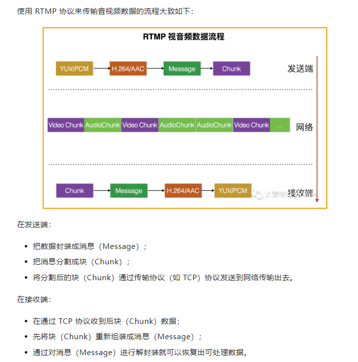
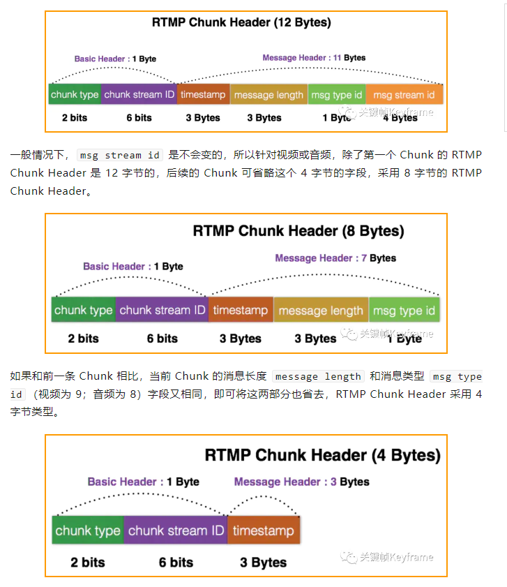
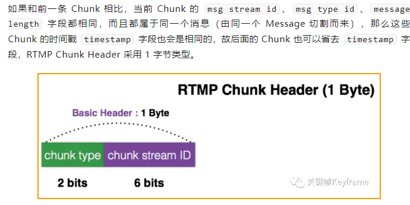
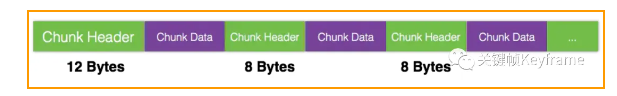

https://mp.weixin.qq.com/s?__biz=MjM5MTkxOTQyMQ==&mid=2257484827&idx=1&sn=249da45e5c2c6bff776fe0fdcff42548&scene=21#wechat_redirect


## 概念
RTMP 协议是 Real Time Message Protocol（实时信息传输协议）的缩写，它是由 Adobe 公司提出的一种应用层的协议，用来解决多媒体数据传输流的多路复用（Multiplexing）和分包（Packetizing）的问题。

### 实时直播场景最常见的传输协议之一
由于协议设计对低延时、音视频同步等能力的良好支持，RTMP 是实时直播场景，尤其是在推流上行链路中，最常用的传输协议之一。

## 传输流程


## 协议设计思想
1) 分包
消息，服务于数据封装，是 RTMP 协议中的基本数据单元；
块，服务于网络传输。

通过这种分层的设计，就**可以将大的消息（Message）数据分包成小的块（Chunk）通过网络来进行传输，这个也是 RTMP 能够实现降低延时的核心原因。**

2) 多路复用
在 RTMP 直播中，实时生成视频 Chunk 和音频 Chunk，依次加入到数据流，通过网络发送到客户端。这样的复用传输流，也是音视频同步的关键。

3) 优先级
块流（Chunck Stream）这一层没有优先级的划分，优先级的设计是放在『消息流（Message Stream）』这层来实现的。

4) 块大小协商

RTMP 发送端，在将消息（Message）切割成块（Chunk）的过程中，是以 Chunk Size（默认值 128 字节）为基准进行切割的。

Chunk Size 越大，切割时 CPU 的负担越小；但在带宽不够宽裕的环境下，发送比较耗时，会阻塞其他消息的发送。

Chunk Size 越小，利于网络发送；但切割时 CPU 的负担越大，而且服务器 CPU 负担也相对较大。不适用于高码率数据流的情况。

Chunk Size 是可以根据实际情况进行改变的，即通过发送控制命令 Set Chunk Size 的方式进行更新。

充分考虑流媒体服务器、带宽、客户端的情况，通过 Set Chunk Size 可动态的适应环境，从而达到最优效果。

5) 压缩优化
RTMP Chunk Header 的长度不是固定的，分为：12 字节、8 字节、4 字节、1 字节四种。

最完整的 RTMP Chunk Header 长度是 12 字节。



因为message的数据相同，所以一条一条压缩减小

当 Chunk Size 很大时，此时所有的 Message 都只能相应切割成一个 Chunk，后续的 Chunk 与前一条 Chunk 仅 msg stream id 相同。此时基本上除了第一个 Chunk 的 Header 是 12 字节外，其它所有 Chunk 的 Header都是 8 字节。


上面从整体上了解了 RTMP 的数据传输流程和协议设计思想后，我们来细看一下『消息（Message）』和『块（Chunk）』。
## 消息概念
### 消息格式
RTMP 的消息分为两个部分：
- 消息头
- 有效负载

其中消息头包含以下几个字段：
- 消息类型（Message Type），1 字节，表示消息类型。其中 1-6 的取值是保留给协议控制消息使用的。
- 长度（Length），3 字节，表示有效负载的长度（不包含消息头的长度）。单位是字节，使用大端格式。
- 时间戳（Timestamp），4 字节，表示消息时间戳。使用大端格式。
- 消息流 ID（Message Stream ID），3 字节，用来标识消息流。使用大端格式。

消息头的结构如下所示：
```js
0                   1                   2                   3
 0 1 2 3 4 5 6 7 8 9 0 1 2 3 4 5 6 7 8 9 0 1 2 3 4 5 6 7 8 9 0 1
+-+-+-+-+-+-+-+-+-+-+-+-+-+-+-+-+-+-+-+-+-+-+-+-+-+-+-+-+-+-+-+-+
| Message Type  |                Payload length                 |
|   (1 byte)    |                  (3 bytes)                    |
+-+-+-+-+-+-+-+-+-+-+-+-+-+-+-+-+-+-+-+-+-+-+-+-+-+-+-+-+-+-+-+-+
|                       Timestamp                               |
|                       (4 bytes)                               |
+-+-+-+-+-+-+-+-+-+-+-+-+-+-+-+-+-+-+-+-+-+-+-+-+-+-+-+-+-+-+-+-+
|                Stream ID                      |
|                (3 bytes)                      |
+-+-+-+-+-+-+-+-+-+-+-+-+-+-+-+-+-+-+-+-+-+-+-+-+
```
### 消息类型

### 消息交互实例
#### 1) 握手顺序
RTMP 协议本身并没有规定这 6 个消息的具体传输顺序，但 RTMP 协议的实现者需要保证这几点：

- 客户端发送 C0 和 C1 块开始握手。
- 客户端必须（MUST）等接收到 S1 后才能发送 C2。
- 客户端必须（MUST）等接收到 S2 后才能发送其它数据。
- 服务器必须（MUST）等接收到 C0 才能发送 S0 和 S1，也可以（MAY）等接到 C1 一起之后。
- 服务器必须（MUST）等到 C1 才能发送 S2。
- 服务器必须（MUST）等到 C2 才能发送其它数据。


#### 5） 握手示意图
```js
+-------------+                            +-------------+
|   Client    |      TCP/IP Network        |     Server  |
+-------------+             |              +-------------+
       |                    |                     |
Uninitialized               |                Uninitialized
       |        C0          |                     |
       |------------------->|           C0        |
       |                    |-------------------->|
       |        C1          |                     |
       |------------------->|           S0        |
       |                    |<--------------------|
       |                    |           S1        |
  Version sent              |<--------------------|
       |        S0          |                     |
       |<-------------------|                     |
       |        S1          |                     |
       |<-------------------|               Version sent
       |                    |           C1        |
       |                    |-------------------->|
       |        C2          |                     |
       |------------------->|           S2        |
       |                    |<--------------------|
    Ack sent                |                   Ack Sent
       |        S2          |                     |
       |<-------------------|                     |
       |                    |           C2        |
       |                    |-------------------->|
Handshake Done              |               Handshake Done
      |                     |                     |
          Pictorial Representation of Handshake
```
下面是握手图示中提到的各个阶段具体内容：

- 未初始化（Uninitialized）：协议的版本发送出去的这个阶段。客户端与服务器都是未初始化态。客户端在 C0 中发送协议版本。如果服务器支持这个版本，它将回应 S0 和 S1。如果不支持，服务器将会采取适当措施的回应。在 RTMP 中，这个措施是终止连接。

- 版本已发送（Version Sent）：客户端和服务器在未初始化态后是版本已发送态。客户端等待 S1，服务器在等待 C1。在接收到响应包后，客户端发送 C2，服务器发送 S2。状态就变成了确认已发送。

- 确认已发送（Ack Send）：客户端和服务器分别在等 S2 和 C2。

- 握手完成（Handshake Done）：客户端与服务器可以交换消息了。


#### 发布录制视频
#### 广播共享对象
#### 发布来自录制流的 Metadata 


## 块概念