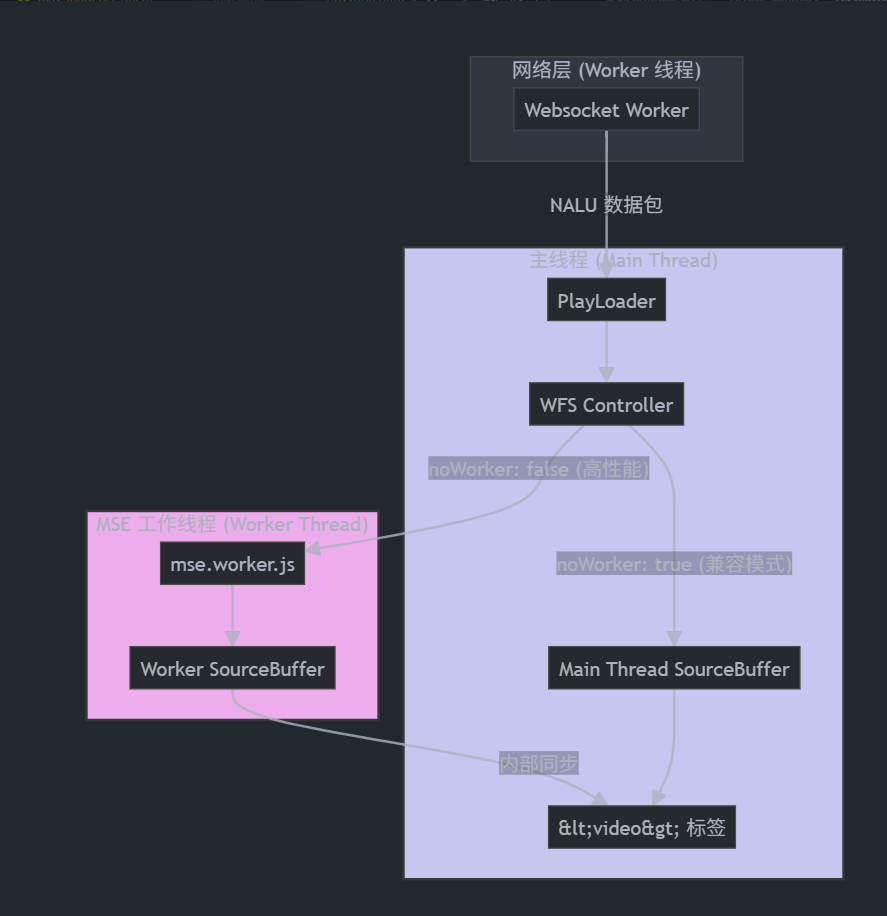
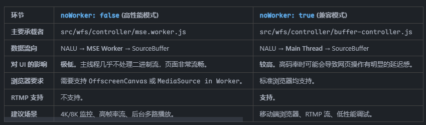
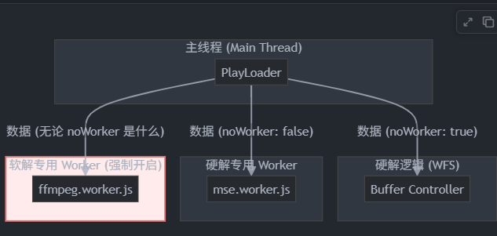

noWorker 是一个关键的架构设计开关。它决定了视频流最耗资源的环节——数据转封装（Remuxing）与缓冲区管理（Buffer Management）是在主线程（UI 线程）还是在独立的 Web Worker 线程中执行。
## 1. 深度解析：noWorker 的用处
### 核心矛盾：UI 响应 vs 数据吞吐
- 主线程压力：浏览器的主线程既要负责页面渲染（DOM 操作、点击、动画），又要负责视频数据的解析和填充。如果视频是 4K/8K 或高码率流，数据处理会非常频繁，导致主线程“卡死”，用户发现网页点不动，甚至视频画面花屏。
- Worker 方案：将耗时的二进制数据操作（如 appendBuffer）移到 Worker 线程。这样主线程只负责简单的逻辑分发，极大地提高了播放器在低配电脑或处理超高清流时的稳定性。

### 具体用处：
1. 性能优化 (noWorker: false)：利用多核 CPU。Worker 线程像一个专职的“后勤员”，在后台拼命打包视频片段，主线程只需要把结果贴到屏幕上。
2. 协议降级 (isRtmp)：当播放 RTMP 流时，由于 RTMP 解析器的特殊性，项目强制关闭 Worker 模式以保证兼容性。
3. 兼容性兜底：部分移动端浏览器不支持在 Worker 中操作 MediaSource API，此时必须设置noWorker: true 才能正常播放。

## 2. 流程对比图
下图展示了在 WFS（硬解） 模式下，开启与关闭 noWorker 的数据流转路径：
 

## 3. 两种模式的详细对比
 

4. 总结
在你的 h5-player 项目中，noWorker 就像一个“卸载器”。
默认（false）时，它把繁重的数据处理任务卸载给 Worker。
当协议（RTMP）不支持或环境不稳定时，它作为一个“安全降级”手段，回退到主线程运行，确保“能播”是第一优先级。

## 为什么软解不需要worker?
1. 软解的天生特性：必须异步
软解是通过 ffmpeg.worker.js 实现的。FFmpeg 的解码计算量极其庞大（涉及大量的数学运算），如果直接放在主线程运行，浏览器会瞬间假死，连鼠标都动不了。
因此，在 play-loader.js 的构造函数中（第 71 行），无论 noWorker 是什么值，wasmPlayer 内部都会启动自己的 FFmpeg Worker。

2. 软解与 noWorker 参数的关系
虽然 play-loader.js 在调用 this.currPlayer.open(sdp, true, this.noWorker) 时传了这个参数，但在软解逻辑（wasm-player.js）中，这个参数通常被忽略或有不同含义。
硬解 (WFS)：noWorker 决定是否开启 MSE Worker（用于操作 MediaSource）。
软解 (Wasm)：noWorker 对它没有意义，因为 Wasm 必须跑在 Worker 里。

3. 为什么硬解需要开关，而软解不需要？
解码方式	核心处理者	对 Worker 的依赖	为什么？
硬解 (WFS)	浏览器内置解码引擎	可选	硬解大部分工作由 GPU 完成。如果不开启 Worker，主线程只需做少量的“打包”工作。开启 Worker 只是为了极致的 UI 顺滑。
软解 (Wasm)	FFmpeg (CPU 计算)	强制/必须	软解全靠 CPU 硬算。不放 Worker 会导致主线程每秒卡顿几十次，网页完全无法使用。

 

