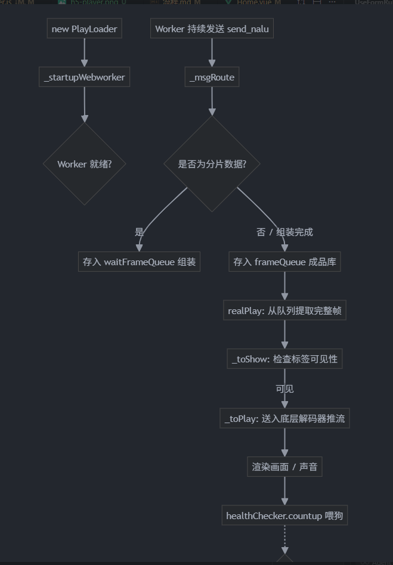
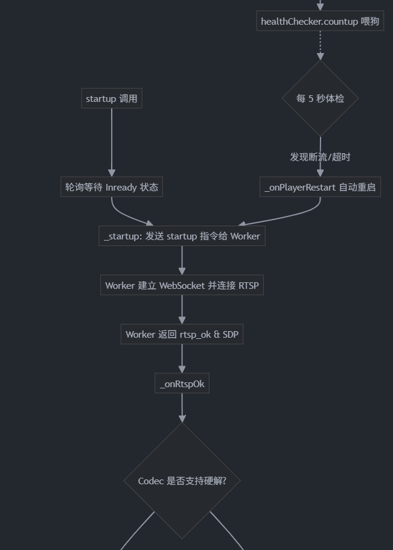
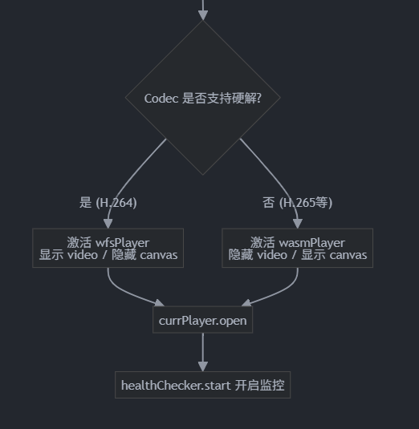

## 方法列表 (Methods List)
### 公开方法 (Public Methods)
constructor(option): 初始化播放器。创建事件总线、心跳检查器、初始化硬/软解码器实例，并启动后台 Worker。
startup(rtsp, ...): 外部启动接口。内部使用轮询确保 Worker 就绪后再真正启动流连接。
shutdown(msg): 停止播放。重置队列、通知 Worker 关闭、停止心跳、关闭当前解码器。
pause(rtsp, msg): 暂停播放逻辑（通知 Worker 停止推流）。
playAfterPause(rtsp, msg): 暂停后的恢复播放逻辑。
destroy(): 彻底销毁播放器实例，释放所有内存和监听器。
on(event, func) / off(event, func): 事件监听与解绑的快捷入口。
emit(event, args): 带有状态过滤的事件触发方法。
realPlay(): 核心渲染驱动。从 frameQueue 中提取完整帧并送入解码器。

### 私有/内部方法 (Private/Internal Methods)
_startup(rtsp, ...): 真正的启动逻辑，通过 postMessage 向后台 Worker 发送连接指令。
_startupWebworker(): 初始化并挂载 WebsocketWorker 线程。
_closeWebWorkerWebsocket(): 强制终止 Worker 线程。
_msgRoute(event): 数据总线。处理 Worker 回传的所有消息（如：rtsp_ok、send_nalu 等）。
_onRtspOk(sdp, isRtmp): 决策方法。解析 SDP 后根据 Codec 决定使用 wfsPlayer（硬解）还是 wasmPlayer（软解）。
_onPlayerRestart(): 故障自愈。当心跳检测异常时，执行自动重连逻辑。
_toShow(): 视图切换。根据当前激活的解码器，控制 <video> 和 <canvas> 的显示隐藏，并处理标签后台隐藏时的挂起逻辑。
_toPlay(playList): 解码器推数。将组装好的帧数据推入 wfsPlayer 或 wasmPlayer 的缓冲区。
_updateSps(sps, enforce): 动态更新视频序列参数集（SPS）。
_onPlayerSync(): 处理多路播放时的同步逻辑，清空缓冲区。

## 核心播放流程图

