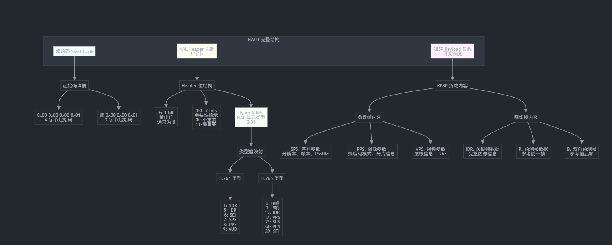

## 1. 帧类型 vs 关键帧的区别
帧类型: 
定义: NALU 单元的类型分类	
包含类型: 参数帧：SPS、PPS、VPS、SEI、AUD 图像帧：IDR、NDR、P、B	
作用: 标识 NALU 的内容性质

关键帧:	
定义:可以独立解码的帧	
包含类型:仅 IDR 帧（Instantaneous Decoder Refresh）	
作用: 解码的起始点，不依赖其他帧

核心区别：
帧类型是分类概念，包含参数帧和图像帧
关键帧是功能概念，只有 IDR 帧是关键帧
IDR 帧既是帧类型（图像帧），也是关键帧

## 2. NALU完成格式结构图
 

## 3.  NAL Header 字节详解
以 H.264 为例，一个典型的 NAL Header 字节：
┌─────────────────────────────────────────────────────────┐
│                    NALU 单元                           ├─────────────────────────────────────────────────────────┤
│  起始码 (Start Code)      │  4 字节: 0x00 0x00 0x00 0x01│
│                           │  或 3 字节: 0x00 0x00 0x01  │├─────────────────────────────────────────────────────────┤
│  NAL Header               │  1 字节                      │
│  ┌─────────────────────┐  │                             │
│  │ F  │ NRI │  Type    │  │  F: 1 bit (禁止位)          │
│  │ 1  │ 2   │  5 bits  │  │  NRI: 2 bits (重要性)       │
│  └─────────────────────┘  │  Type: 5 bits (类型)        │├─────────────────────────────────────────────────────────┤
│  RBSP Payload             │  可变长度                    │
│  (原始字节序列负载)        │  实际视频/音频数据            │

 Type: 5 bits (类型)   
 H.264类型: 
 1 NDR
 5 IDR
 6 SEI
 7 SPS
 8 PPS
 9 AUD

 H.265类型:
 0 B帧
 1 P帧
 19 IDR
 32 VPS
 33 SPS
 34 PPS
 39 SEI

 RBSP: 
 a.参考帧内容:
 SPS 序列参数,分辨率 帧率 Profile
 PPS 推向参数:熵编码模式\分片信息
 VPS 视频参数 层级信息H.265
 b.图像帧内容
 IDR: 关键帧数据,完整图像信息
 P: 预测帧数据,参考前一帧
 B: 双向预测帧,参考前后帧

## 常见 NALU 类型对照表
NAL Type	H.264 值	H.265 值	名称	是否为关键帧	说明
SPS	7	33	Sequence Parameter Set	❌	序列参数集（分辨率、帧率）
PPS	8	34	Picture Parameter Set	❌	图像参数集（编码参数）
VPS	-	32	Video Parameter Set	❌	视频参数集（H.265 专用）
IDR	5	19	Instantaneous Decoder Refresh	✅	关键帧（独立解码）
NDR	1	-	Non-IDR	❌	非关键帧（I 帧但不是 IDR）
P	-	1	Predictive	❌	预测帧（参考前一帧）
B	-	0	Bi-predictive	❌	双向预测帧
SEI	6	39	Supplemental Enhancement Info	❌	补充增强信息

4. 实际 NALU 示例
示例 1：SPS NALU（H.264）
示例：0x67 (二进制: 0110 0111)
位布局：
┌───┬─────┬─────────┐
│ F │ NRI │  Type   │
├───┼─────┼─────────┤
│ 0 │ 11  │ 00111   │
└───┴─────┴─────────┘
 │   │     │ 
 │   │     └─> Type = 7 (十进制) = SPS
 │   └───────> NRI = 3 (最重要) 
 └───────────> F = 0 (正常)

示例 2：IDR 帧 NALU（H.264）
十六进制数据：00 00 00 01 67 64 00 1F AC D9 40 50 05 BB 01 10 ...
解析：
┌─────────────────┬────────────────────────────────┐
│ 00 00 00 01      │ 起始码                          │├─────────────────┼────────────────────────────────┤
│ 67              │ NAL Header                     │
│                 │ - F = 0                         │
│                 │ - NRI = 3 (最重要)             │
│                 │ - Type = 7 (SPS)                │├─────────────────┼────────────────────────────────┤
│ 64 00 1F AC ... │ RBSP Payload                    │
│                 │ 包含：分辨率、帧率、Profile 等   │