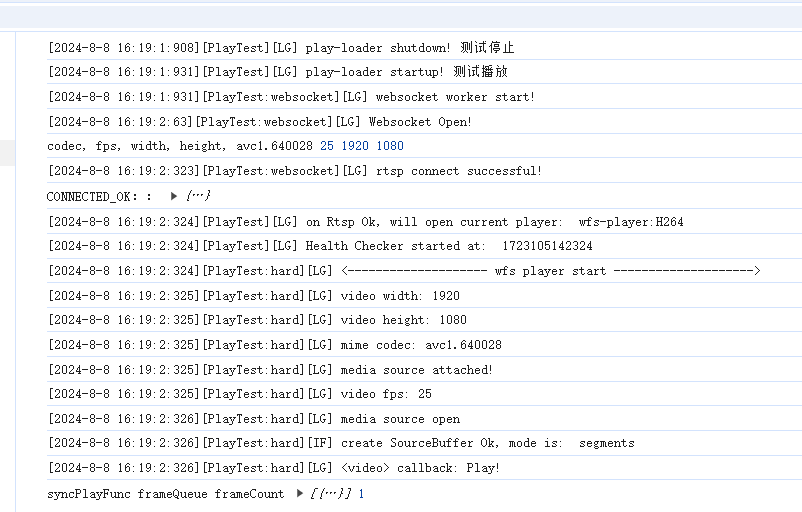
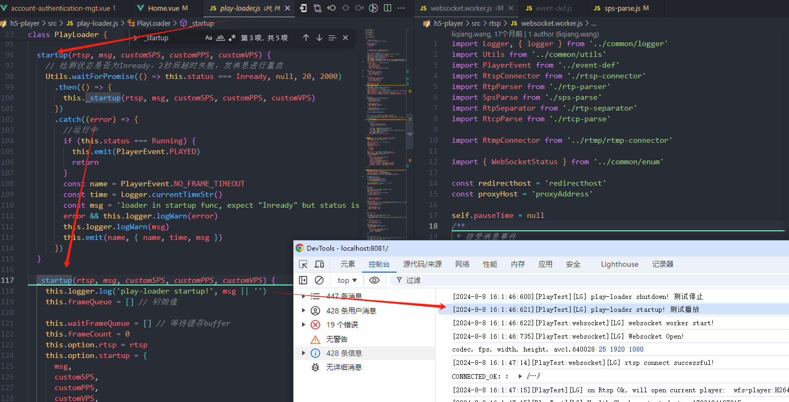
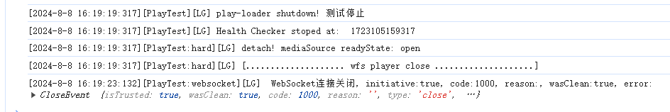

## 流程
- 摄像头将画面进行编码(rtsp/rtmp)
- 通过tcp to websocket传输到浏览器/代码(mediaSource)
- 通过帧数据再组装成fmp4提供给浏览器的api MediaSource解码，解码成功后即可看到视频的实时画面。(视频/图)

## 开始播放

## play
1. 开始了，先去停止，然后再开启 调用play-loader的startup

## 停止播放
