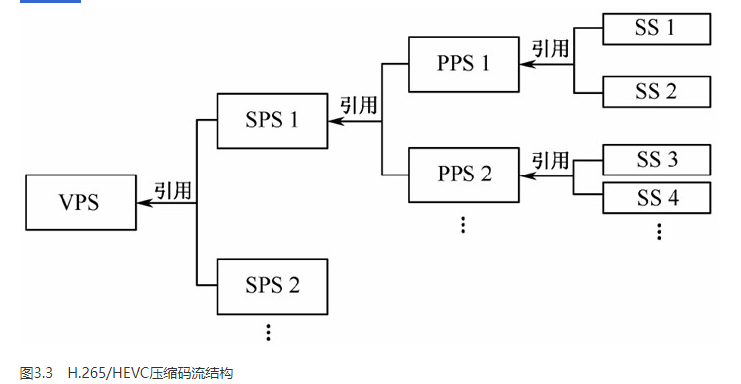

## 硬解码 不使用CPU进行编码。
使用显卡GPU,专用的DSP、FPGA、ASIC芯片等硬件进行编码。

性能高，低码率下通常质量低于硬编码器，
但部分产品在GPU硬件平台移植了优秀的软编码算法（如X264）的，质量基本等同于软编码。

## 软解码 使用CPU进行编码
实现直接、简单，参数调整方便，升级易，
但CPU负载重，性能较硬编码低，低码率下质量通常比硬编码要好一点。

## 健康检查
health-checker 播放健康检查器
四个阶段：
### 第一阶段：初始化与启动
1. 构造：在 PlayLoader 初始化时，HealthChecker 被创建。
2. 启动 (start)：当视频流成功连接并准备播放时，PlayLoader 调用 start()。
3. 定时器：开启一个 setInterval，每 5 秒执行一次 healthyCheck()。
### 第二阶段：数据喂养 (Feeding the Dog)
1. 每当主逻辑 PlayLoader 接收到一帧数据并准备播放时，会调用 this.healthChecker.countup(1)。
2. 这个动作会增加 frameCount 的值。
### 第三阶段：周期性体检 (healthyCheck)
每 5 秒钟，定时器触发体检逻辑：
1. 流检查 (noFrameCheck)：
- 检查 frameCount 是否为 0？
- 如果是 0：说明这 5 秒内一帧数据都没收到！
- 动作：打印警告日志，发出 NO_FRAME_TIMEOUT 事件，并停止检查器。PlayLoader 监听到这个事件后，通常会尝试重新连接。
2. 时长检查 (overtimeCheck)：
- 检查当前时间距离播放开始时间是否超过了 2 小时？
- 如果超过：说明跑太久了。
- 动作：发出 PLAYER_REBOOT 事件。这会触发播放器的完整重启流程。
3. 重置：将 frameCount 清零，准备下一个 5 秒的统计。
### 第四阶段：停止
当用户手动关闭视频或切换频道时，调用 stop()，清除定时器，停止监控。

## sdp
Session Description Protocol（会话描述协议）
SDP 扮演着“流媒体身份证”的角色。当播放器通过 RTSP 协议与服务器建立连接成功后，服务器会发回一段文本（即 SDP），告诉播放器这个视频流的具体信息。
包含信息：
- 媒体类型 (Type)：是视频（video）还是音频（audio）。
- 编码格式 (CodecMime)：例如 H264、H265、PCMA 等。这是播放器决定走“硬解”还是“软解”的唯一依据。
- 控制地址 (Control URL)：用于后续发送播放、暂停等指令。
- 关键参数 (SPS/PPS)：视频解码所必须的配置信息（如分辨率、帧率、Profile 等）。

### SPS 序列参数集
SPS包含了一个***CVS（Coded Video Sequence）中所有图像共用的信息***。其中CVS被定义为一个GOP编码后所生成的压缩数据。
SPS的内容大致包括解码相关信息，如档次级别、分辨率、某档次中编码工具开关标识和涉及的参数、时域可分级信息等。

### PPS 图像参数集
PPS包含***一幅图像所用的公共参数***，即一幅图像中所有SS引用同一个PPS。其大致内容包括初始图像控制信息，如初始量化参数（Quantization Parameter，QP）、分块信息等。

### VPS 视频参数集(H265上才有)
此外，为了兼容标准在其他应用上的扩展，例如可分级视频编码器、多视点视频编码器，H.265/HEVC的语法架构中增加了视频参数集（Video Parameter Set，VPS）。
其内容大致包括多个子层共享的语法元素，其他不属于SPS的特定信息等。对于一个SS，通过引用它所使用的PPS，该PPS又引用其对应的SPS，该SPS又引用它对应的VPS，最终得到SS的公用信息。

VPS--SPS--PPS-->SS

H.265/HEVC压缩码流的结构:

## NAL
在RBSP头部加上NAL Header来组成一个一个的NAL单元
## NALU
NAL unit 单元， IDR就是由一个借一个的NALU组成

## H264(AVC)
高级视频编码（Advanced Video Coding，简称 AVC），
是一种被广泛使用的高精度视频的录制、压缩和发布格式。

## H265(HEVC)
高效率视频编码（High Efficiency Video Coding，简称 HEVC），是 H.264 的继任者。
提升了图像质量,同时达到H.264两倍的压缩率（等同于同样画面质量下比特率减少了 50%）,支持4K甚至超高画质电视

## HLS

## FLV M3U8

## 关键帧 I P B

## 裸流
即H.264原始编码，由一个接一个NAL单元组成的

## 过程！！！
视频编码层（VCL）生成的SODB ---> 
在后面添加比特结尾，字节对齐生成rtsp ----> 
在头部加上NAL header生成NAL单元 

H.264原始码流（即裸流） = NAL+ NAL+NAL+ N*NAL；
NAL = MAL Header + RBSP 
RBSP = （VCL生成的）SODB + 结尾比特（对其字节）

在 H.264/H.265 编码中，视频数据层层嵌套，关系如下：
SODB → RBSP → EBSP → NALU
SODB (String Of Data Bits)：最原始的二进制码流，长度不一定是 8 的倍数（按 bit 计算）。
RBSP (Raw Byte Sequence Payload)：在 SODB 的末尾添加“补齐位”（Trailing Bits），确保数据长度变成 整字节。
EBSP (Encapsulated Byte Sequence Payload)：在 RBSP 的特定位置插入“防止竞争字节”（0x03），防止数据中意外出现和起始码（0x000001）冲突的序列。
NALU (Network Abstraction Layer Unit)：在 EBSP 前面加上一个字节的 NAL Header（标识帧类型，如 I 帧、P 帧、SPS 等）。

[ NAL Header ] + [ EBSP ]  =  NALU 
                   ↓
              [ RBSP ] (去掉了防止竞争码 0x03 的纯净字节)
                   ↓
              [ SODB ] (真正的原始视频比特流)

## RTMP和RTSP
RTSP/RTMP：管“怎么运”。
SDP：管“运的是啥”。
NALU：管“怎么装箱”。
RBSP：管“箱子里的干货”。
### rtp 传输数据 （Real-Time Transport Protocol）

### rbsp   (Raw Byte Sequence Payload，原始字节序列负载) 与 RTSP、RTMP 完全不在一个维度。
在网络适配层NAL,是对图像序列、图像等片级别以上的概念的定义;
该层将上一层VCL层输出的SODB(string of data bite)数据打包成RBSP;
SODV是编码后的原始数据，RBSP是在原始编码数据后添加结尾比特，用于字节对齐。
再在RBSP头部加上NAL Header来组成一个一个的NAL单元

### RTMP Real time message protocol 实时信息传输协议
用来解决多媒体数据传输流的***多路复用***（Multiplexing）和***分包***（Packetizing）的问题。

传输的数据叫message,包含音视频数据和指令,但是会分成chunk发送
典型场景: 互联网直播推流（如主播把画面推送到抖音、B站服务器）、CDN 分发。

是一种基于 TCP 的协议，它提供低延迟的通信，使得它非常适合需要实时互动的应用，如直播流。由于现代网络技术的发展和 HTML5 的广泛采用，RTMP 逐渐被 HLS 和 DASH 这样的 HTTP 基础的流媒体协议所取代。

#### 为什么要折腾出 RBSP 这个概念？
- 字节对齐：计算机处理字节（Byte）比处理位（Bit）快得多。RBSP 确保了复杂的视频压缩算法（SODB）最终能以整齐的字节流形式存在。
- 数据纯净：解码器（如你的 wfsPlayer 或 wasmPlayer）在真正开始解码画面前，必须先把 NALU 里的 Header 去掉，把 EBSP 里的 0x03 过滤掉，还原回 RBSP。只有拿到 RBSP，解码器才能进行熵解码，还原出图像。

### RTSP - Real-Time Streaming Protocol（实时流传输协议）。
这是一种控制协议，提供了一个框架以便控制流媒体服务器，使客户端能够在实时基础上与媒体服务器进行交互，如播放、暂停和停止视频流。
RTSP 本身不传输数据流，它依赖于 RTP（Real-Time Transport Protocol）来传输媒体数据。

典型场景：安防监控（海康、大华摄像头几乎都用 RTSP）、网络广播、私有对讲系统。

### 关系与区别
1、应用层定义不同：
- RTMP 直接封装音视频数据并在连接上提供多路复用和分包的功能，适合需要低延迟的实时交互场景。
- RTSP 主要用于控制流媒体的播放状态，如播放、暂停等，并不负责数据传输本身。

2、基于不同协议：
- RTMP 基于 TCP，保证数据传输的可靠性和顺序。
- RTSP 可以使用 TCP 或 UDP 与 RTP 结合使用来传输视频数据，其中 RTP 负责数据传输。

3、使用场景：
RTMP 通常用于直播应用，如 Twitch 和 YouTube Live。
RTSP 通常用于监控摄像头流、会议视频流等需要远程控制的应用。

一旦解析出原始视频帧，协议的差异就消失了。播放器会统一根据 SDP 里的编码格式（H.264 或 H.265）来决定是送去 WFS (硬解) 还是 Wasm (软解)。

### RTP 与 RBSP/NALU 的包含关系（嵌套套娃）
这是最核心的物理结构关系，我们可以用一个“剥洋葱”的模型来看：
- 最外层：RTP Packet
Header 包含：序列号（防止乱序）、时间戳（用于音视频同步）。
- 中间层：NALU (网络抽象层单元)
Header 包含：这一帧是什么类型（I 帧、P 帧等）。
- 内核层：RBSP (原始字节序列负载)
这是真正的视频压缩干货。
公式表达：
RTP 包 = [RTP Header] + [NALU Header + RBSP]

术语	角色	相当于快递里的...	所在的层级
RTSP	协议控制	快递公司的下单/查询系统	应用层（控制）
RTMP	协议传输	顺丰/京东这种自营快递方案	应用层（全能）
RTP	数据封装	快递员的小推车/包裹袋	传输层/应用层（运输）
NALU	逻辑单元	每个包裹里的独立包装盒	视频编码层（包装）
RBSP	原始数据	包装盒里的纯净商品	视频编码层（内核）