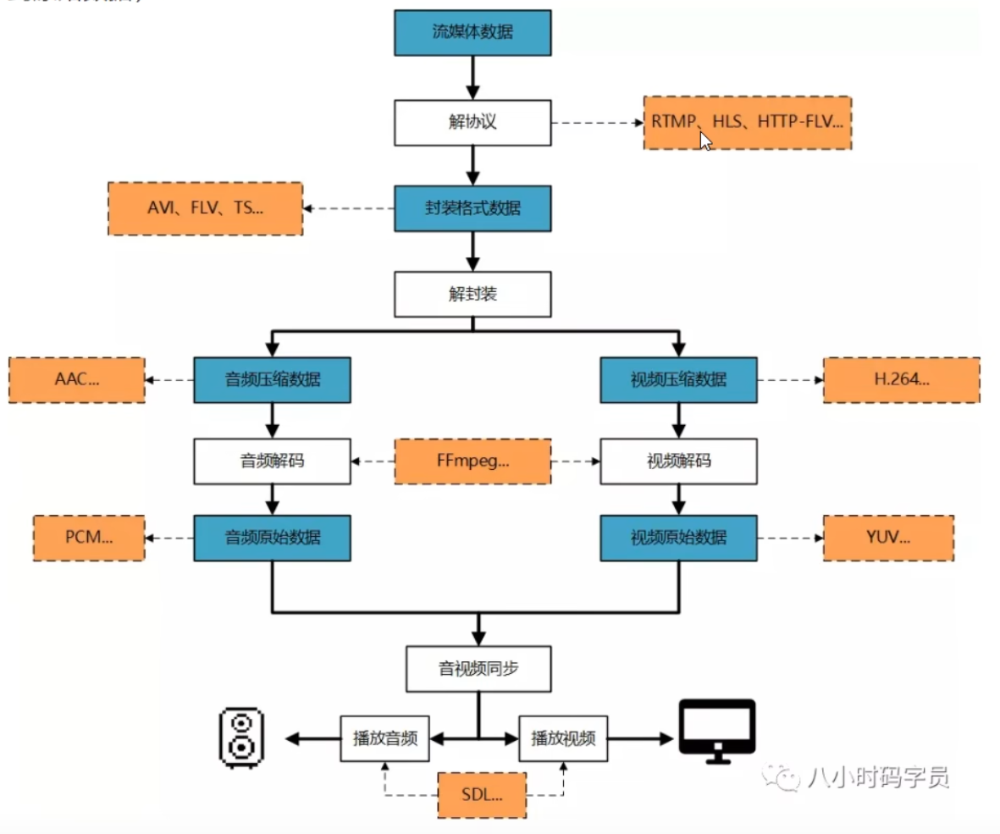
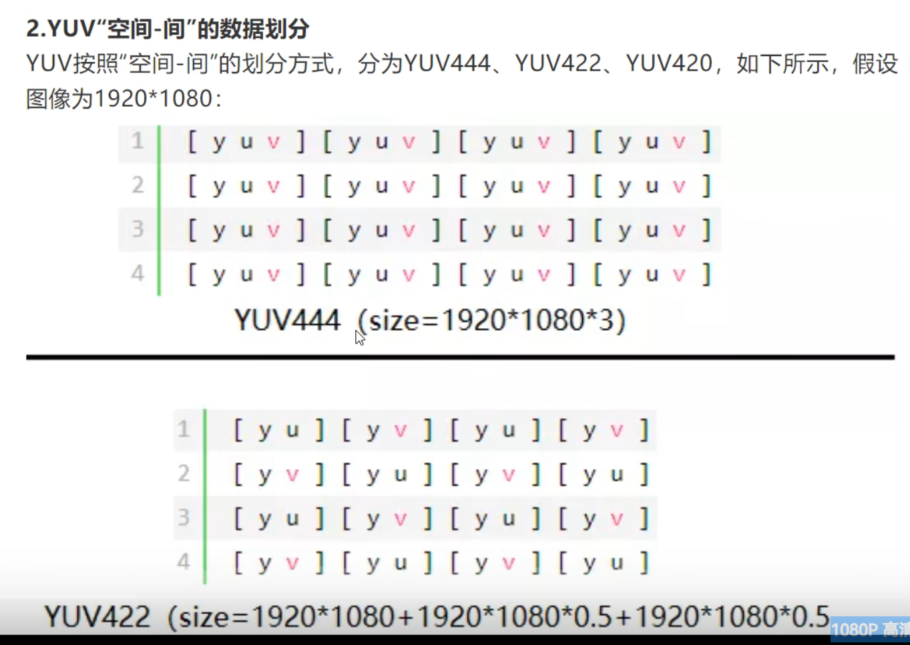
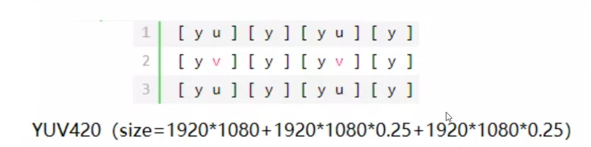
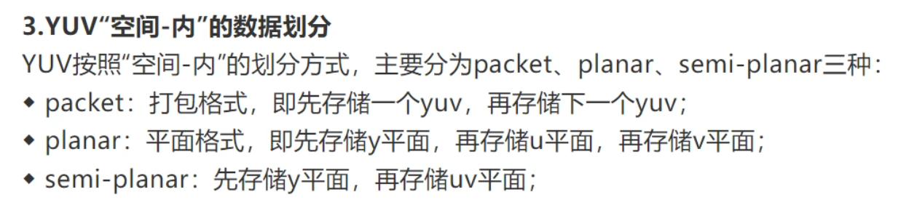
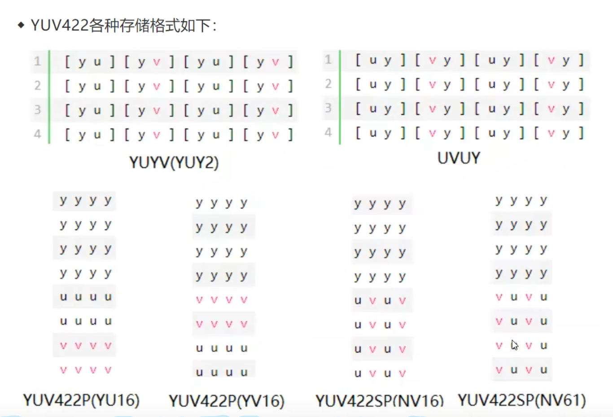
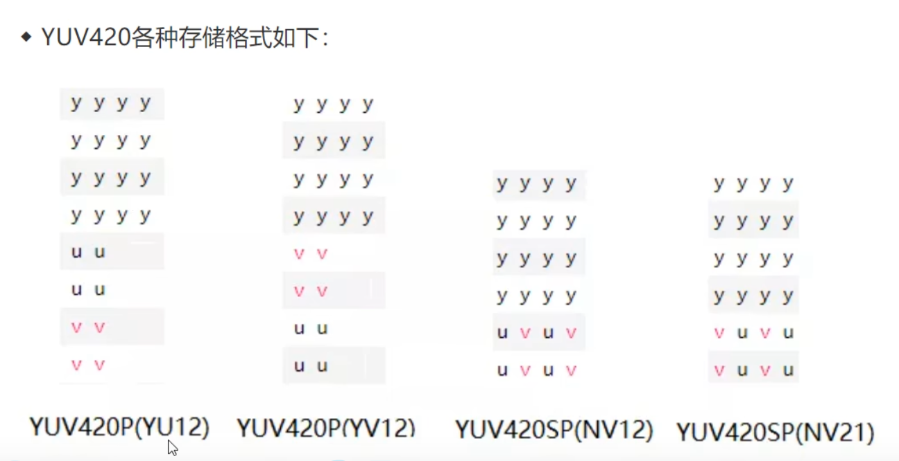
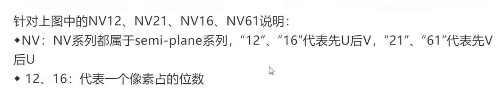

## 音视频原理
解协议
  |
解封装
  |
解码
  |
音视频同步
  |
播放

（如果是本地播放，没有接协议这步）

## 图像篇
### YUV 空间-间 划分

相邻的4个像素点理解为一个整体，共享1个v和1个u，所以比例为4：1：1

YUV444 1:1:1
YUV422 2:1:1
YUV420 4:1:1 

为什么用444而不是像素比111或者221呢，因为YUV420的比例

### YUV 空间-内 划分

ps： uv顺序可变

Y占8比特， 
YUV422: Y 8 U 4 V 4 = 16
YUV420： Y 8 U 2 V 2 = 12

## H.264
### 高度压缩数字视频编解码器标准。

### H.264的数据格式是怎样的?
H.264由视频编码层(VCL)和网络适配层(NAL)组成。
- VCL:H264编码/压缩的核心，主要负责将视频数据编码/压缩，再切分
- NALU = NALU header + NALU payload

### VCL是如何管理H264视频数据？
- 压缩：预测（帧内预测和帧间预测）-> DCT变化和量化 -> 比特流编码；
- 切分数据，主要为了第三步。"切片(slice)"、“宏块(macroblock)"是在VCL中的概念，一方面提高编码效率和降低误码率、另一方面提高网络传输的灵活性。
- 包装成『NAL』。
-『VCL』最后会被包装成『NAL』
