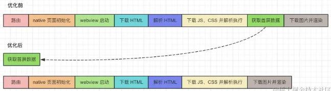
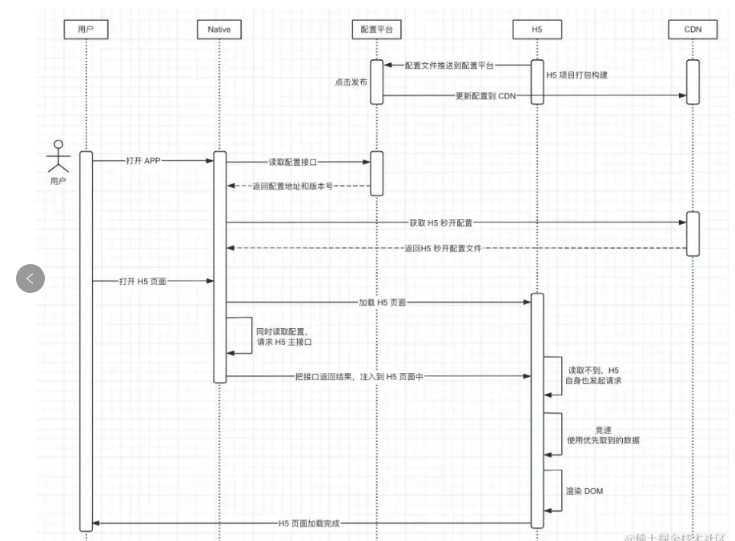
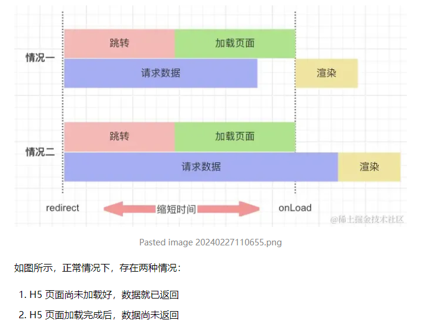
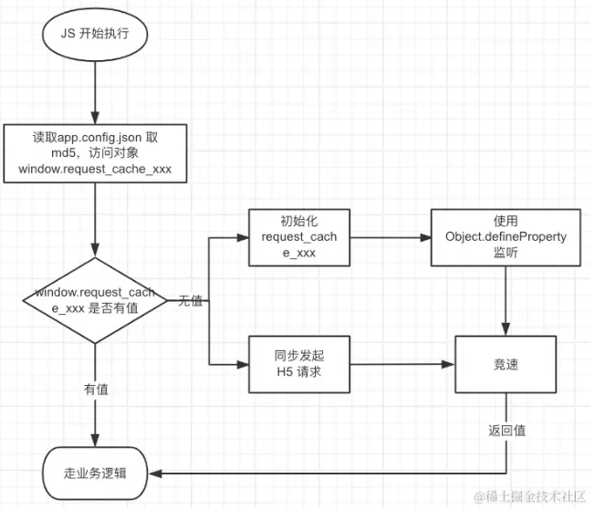

## 低成本的 H5 秒开方案-接口预请求

### 提升打开速度方法
有从网络优化入手的 CDN、gzip压缩、Keep-Alive等，有从加载优化入手的资源大小优化、懒加载、按需加载、代码拆分、Tree Shaking等，以及页面渲染时的一些优化


### 接口预请求
打开 APP 内的 H5 页面时，一般会经过原生切页面动画、创建新页面、加载 webview、加载 HTML、请求静态资源并解析、获取首屏数据、渲染内容、下载图片等步骤。

其实在加载的同时，可以***利用 APP 在帮助 H5 获取首屏数据，这样在 H5 页面加载完成后，可以直接使用 APP 已请求的首屏数据进行渲染***，这样就节省了获取首屏数据的时间。首屏数据接口越慢，该方案的价值就越大。



### 为什么是接口预请求而不是SSR
SSR:服务端渲染，一般由前端使用nodejs在服务器进行页面渲染，服务器返回的是携带了具体数据的html文本。减少了摆白屏时间，但相较于接口预请求有以下问题：

- 需要有完善的基于 nodeJS 的服务器运维、监控、告警等支持。这块是最大问题，大多数公司的服务端是基于 Java 等，缺乏对 nodeJS 的运维经验，但是由前端团队来做这一块支持，对有C 端访问量的项目也不保险。
- 需要更多的服务器负载均衡，消耗更多的服务器自由。而接口预请求计算是在客户端，不增加服务端复杂度。

## 方案
问题：
1、告诉app打开那些页面时需要请求那些接口，参数是什么？
2、把结果给h5页面并防止h5自身再发起重复请求，增加服务器负担？
3、如果h5修改了代码，而告知app的入参配置未更新，怎么避免使用旧配置请求结果？


### h5项目接口预请求配置
- 每个h5项目添加一个app.config.js配置文件，配置该页面要请求的接口。
单页面配置：（也可以多页面配置）
```js
{    
    pageName: '页面名称',
    key: 'H5页面的URL',   //页面唯一路径，作为key
    preRequest: {        // 接口预请求配置
        appVersion: '8.0.1', // 支持app最低版本号，为了处理APP识别字段新增等变更情况
        support: 0,      // 是否支持接口预请求，0 | 1
        apis:[           // 预请求接口信息，数组
            {
                fragment: "#/detail", // 新增fragment 指定对应的路由（hash模式）页面
                url: 'https://xxxx/api/address', // 请求url
                method: 'get',                      // 请求类型，如get|post，不传默认get
                header: {},                         // 请求头，规则同请求体
                body:{                              // 请求体
                    shopId: "getUserInfo.shopId:String|''",
                    cityId:'getLocation.cityId:Int',
                    key5:'params.orderId',
                    key6:'params.xxx'
                }
            }
        ]
    }
}
```
- 告诉app去哪里取参数。比如上面的body中：
    params.orderId 是在url接口上取参，
    getUserInfo.shopId 通过 JSBridge 在 APP 内获取，比如全局的用户信息等。
    只需要跟app约定好，比如入参type=1 是在哪里取参。

## 配置文件下发给app
构建完成，发布上线后，在H5配置平台打开预请求开关，由配置文件读取所有的配置页面，生成json文件，命名：h5config.xxx.js (xxx版本号)，并配置文件上传至CDN

用户打开时，通过接口下发最新文件的 地址和版本，与APP本地缓存的文件比较，判断是否要拿最新的配置文件。

配置文件长这样：
```js
{
 version: "0.0.1",
 global:{
  // 全局配置
 },
 pages: [
  {
   key: "https://xxx.com/pages/xxx.html", 
   pageName: "XXX活动页", 
   openImageCache: 0, // 是否开启图片缓存，0关闭，1开启 
   openPreRequest: 1, // 是否开启接口预请求，0关闭，1开启 
   config: {
    // 上面的单个页面配置生成而来
   }
  }
 ]
}
```

## 同步请求结果并避免h5重复请求
通过 APP 在获取到结果，并且 webview 触发“onLoad ”事件后，把数据注入到 window 对象下。


不管是哪种情况，我们都可以通过监听 注入的 window 对象，来获取数据，当第一次没有读取到时，会立即发起 H5 本身的请求，这样即使接口预请求异常也不影响 H5 本身。
对于 window 对象我们通过 Object.defineProperty 进行监听，APP 和 H5 自身的请求谁先返回就用谁。


这样就解决了第二个问题，既能提升又完全不影响 H5 自身业务。

## 如何获取正确数据
上图中注入的window.request_cache_xxx 对象，
其中 xxx 是配置中 url、method、header、body、params（params 是指参数挂载在 URL 上）这些字符串的 md5 值，每个H5 项目每次更新配置都有一个唯一的 md5 值。其中 H5 本地保留一份，另一份通过配置文件下发给APP，如果两边的 md5 值匹配不上，则 H5 不会使用 APP 注入的数据。

这里其实还有另一个风险。
如果 H5 开发者在代码中的参数和配置文件不同步，比如迭代时间长后，忘记需要更新配置文件了。那么也就出现悲剧。
作为技术方案设计者，我们不能依赖人员的谨慎性，而应该靠系统设计来规避这些问题。
