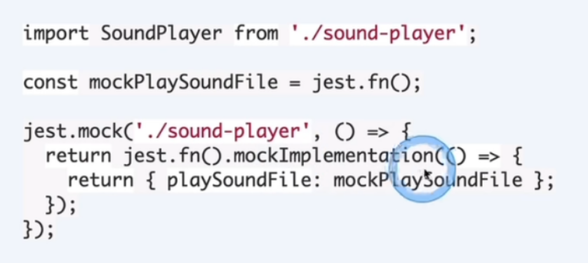
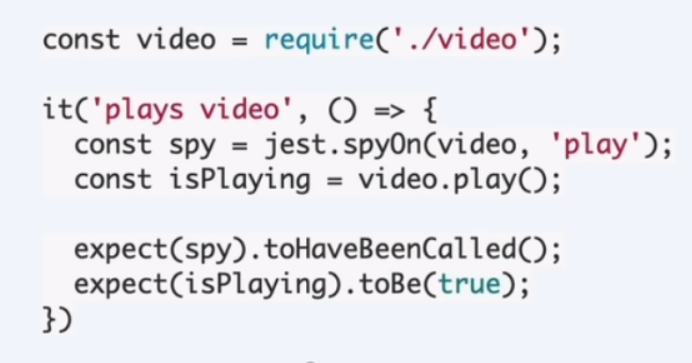

## 基本概念 
- given（参数） 
- when（执行） 
- then （预期结果）

# jest单元测试
## 1、模块之间的依赖
现实世界里，写代码和单元测试时，常常遇到的一些需要替身的对象:
- Database 数据库
- NetworkRequests 网络请求
- Access to Files 存取文件
- any Externalsystem 任何外部系统

## 2、Mock用于替代整个模块


## 3、Stub模拟特定行为
```js
const mockFn=jest.fn();
mockFn();
expect(mockFn).toHaveBeenCalled();
// With a mock implementation:
const returnsTrue =jest.fn(()=> true);
console.log(returnsTrue();//true;
``` 
但是不知道这个有什么意义？

## 4、spy监听模块行为
