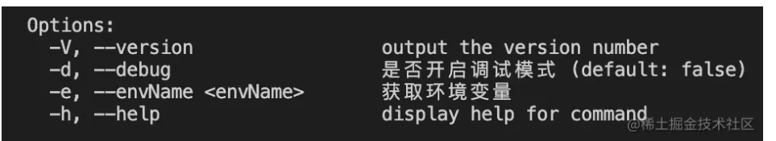
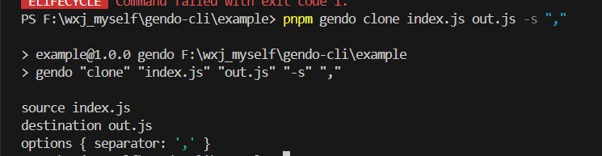
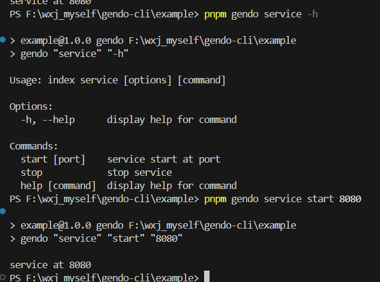
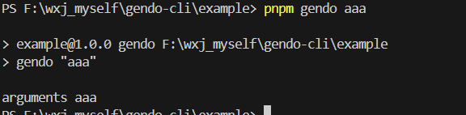

## 全局配置options
获取program对象有两种方式:
```js
// 获取commander单例 
const { program } = commander 
// 手动实例化一个commander实例 
const program = new commander.Command();
```

```js
#!usr/bin/env node

const commander = require('commander')
const pkg = require('../package.json')

const program = new commander.Command()

program.usage('<command> [options]')
program.version(pkg.version)

program.parse()
```

### 两个全局配置(options) 
commander会默认有两个全局配置(options) --version -V 和 --help -h，因此你可以执行下面语句：

> test-cli -V // 1.0.0

### 自定义全局配置

除了默认全局配置，我们还可以增加自己定义的全局配置：
```js
// 第三个参数是默认值
program.option('-d, --debug', '是否开启调试模式', false)
// -e 后面必须要输入值，因为<>表示必填
program.option('-e, --envName <envName>', '获取环境变量')
```

执行test-cli -h:


### 获取options的值
```js
// 获取所有options的值 
program.opts()
```

全局配置options有四种写法，如下:
```js
serve -p 80 // 常用
serve -p80
serve --port 80
serve --port=80  // 常用
```

## 命令注册
先看一个最简单的例子:
```js
program
  .command('clone [source] [destination]')  // 命令
  .description('clone a repository into a newly created directory') // 描述
  .option('-s, --separator <char>', 'separator character', ',')  // 参数？
  .action((source, destination, options) => {
    console.log('source', source)
    console.log('destination', destination)
    console.log('options', options)
  })
```
执行:
> test-cli clone index.js out.js -s ","


```js
// 打印结果:
source index.js
destination out.js
options { separator: ',' }
```

> 【注意】 <>表示必填，[]表示可选

### 可选参数定义及获取
```js
const { program } = require('commander');

program
  .option('-p, --port <port>', 'specify port', '8080')
  .action((options) => {
    console.log(`Port: ${options.port}`);
  });

program.parse(process.argv);
```
> node yourprogram.js -p 3000

### 必选参数定义及获取
```js
const { program } = require('commander');

program
  .requiredOption('-p, --port <port>', 'specify port')
  .action((options) => {
    if (!options.port) {
      console.error('Error: Port is required');
      program.help(); // 显示帮助信息
    }
    console.log(`Port: ${options.port}`);
  });

program.parse(process.argv);
```
.requiredOption() 方法定义了一个名为 port 的必选参数。在 .action() 方法中，我们首先检查 options.port 是否存在，如果不存在则打印错误信息，并显示命令的帮助信息以提供用户帮助。

### 命令参数与命令分开
上面的那种写法把命令的参数(source, destination)和命令写在一起，其实我们可以分开写(推荐分开写):
```js
program
  .command('split')
  .description('分割字符串')
  // 用<>表示是一个必输的字符，[]表示可输
  .argument('<string>', 'str to split')
  .argument('<array>', 'str to split')
  .option('-s, --separator <char>', 'separator character', ',')
  .action((str, array, options) => {
    console.log('str', str)
    console.log('array', array)
    console.log('options', options)
  })
```
## addCommand 命令分组
假如你的命令很多，需要对命令进行分组，这样方便管理，怎么做呢？需要使用addCommand这个api:
```js
// 定义了一个service命令
const service = new commander.Command('service')
// 在service命令对象上注册子命令start和stop
service
  .command('start [port]')
  .description('service start at port')
  .action(port => {
    console.log('service at' + port)
  })
service
  .command('stop')
  .description('stop service')
  .action(() => {
    console.log('stop service')
  })
  
program.addCommand(service)
```
> gendo service -h
> gendo service start 8080

分组 命令中需要把 service也加上

## 如何调用其他的脚手架
在你的脚手架上调用其他的第三方脚手架，实现脚手架的串行使用，可以使你的脚手架功能大大增强。

command方法有两种使用，它用一个函数重载来实现的:
```js
command(nameAndArgs: string, opts?: CommandOptions): ReturnType<this['createCommand']>;
  
command(nameAndArgs: string, description: string, opts?: ExecutableCommandOptions): this;
```
当我们在command命令中传入脚手架命令和命令描述时，它的使用就有点不一样了，看下面代码：
```js
program.command('install [name]', 'install package')
```
当执行命令test-cli install时，它会报错test-cli-install不存在，也就是当你执行上面命令时会帮你拼接成一个新的命令test-cli-install，这有点类似于npm init aaabbb这个命令，这个命令执行时会报'create-aaabbb@latest' is not in this registry，因为它会在aaabbb前面加上create然后去下载create-aaabbb包。

所以，如果你想再执行test-cli install不报错，可以加上第三个参数：
```js
program
  .command('install [name]', 'install package', {
    executableFile: 'vue'
  })
```
以上还没有实践。

```js
const { execSync } = require('child_process');
const program = new Command()

program
  .command('install [name]')
  .description('install package')
  .action((name) => {
    // 执行 Shell 命令调用第三方脚手架
    const command = `vue create ${name}`; // 假设调用的是 vue-cli
    try {
      execSync(command, { stdio: 'inherit' }); // 将子进程的标准输入输出与当前进程绑定，以便实时显示输出
    } catch (error) {
      console.error(`Failed to execute command: ${command}`);
      console.error(error.message);
      process.exit(1); // 如果执行失败，退出进程并返回非零状态码
    }
  });
```
当你执行test-cli install时，它实际上是执行vue这个脚手架。

所以当你执行test-cli install create test-name，就是在执行vue create test-name。


## 监听
### 对options的监听
现在我要对--debug进行监听，如果有输入--debug就执行回调函数，这个回调函数要早于命令的回调函数。
```js
program.on('option:debug', () => { 
    process.env.LOG_LEVEL = 'verbose' 
})
```
怎么调用？

### 对command的监听
如果用户输入一个我们没有定义的命令，那么需要给用户提供一个纠错信息，那么就可以使用监听功能。
```js
program.on('command:*', obj => {
  console.error('未知的命令：' + obj[0])
  // 获取已经注册的命令
  const availableCommands = program.commands.map(cmd => cmd.name())
  console.log('可用命令：' + availableCommands.join(','))
})
```
？怎么测

对于上面的功能除了使用监听外，还可以使用program.arguments，这是一个兜底的命令，也就是用户输入的命令我们没有定义，那么就走到program.arguments里面的逻辑。
```js
program
  .arguments('<cmd> [options]')
  .description('未知命令')
  .action(function (cmd) {
    console.log('arguments', cmd)
  })
```


除了program.arguments外，其实还有一个配置能实现兜底的功能，即isDefault: true:
```js
// command可以传一个opts选项
program
  .command('clone [source] [destination]', {
    isDefault: true
  })
  .action((source) => {
    console.log('source')
  })
```
当输入test-cli aaa时，因为aaa没有注册，那么就执行clone命令。
