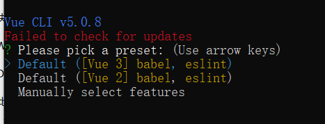

vue create fake-vue-cli 
选择第一个的

## 工程搭建
1. 新建文件夹，执行 pnpm init 生成package.json
2. 新建pnpm-workspace.yaml 声明工作区
3. 新建两个工作区文件 examples packages
4. packages 中添加fakevue-cli文件夹，脚手架生成项目主要代码
5. fakevue-cli中执行 pnpm init 并添加bin 
```js
"bin":{  
 "fakevue": "./bin/index.js"  
 }  
```
新建 bin/index

6. examples 文件夹中新建 app 文件夹，并运行  pnpm init,
package.json中添加 dependencies 字段，来添加 fakevue-cli 依赖
```js
"scripts": {  
 "fakevue": "fakevue"  // +
 },  
 "dependencies": {  // +
    "fakevue-cli": "workspace:*"  // +
 }  // +
```
7. 最外层 pnpm i 添加依赖
8. 在app文件中执行 pnpm fakevue 
有输出 则为成功

脚手架工程搭建成功啦，接下来，逐步分析并完成vue-cli的第一个选择：


## 1、创建项目文件夹
mkdir
## 2、Npm init,生成package.json文件。怎么操作这里的选择?
## 3、npm install vue core-js   

### core-js
1. core-js 它是JavaScript标准库的 polyfill（垫片/补丁）, 新功能的es'api'转换为大部分现代浏览器都可以支持 运行的一个'api' 补丁包集合。
2. 因为官方库对他介绍的形容 
- 它支持最新的 ECMAScript 标准 
- 它支持ECMAScript 标准库提案 
- 它支持一些 WHATWG / W3C 标准（跨平台或者 ECMAScript 相关） 
- 它最大限度的模块化：你能仅仅加载你想要使用的功能 
- 它能够不污染全局命名空间 
- 它和babel紧密集成：这能够优化core-js的导入 
- 它是最普遍、最流行 的给 JavaScript 标准库打补丁的方式

## 4、npm install @babel/core @babel/eslint-parser -D
这两个包分别是 Babel 的核心包 (@babel/core) 和 Babel 的 ESLint 解析器 (@babel/eslint-parser)。

### @babel/core：
这个包是 Babel 的核心功能，它包含了所有 Babel 转换和编译的核心逻辑。通过使用 @babel/core，你可以使用 Babel 来转换你的 JavaScript 代码，例如将 ES6+ 代码转换为向下兼容的 JavaScript 代码。

### @babel/eslint-parser：
这个包是 Babel 的官方 ESLint 解析器。它允许 ESLint 使用 Babel 解析器来解析 JavaScript 代码，以便 ESLint 可以理解最新的 ECMAScript 特性。如果你正在使用 ESLint 来检查你的 JavaScript 代码，并且希望 ESLint 能够理解像箭头函数、解构赋值等新的 JavaScript 语法，那么你可以使用 @babel/eslint-parser。

## 5、npm install @vue/cli-plugin-babel @vue/cli-plugin-eslint @vue/cli-service -D
这三个包都是 Vue CLI 的插件，用于帮助你在 Vue 项目中使用 Babel 和 ESLint，并提供了一些相关的配置和功能。

### @vue/cli-plugin-babel：
这个插件允许你在 Vue 项目中使用 Babel。它集成了 Babel 相关的配置和功能，使得你可以在 Vue 项目中使用最新的 JavaScript 语法特性，比如箭头函数、解构赋值等。安装了这个插件后，你可以在 Vue 项目的配置文件中配置 Babel 相关的选项。

### @vue/cli-plugin-eslint：
这个插件集成了 ESLint 到 Vue 项目中。ESLint 是一个 JavaScript 代码检查工具，可以帮助你在开发过程中发现并修复代码中的问题。这个插件为 Vue 项目提供了 ESLint 的配置和集成，使得你可以在 Vue 项目中使用 ESLint，并通过配置来定义代码规范和检查规则。

### @vue/cli-service：
这个包提供了 Vue CLI 的核心功能，比如启动开发服务器、构建项目、运行测试等。@vue/cli-plugin-babel 和 @vue/cli-plugin-eslint 这两个插件都是基于 @vue/cli-service 的，它们为 Vue 项目提供了 Babel 和 ESLint 的功能，并且集成到 Vue CLI 的命令中，使得你可以通过简单的命令来启用和配置这些功能。

## 6、npm install eslint eslint-plugin-vue -D
eslint 是一个 JavaScript 代码检查工具，而 eslint-plugin-vue 则是专门用于 Vue.js 项目的 ESLint 插件。

### eslint：
ESLint 是一个用于识别并报告 ECMAScript/JavaScript 代码中的模式的工具，它的目标是保证代码的一致性和避免错误。你可以使用 ESLint 来检查你的 JavaScript 代码是否符合一定的规范或者风格，以及是否包含了一些常见的错误。

### eslint-plugin-vue：
这个插件为 Vue.js 项目提供了特定的 ESLint 规则，用于检查 Vue 单文件组件（.vue 文件）中的代码。它包含了一系列的规则，用于检查模板语法、组件声明、生命周期钩子、计算属性等 Vue.js 相关的代码。安装了 eslint-plugin-vue 后，你可以配置 ESLint 来使用这些规则，并确保你的 Vue 项目中的代码符合 Vue.js 的最佳实践和风格。

## 7、往package中添加 eslintConfig browserslist配置

若要向 JSON 文件中添加新的配置，你可以按照以下步骤进行：
1. 读取原始的 JSON 文件内容。
2. 将新的配置对象合并到原始的 JSON 对象中。
3. 将合并后的 JSON 对象写回到文件中。

下面是一个示例 JavaScript 代码，演示了如何实现这个过程：

```js
const fs = require('fs');

// 读取原始的 JSON 文件内容
const originalData = fs.readFileSync('package.json', 'utf-8');
const jsonData = JSON.parse(originalData);

// 新的配置对象
const newConfig = {
  "key1": "value1",
  "key2": "value2",
  // 添加其他配置项
};

// 将新的配置对象合并到原始的 JSON 对象中
const mergedData = Object.assign({}, jsonData, newConfig);

// 将合并后的 JSON 对象写回到文件中
fs.writeFileSync('package.json', JSON.stringify(mergedData, null, 2), 'utf-8');

console.log('配置已成功添加到 package.json 文件中！');
```
请注意，这个示例假设你的 JSON 文件已经存在，并且内容是有效的 JSON 格式。此外，Object.assign() 方法用于将新的配置对象合并到原始的 JSON 对象中，保留了原始 JSON 对象中的其他键值对。最后，通过 fs.writeFileSync() 方法将合并后的 JSON 对象写回到文件中。

```js
"eslintConfig": {
    "root": true,
    "env": {
      "node": true
    },
    "extends": [
      "plugin:vue/vue3-essential",
      "eslint:recommended"
    ],
    "parserOptions": {
      "parser": "@babel/eslint-parser"
    },
    "rules": {}
  },
  "browserslist": [
    "> 1%",
    "last 2 versions",
    "not dead",
    "not ie 11"
  ]
```
## 8、改掉scripts
```js
  "scripts": {
    "serve": "vue-cli-service serve",
    "build": "vue-cli-service build",
    "lint": "vue-cli-service lint"
  },
  ```

## 9、建 文件 并 写入
gitignore
babel.config.js
README.md -- 模板的，有文件名 还有脚手架地址
vue.config.js

## 10、 public文件夹
icon
html模板

## 11、 建src
