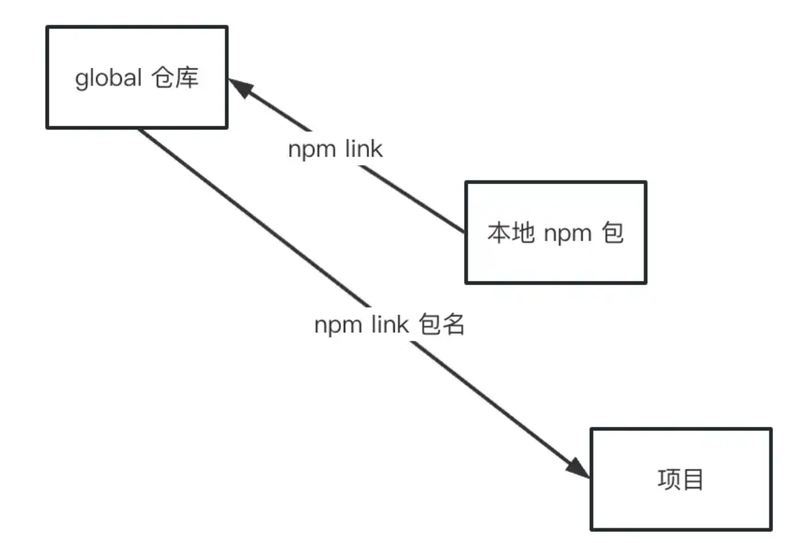
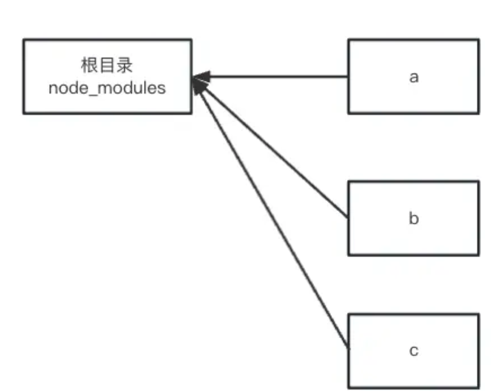

- npm link
- monorepo
- lerna

## npm link
### 

### 使用：
全局范围内使用我们本地的npm包
```js
cd ./my-library     # 进入包目录
npm link            # 创建全局链接                     
cd ./my-application    # 进入其他包目录。
npm link my-library    # 链接安装包 
```
或者合起来: npm link <package-path>
```js
$ cd ./my-application
$ npm link ../my-library
```

### 流程


### 存在缺陷
1. node版本要相同:需要确保npm link的执行是在同一个node版本,否则包查找失败
2. 没有找到包就会直接从Npm仓库上安装,无法链接到本地包,不会报错
3. 会有预期之外的二进制可执行文件安装
4. 不符合预期的软链接删除:链接多个包时，将删除先前链接的包。这个行为是npm v7中引入的: 例子pkg-a已经被链接过并且存在于node_modules中了。但当链接了第二个包pkg-b后，pkg-a就不在node_modules中了

### 使用:
- 发布npm包之前的测试
- 第三方包调试

## Monorepo (项目开发与管理的策略)
* **目标：**Monorepo 是指在单个仓库中管理多个项目，而不仅仅是多个软件包。它的目标是将相关项目组织在一个统一的仓库中，从而方便共享代码、维护依赖和管理构建过程。
* **功能：**Monorepo 可以包含多个项目、库和应用程序，它们可以共享代码、依赖和配置文件。通常，Monorepo 提供了一套工具和最佳实践，用于管理多个项目之间的依赖关系、构建过程和发布流程。(✅ 构建性 Monorepo 工具可以配置依赖项目的构建优先级，可以实现一次命令完成所有的部署。)
* **工作原理：**Monorepo 使用单个版本控制仓库来管理多个项目。它可以使用不同的工具和技术，例如 Yarn/pnpm+ Workspaces、Nx、Rush 等来实现多项目管理。

### 流程



## lerna （工具）
* **目标：**Lerna 的主要目标是简化管理包含多个软件包的 JavaScript 项目。它可以帮助你在一个仓库中管理多个独立发布的软件包，从而使得在团队合作和持续集成环境下更加方便。
* **功能：**Lerna 提供了一系列命令和工具，用于管理包括版本控制、依赖管理、软件包发布等在内的各个方面。它可以帮助你在一个代码库中管理多个独立的 NPM 包，并且提供了一套默认的工作流程。
* **工作原理：**Lerna 通过将项目拆分为独立的软件包，每个软件包可以有自己的版本号、依赖和发布流程。它使用了 Git 子模块或符号链接来管理这些软件包。

### Lerna 能解决了什么问题？
它解决了 JavaScript/TypeScript 大仓的两个最大问题：
- Lerna 对任意数量的项目运行命令，它以最有效的方式、以正确的顺序执行，并且可以将其分发到多台计算机上。
- Lerna 管理你的发布流程，从版本管理到发布到 NPM，它提供了多种选项以确保可以适应任何工作流程。

### 区别
|             | Lerna         |  Monorepo |
|:-----------:| :-------------:|:-------------: |
| 范围 | 更专注于管理多个独立的软件包， | 可以包含多个项目、库和应用程序。 |
| 功能 | 提供了一套专门用于软件包管理的工具， |  则提供了更广泛的功能，包括共享代码、依赖管理、构建和发布等。
| 应用场景 | 由多个独立的软件包组成 | 在一个统一的仓库中管理多个项目


Lerna 将依赖管理交给 yarn/pnpm workspace；Lerna 承担依赖发布能力。


集中版本号或独立版本号
截止目前，我们已经成功发布了2个package，现在再新增一个Tree组件，它和其他2个package保持独立，随后我们执行lerna publish，它会提示Tree组件的版本号将会从0.0.0升级至1.0.0，但是事实上Tree组件仅仅是刚创建的，这点不利于版本号的语义化，lerna已经考虑到了这一点，它包含2种版本号管理机制。

fixed模式下，模块发布新版本时，都会升级到leran.json里编写的version字段
independent模式下，模块发布新版本时，会逐个询问需要升级的版本号，基准版本为它自身的package.json，这样就避免了上述问题
如果需要各个组件维护自身的版本号，那么就使用independent模式，只需要去配置leran.json即可。