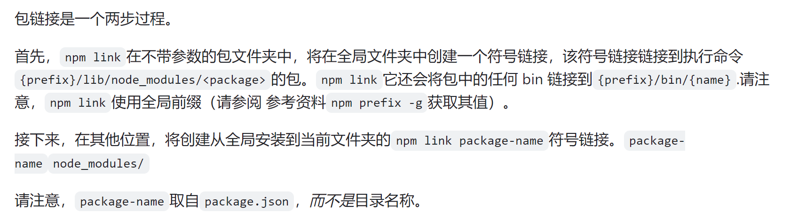

## 
- npm link
- monorepo
- lerna

## npm link
### 

### 使用：
```js
cd ~/projects/node-redis     # 进入包目录
npm link # 创建全局链接                     
cd ~/projects/node-bloggy    # 进入其他包目录。
npm link redis               # 链接安装包 
```

### 流程


### 缺陷


## Monorepo (项目开发与管理的策略)
* **目标：**Monorepo 是指在单个仓库中管理多个项目，而不仅仅是多个软件包。它的目标是将相关项目组织在一个统一的仓库中，从而方便共享代码、维护依赖和管理构建过程。
* **功能：**Monorepo 可以包含多个项目、库和应用程序，它们可以共享代码、依赖和配置文件。通常，Monorepo 提供了一套工具和最佳实践，用于管理多个项目之间的依赖关系、构建过程和发布流程。
* **工作原理：**Monorepo 使用单个版本控制仓库来管理多个项目。它可以使用不同的工具和技术，例如 Yarn/pnpm+ Workspaces、Nx、Rush 等来实现多项目管理。

### 流程


## lerna （工具）
* **目标：**Lerna 的主要目标是简化管理包含多个软件包的 JavaScript 项目。它可以帮助你在一个仓库中管理多个独立发布的软件包，从而使得在团队合作和持续集成环境下更加方便。
* **功能：**Lerna 提供了一系列命令和工具，用于管理包括版本控制、依赖管理、软件包发布等在内的各个方面。它可以帮助你在一个代码库中管理多个独立的 NPM 包，并且提供了一套默认的工作流程。
* **工作原理：**Lerna 通过将项目拆分为独立的软件包，每个软件包可以有自己的版本号、依赖和发布流程。它使用了 Git 子模块或符号链接来管理这些软件包。

### Lerna 主要做三件事

为单个包或多个包运行命令 (lerna run)
管理依赖项 (lerna bootstrap)
发布依赖包，处理版本管理，并生成变更日志 (lerna publish)

### Lerna 能解决了什么问题？
- 代码共享，调试便捷： 一个依赖包更新，其他依赖此包的包/项目无需安装最新版本，因为 Lerna 自动 Link
- 安装依赖，减少冗余：多个包都使用相同版本的依赖包时，Lerna 优先将依赖包安装在根目录
- 规范版本管理： Lerna 通过 Git 检测代码变动，自动发版、更新版本号；两种模式管理多个依赖包的版本号
- 自动生成发版日志：使用插件，根据 Git Commit 记录，自动生成 ChangeLog

(看一下lerna项目，他的包之间是怎么链接的)

### 区别
|             | Lerna         |  Monorepo |
|:-----------:| :-------------:|:-------------: |
| 范围 | 更专注于管理多个独立的软件包， | 可以包含多个项目、库和应用程序。 |
| 功能 | 提供了一套专门用于软件包管理的工具， |  则提供了更广泛的功能，包括共享代码、依赖管理、构建和发布等。
| 应用场景 | 由多个独立的软件包组成 | 在一个统一的仓库中管理多个项目


### 添加lerna可以为monorepo解决什么问题？
- 统一的版本控制： 在Monorepo中，多个项目或包共享同一个版本控制仓库，这意味着它们可以共享相同的版本号。Lerna可以帮助自动化版本管理，使得当一个或多个包发生变化时，可以适时地增加版本号并将其发布。

- 统一的依赖管理： Monorepo中的项目可以共享依赖项，而不必每个项目都单独安装依赖。Lerna可以确保依赖项在整个Monorepo中得到一致的管理和更新，同时减少了重复安装和版本冲突的问题。

- 代码重用和共享： 在Monorepo中，不同项目之间可以更容易地共享代码和组件。这可以提高开发效率，避免重复编写相似的功能或组件。Lerna可以帮助管理和维护这些共享的代码库。

- 统一的构建和测试： 使用Monorepo可以更轻松地管理构建和测试流程，因为所有项目都位于同一个代码库中。Lerna可以帮助自动化这些流程，例如并行构建、并行测试等，从而加快整体开发速度。

- 简化工作流程： Lerna提供了一组命令和工具，可以简化Monorepo的工作流程，包括安装依赖、运行脚本、发布版本等。这些工具使得开发人员可以更轻松地管理和维护整个Monorepo，而不必依赖于复杂的手动操作或脚本。

Lerna 将依赖管理交给 yarn/pnpm workspace；Lerna 承担依赖发布能力。

