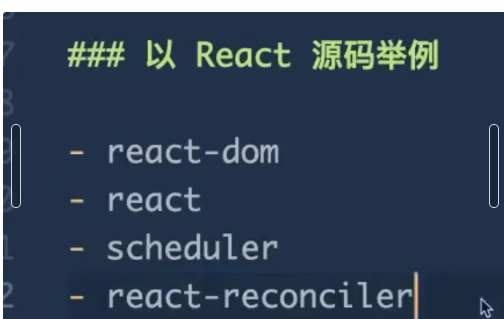
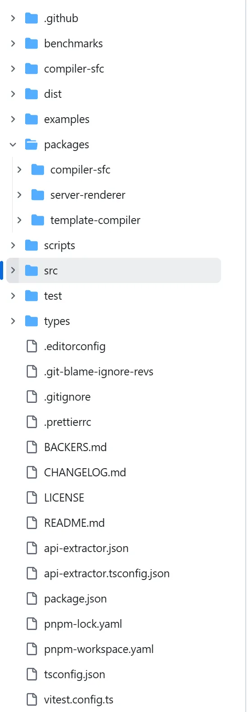
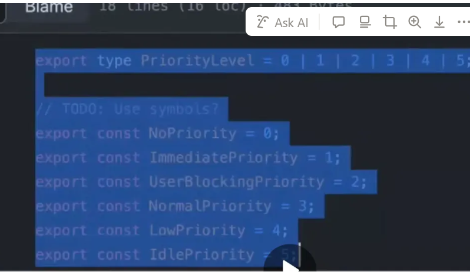
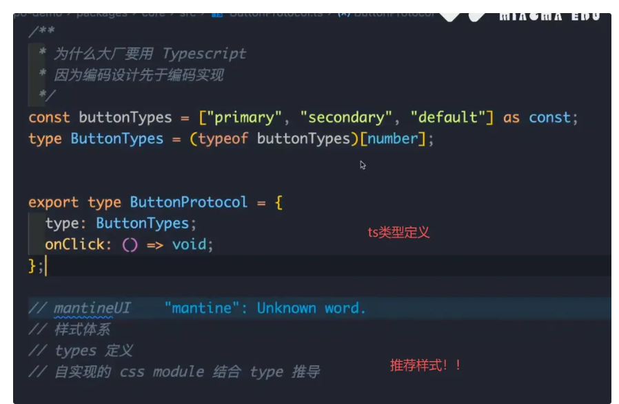

【公开课-秒码学院】高级前端专家如何做项目架构与工程化设计？

- 基础架构：

用多个git,git submodule那个就是mutilrepo （每个服务和库都有自己的版本控制）

在一个 git 仓库中，放多个项目，那这个仓库我们就称之为 monorepo(multirepo)

lerna
pnpm workspace

- monorepo例子：

react 、vue 

vue:

- 权限设置可以用 位运算、策略模式

const ADMIN = 001

const VISITOR = 010

const userPermission = 001

位运算： userPermission & ADMIN = 1 ,

userPermission就是管理员ADMIN

## monorepo 设计实践：

1、统一的依赖管理

2、版本同步，使用workspace:* 

3、模块共享

4、统一工具链

5、相同代码风格

6、统一CI/CD

7、增量部署

8、一键生成依赖图 （nx.dev, fast CI)

9、分支管理

## 技术方案

React：
- 基础库： React react-native 
- 状态管理：基础 React Hook
- 全局状态 redux 流行的状态管理库，采用单一数据源和不可变状态 / 
     mobX 基于响应式编程的状态管理库 /  
     recoil 由 Facebook 开发的状态管理库，兼容 Hooks 的设计 
- context + provider 内部管理
- react-router 路由
- @tanstack/router 类型安全的
-  表单管理 formilk 简化表单管理和验证的库 /  
      react-hook-form  基于 React Hooks 的轻量级表单管理库
- axios/fetch
- 数据获取库 swr 
- Facebook 开发的高效 GraphQL 客户端： relay
- 样式相关的 styled-components  在 JavaScript 中编写 CSS/
    emotion 高性能的 CSS-in-JS 库 /
    css module 为每个组件创建唯一的 CSS 类名，避免样式冲突 /
    tailwind css
- antd 各种UI库
- 流程引擎编辑器 react-flow
- 3d: threejs、 react-three-fiber 
- anltr 生成编译器
- 打包编译工具 webpack 模块打包 / vite 构建工具 / babel  js编译器
- 测试相关 jest / react-testing-library
- 端到端测试 Playwrite / cypress
- 代码质量与开发工具 Eslint: 代码静态分析工具 / 
      stylelint 样式语法检查 / 
      Prettier 代码格式化工具 / 
      Cspell 单词拼写检查 / 
      Commitlint 提交检查 / 
      Husky Git hooks工具，提交代码前执行代码检查和格式化
- CICD 工具： Jenkins 自动化服务器，支持持续集成和持续部署 / 
      Github Actions : Github提供的CICD服务
- 部署平台： Vercel 适用于前端项目的即部署即平台 / 
     Netlify: 提供静态网站托管和自动部署服务

Vue:
- vue
- vite
- vue-router
- pinia
- vee-validate 灵活的表单验证库，与 Vue 深度集成
- axios
- 数据获取库 vue-query 用于数据获取、缓存和同步的库，类似于 React Query
- scoped style
- element-plus / andv
- webpack / vite 快速、现代的构建工具，特别适合 Vue 3 项目 /
    rollup 用于库开发的打包工具，体积小、性能好

- 流程引擎编辑器 vue-flow
- 3d: threejs
- anltr 生成编译器
- 低代码编排引擎：smooth-dnd
- 单元测试 jest
- 端到端测试 playwrite /  crypress
- 其他代码质量与开发工具/ CICD工具 同上

## 业务重难点

低代码平台：
- 编排引擎实现
- 公式编辑执行器开发
- 流程引擎实现

3D可视化方面：
- 着色器优化
- 基于wasm+skia的渲染引擎优化
- 纹理、贴图、tile的延迟加载
- 可视区检测与加载

团队基建：
- cli 脚手架
- 基础库
- 可视化图表

技术亮点：
- 复杂编辑器（不是wang-editor等api使用）
    光标处理，缓存区处理，结合公式编辑器，自动提示、自动补全
- 3D
    tile瓦片，着色器shader、 粒子
    svg canvas 双引擎 echarts

echarts 优秀的开源库（echarts 渲染器，两种 canvas和svg: 
svg: 适用于大屏，矢量图，对于缩放和交互来说更容易，
canvas: 适用于大数据量的图表，性能取决于绘制的算法

## 总结：

感觉这是一些介绍，monorepo架构（加一些第三方推荐的源码），技术栈的一些东西，还有一些业务重难点介绍而已，有兴趣的话可以深入，收获一般