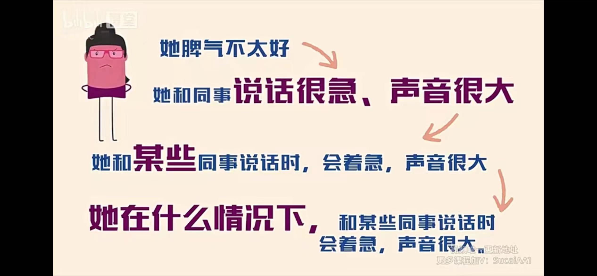
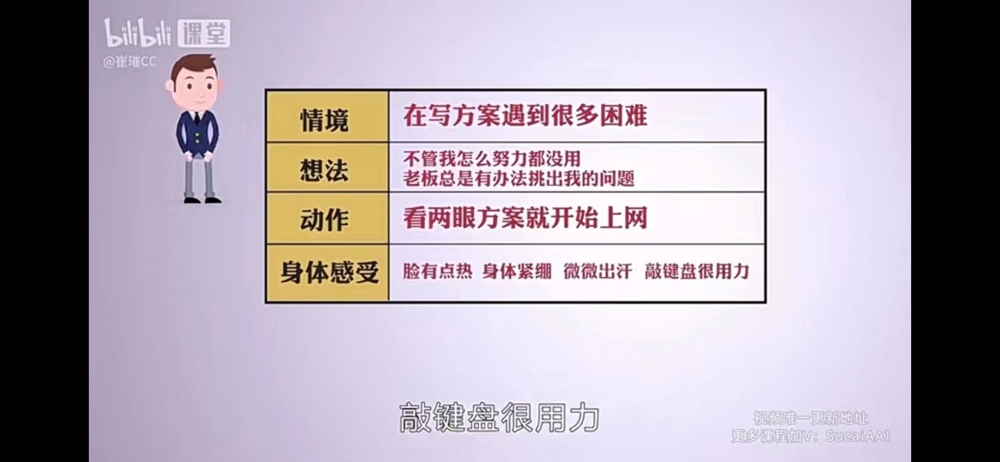
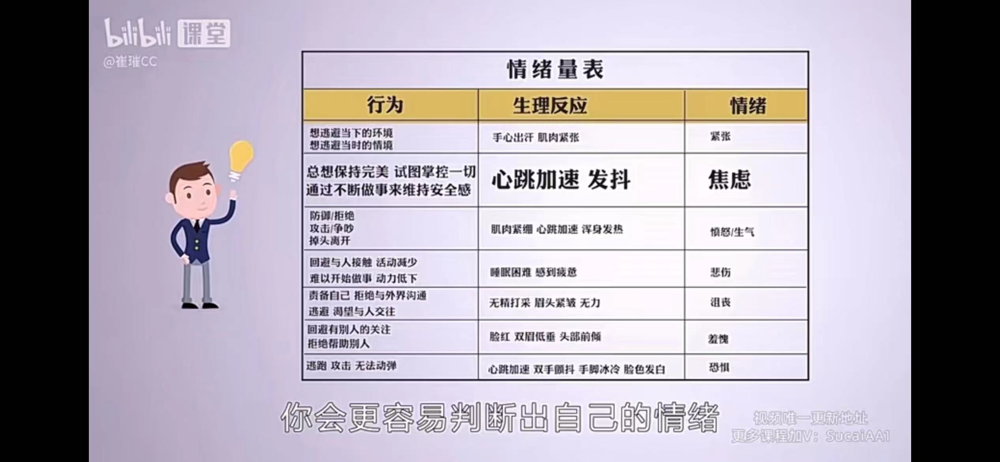
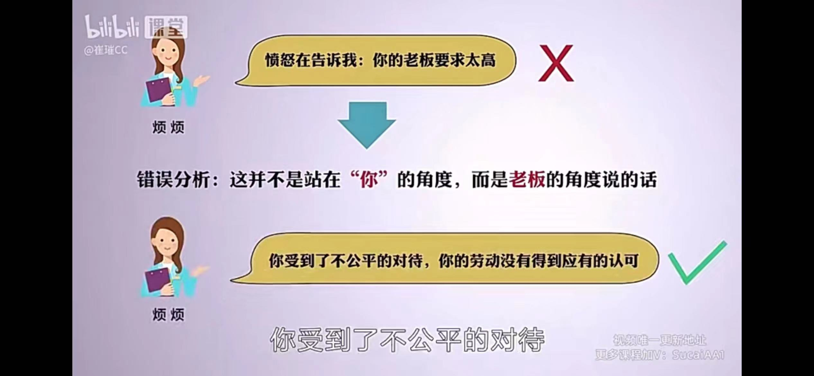
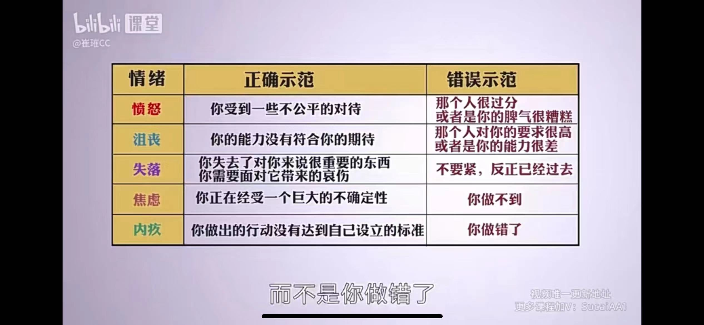
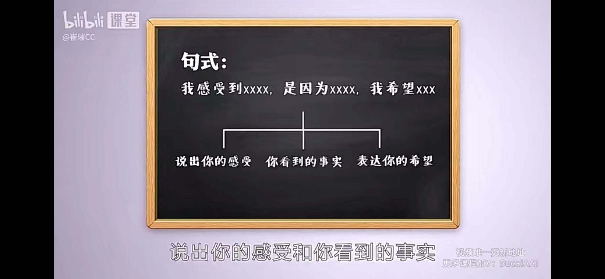

## 为什么要学
有些事发生后几天，才想通觉得，我当时应该这样说这样做。

一种思维：
为什么我就是做不到呢？
谁困扰，谁负责。

别人的不满是我导致的不高兴。
其实领导生气是领导的困扰，这是他要负责的事？？？
我的方案，我负责，把方案清清楚楚的讲完

听起来简单，但实际发生的时候其实很难做到，需要我们进行大量的反本能训练。
**主语转化**

老板质疑，说不清楚该怎么办？
主语转化前：老板质疑我，因为我没有讲清楚
后：老板质疑我，是因为没听出我说的。

但可能真的是我没有讲清楚呢？？？？？
卸下不属于自己的包袱，轻松上阵。

为什么我要学？
1）迷茫焦虑，不喜欢现在的生活
2）能力不足，好的机会住不住，没实力
3）敏感内向，被情绪牵着走
4）沟通不顺，得不到支持，同时不配合很无奈，觉得自己很弱小

结合管理学和心理学

思维管理、行为管理、沟通管理

## 标签粉碎机--看清困扰你的人和事的真相
拖延：中度拖延更可能有创造了，获得很多时间进行发散思考，反而会获得意想不到的收获。

贴一个标签，找一个交代：
懒，所以不用干家务活
拖延：给自己放弃考察一个交代
粗心：我纠正不了他犯错找了个交代

我们想解释一个事，就给他贴一个标签，找一个交代就够了，可是问题还是没被解决了。
执着与给自己找交代找解释：心理学的一个概念:自我合理化的心理防御机制
人类是很擅长给自己找理由的动物。
找一个理由保护自己。

一般人会先选定自己的立场，再找支持自己立场的证据，以此证明自己的立场是有道理的，
然后思考戛然而止，更不会自动自发的去反向思考。

贴标签：可以帮助我们快速的处理信息，给人和事做一个分类

弊端：
像盲人摸象，摸了大象腿所以大象腿就是大象

在认知上给孩子贴了个成绩不好的标签，制造了一个成绩不好的焦点，让我们总是盯着这个点看，
接下来，我们搜集证据，用各种行为来佐证这个认知，你看，你就是成绩不好。

比如小孩子偷：
他的行为可能在表达某种需求，贴了标签，看不清他需要什么。
我们应该更专注他需要什么，为什么要这么做。
或者他是想引起你的注意。

### 标签替换那更具体的描述

## 情绪管理

#### 任务一：觉察，我的情绪是什么

负面情绪也有意义，他在提醒我们你受伤了，你生病了
#### 任务二：看到情绪在向我们表达什么，从而清楚我们的处境

情绪既不会否定你，也不会跟你吐槽

#### 任务三：跟情绪对话，进行正面回应
谢谢你'我意识到什么，比如孩子辅导作业让我生气，我的权威受到威胁

#### 任务四：采取行动
方法一：'接纳，孩子一天天长的'他慢慢有自己的想法，总有一天我会失去自己的权威，我应该找一个更有权威的，比如家教
方法二，学会表达，让我嗨一点，但是我身上没有这样的开关，而且你这么说，让我感到更焦虑，更容易忘词，有什么办法可以让我嗨起来吗

