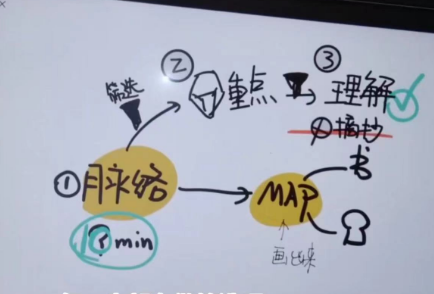
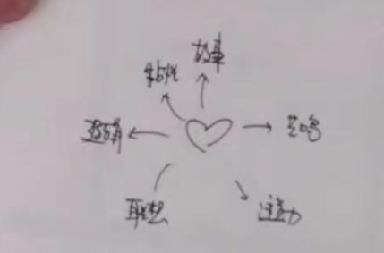
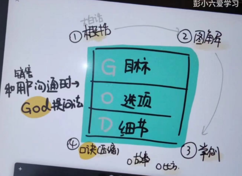

## 怎么读

读取一小段

### 一三一法学习单
- 一句话
- 三个重点
- 一个应用点

### 便签读书法（示范）
- 用自己的话重述知识（要有积极主动，懂得选择的态度）
- 描述自己的相关经验（之前总是说要跑步，要锻炼身体，可总是推脱没有时间，天气不好各种理由，一年了也没跑过一次）
- 以后我怎么应用（本着对我自己现在已经渣一样的身体负责的态度，我计划循序渐进的跑，并且记录打卡）

## 分享
- 准备议题

## 第一步：一本书的脉络
- 看引言（这本书想讲什么，为你解决什么问题）
- 看目录（比如：卡片笔记写作法。map: 写作的四大前提，四大原则，六大步骤）
  （可能可以直接从6大步骤读，但是他还有一些名词你并不知道，前面是理论知识，所以需要补充前面的基础）

    画出每个章节的重点字，构成map:
    

## 第二步：选择一章你感兴趣的，看重点
比如有一章：用联想不动声色的影响....
阅读前：分为几种钻石：
1、新名词（里面提到的一些新名词，比如：’费曼学习法‘--是什么呢）
2、新分类（如：人类语言分为正面语言和负面语言两种...）
3、新动作（上堆下切平行。。。）

## 第三步：理解（并不是直接摘抄）
想象下你需要给别人解释这个东西。

步骤：概括 -- 图解 -- 举例（作者的例子+我的例子） -- 总结（更好的记忆，口诀或者故事、打比方）

