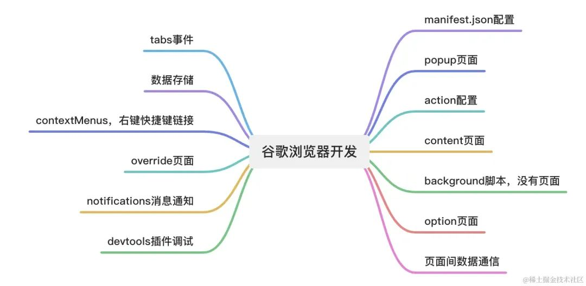

谷歌浏览器插件通常由HTML、CSS和JavaScript组成，非常利于前端开发者


开发者通常需要创建一个包含*清单文件（manifest.json）、背景脚本（background script）、内容脚本（content script）*等文件的项目结构。

- 清单文件是插件的配置文件，包含插件的名称、版本、描述、权限以及其他相关信息。
- 背景脚本用于处理插件的后台逻辑，
- 内容脚本则用于在网页中执行JavaScript代码。

谷歌浏览器插件可以实现各种功能，例如添加新的工具栏按钮、修改网页内容、捕获用户输入、与后台服务器进行通信等。开发者可以通过谷歌浏览器插件API来访问浏览器的各种功能和数据，实现各种定制化的需求。插件开发涉及的要点：


### 基础配置
```json
{
  "name": "Getting Started Example",  // 插件名称
  "description": "Build an Extension!", // 插件描述
  "version": "1.0", // 版本
  "manifest_version": 3, // 指定插件版本，这个很重要，指定什么版本就用什么样的api，不能用错了
  "background": {
    "service_worker": "background.js" // 指定background脚本的路径
  },
  "action": {
    "default_popup": "popup.html", // 指定popup的路径
    "default_icon": {  // 指定popup的图标，不同尺寸
      "16": "/images/icon16.png",
      "32": "/images/icon32.png",
      "48": "/images/icon48.png",
      "128": "/images/icon128.png"
    }
  },
  "icons": { // 指定插件的图标，不同尺寸
    "16": "/images/icon16.png",
    "32": "/images/icon32.png",
    "48": "/images/icon48.png",
    "128": "/images/icon128.png"
  },
  "permissions": [],// 指定应该在脚本中注入那些变量方法，后文再详细说
  "options_page": "options.html",
  "content_scripts": [ // 指定content脚本配置
    {
      "js": [ "content.js"], // content脚本路径
      "css":[ "content.css" ],// content的css
      "matches": ["<all_urls>"] // 对匹配到的tab起作用。all_urls就是全部都起作用
    }
  ]
}
```

### 打开pop弹窗界面
设置action的default_popup属性