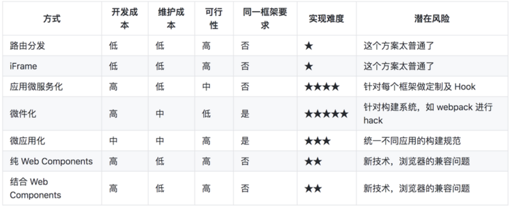

## 1.1 Module Federation（模块联邦）
Webpack 5 引入的 Module Federation 特性允许不同的应用动态地加载彼此的代码。这意味着您可以让主应用动态地加载子应用，即使它们使用了不同版本的 Vue。实现时，您可以这样做：

主应用（Vue 2）：配置为 Host，设置好需要暴露的接口和需要动态加载的子应用。
子应用（Vue 3）：配置为 Remote，将自己的部分模块导出，供主应用按需加载。
## single-spa

## iframe

## qiankun

## web component

