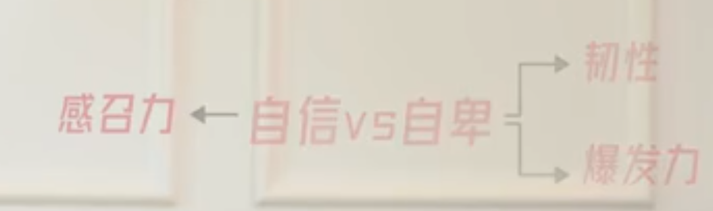
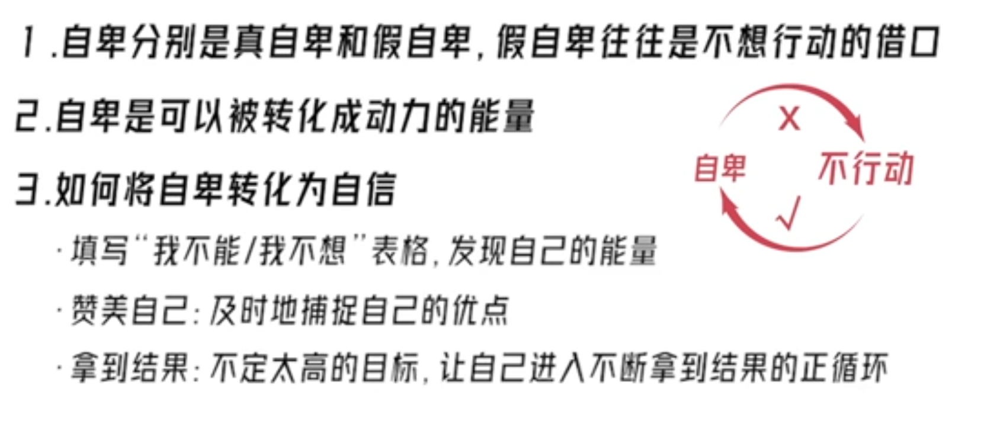

# 【公式3】战胜自卑： 颠覆你对自卑的认知，把自卑变成自驱力 

自卑的本质：自卑是一种主动选择
自卑≠难以改变的性格
自卑=难以摆脱的宿命

PART3 方法论:
把自卑变成能量的三种方式
1.觉察“我不能”还是“我不想
填表：
自己一直想做但没有做的事情 | 我不能做这件事的原因 | 我不想做这件事的原因

2.赞美自己
3.拿到结果

情商真言
人会变得自信
是你在正确的方向上
做着不断成功的事情
你知道自己做的是对的
且结果也不断验证你是对的

