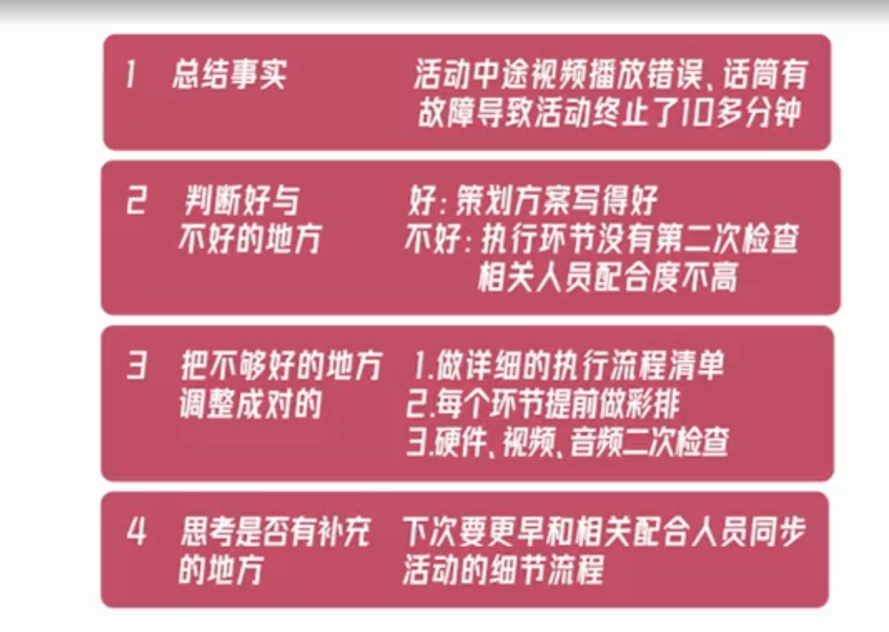

#【公式5】面对失败：制作你的个人白皮书，把失败变为成长的契机

## PART1 认识失败：失败是个节点
你要搞清楚，你自己的人生，什么样才算成功

有的人觉得成功，是在平凡生活中，开心过好每一天
有的人局的成功，是他的小家庭过上踏实的日子
有的人局的成功，是锁定他喜欢的一个人，让对方离不开自己

成功人士，有的人会想到他是事业成功，春风得意
但其实，每个人对成功的定义不一样，
按照我们自己对成功的定义，活成自己想要的样子，才是成功
而不是按照那些所谓普世意义的成功，去定义和要求自己
按照那个标准没有多少人会成功的

在人生这个问题前面，没有任何人会做到真正的成功

时间是衡量成功的重要标尺
成功只是某一段时间的额成功，没有永恒的成功
所以相对应的，
失败也只是一个阶段意义上的失败
在人生长河的一个维度里，
失败只是一个很小的节点

比如小时候考试没考好

失败是成功之母，我不认同
所谓的失败是成功之母，是说我们可以在失败里复盘得到的一些收获
为下次做这个事情做好一些铺垫
有可能因为吸收了一些失败的经验
我们下次可能要成功
所以这里取决于，我们怎么看待和用好失败这个节点
失败本身没有意义，他就是事完结了嘛
你没做成功，他有啥意义
是失败后的收获才有意义
是我们从失败的过程中
学到的经验收获
能让我们在下次挑战的时候帮助我们成功
他才有意义，这样失败他不再是消耗我们能量的意义
反而成为了我们人生中的正向节点

## PART2 转化失败:将失败变成正向节点
第一阶段: 接受失败
第二阶段: 调整情绪
第三阶段:走向复盘

### 把失败看成一个终止信号，我觉得面对失败最好的心态就是“一把一结”

## PART3: 方法论：复盘
- 总结事实，客观的描述事情的发展和经过、重点
- 判断做的好和不好的地方
- 把不够好的地方调整成对的
- 还有那些没做到的，需要补充的
  
示例：

# 总结：
1.时间维度上,失败只是一个小的节点

2.失败+经验收获=正向节点
失败+负面情绪=负向节点

3.每个人失败后都会经历下面这三个阶段
接受失败→调整情绪→走向复盘

4、怎么复盘