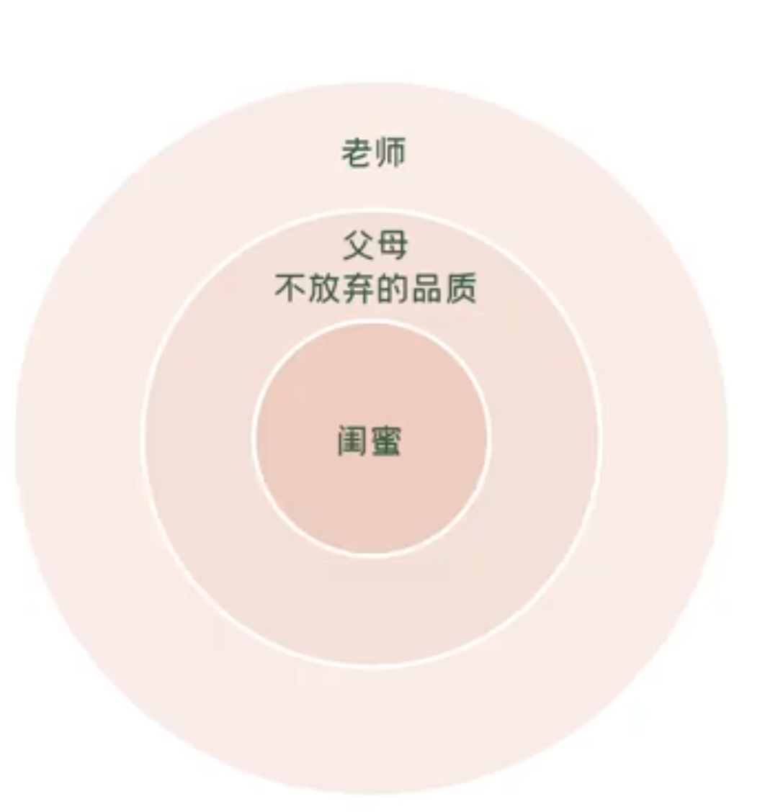

## 十一：升职加薪落选之后，我该做什么
！！！找领导问问原因

失败只是一个节点，学会总结经验

## 十二、如何高效复盘，让失败也富有价值 
复盘重点                    |  具体内容
总结事实                    |   升职加薪竞选失败一>不会表达与包装，在项目汇报时候不被看见

判断做得好&不好的地方        |  好的址也方:
                           |     项目按照进度高质量完成
                           |    不好的地方:不会表达，没有将自己在项目背亏的付出和整个项目的精华表达出来

把不够好的地方调整成对的     |      1.学习表达课，提升自己的表达水平
                           |    2.下次开会前，多加练习，争取在和老板汇报日不遗漏信息    

其它补充                    |  完成PPT之后请同事和老板先看一遍，避免不要的错误

## 十三、了解自身所拥有的内外资源，提高自己抗逆力
抗逆力是一种个人的资源和资产

能够引领个人在身处恶劣环境下懂得如何处理不利的条件，从而产生正面的结果

## 十四、工作中被同事抢了功劳，生气的我该怎么办？
小口的愤怒在于认为自己遭遇到了不公平的对待
自己的付出并没有被老板看到
没有得到应有的赞扬和奖赏

找老板单独聊一聊，告诉老板近期的付出，很多工作小有成果，希望老板赞扬并得到他的肯定

愤怒,背后其实都是因为我们感觉受到了不公平的对待
面对愤怒,我们一定要有透过现象看到本质的能力

## 十五、老板/同事不配合，工作总做不好，我该怎么办？ 
- 改变现实：换一个人做 pass
- 改变预期
- 情绪出口

## 十六、将负面情绪带到工作中，我该如何调整
源头：跟男友冷战，工作心不在焉
解决：找男友沟通

生气和愤怒的边界:是否 自知
自知能意识到自己很生气, 难过、委屈知道自己能承担多大的后果

## 十七、

## 十八、

## 十九、

## 二十、