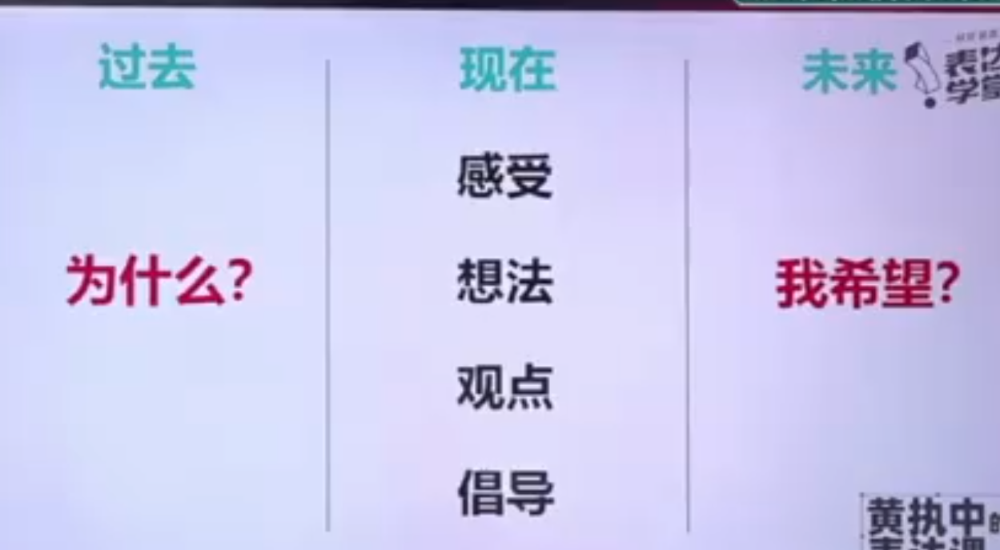
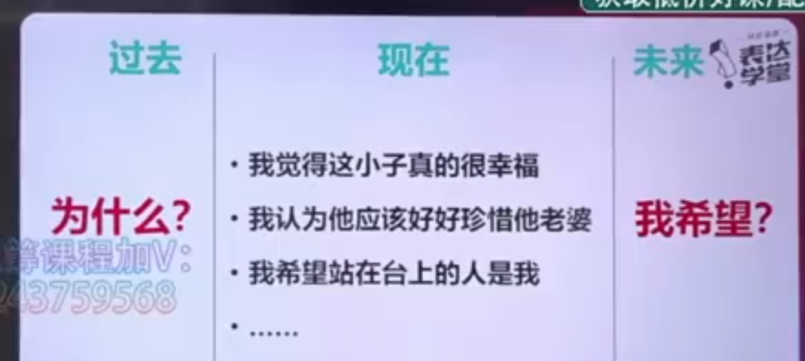

## 3C
老板，疫情严重了，所以原定的线下课没有办法如期开课了。
很多人觉得，在疫情的时候，是大家都很不好过，所以在这个时候还不如“躺平"，好好休息，反正也已经没有生意可做了;
有的人觉得，线上教育行业在这个时候应该缩减项目成本，只保留王牌课程，尽量能让公司平安度过这段时间，为疫情恢复之后做准备。
但我会觉得，哪怕是这个时候，我们项目部门都还可以继续投入更多的生产成本，因为正是现在的这个情况，给了我们好好静下心来好好出课的机会，我们可以在这个时候，丰富我们自己的课程体系，在疫情结束后好好打一场翻身仗，所以公司应该把握住这次的机遇的。

## 空（背景）雨（问题）伞（方案）
### 强调方案:
空(背景): 老板，疫情严重了，所以原定的线下课没有办法如期开课了
雨(问题): 我核算项目成本后发现，如果我们下一次的招生情况不理想的话，公司就会面临比较严峻的经营问题。
伞(方案): 我根据我们现在的处境，我想到了2个方案:
其一是:我们继续投入更多的生产成本，做更多的内容，丰富我们自己的课程体系，在疫情期间弯道超车，蓄力，为疫情好起来做准备;
其二是:缩减项目成本，减少项目数量只保留王牌课程，只要核心员工，以更小的公司体量保守的度过这段时间。老板，你觉得我们目前更应该朝哪个方向做呢?

### 强调问题:
空(背景):老板，疫情严重了，所以原定的线下课没有办法如期开课了
雨(问题):我也核算了这次线下课的项目前期投入的成本和公司目前其他的项目的投入，
如果我们到下个月前不能招到20个班的学员的话，公司目前的现金链就会出问题;而且我们不能去赌疫情什么时候会好起来，
如果情况迟迟没有好转，公司应该在2个月内就会面临严重的经营问题，所以我们现在已经应该把问题重视起来了。
伞(方案):我想了方案应该有两个，继续投入做更多课程蓄力或者减少成本保留核心员工，老板，针对这个情况，我们应该怎么办呢?

## 过去现在未来
我已经把我的一生奉献给了非洲人民的斗争，我为反对白人种族统治而斗争，我也为反对黑人专制而斗争。
我怀有一个建立民主和自由社会的美好理想，在这样的社会里，所有人都和睦相处，有着平等的机会。
我希望为这一理想活着，并去实现它。但如果需要的话，我也准备为它付出生命

搬新办公室发表：
感觉公司现在越来越好了。balabala
以前跟谁谁谁挤在一个办公室，怎么怎么滴
现在怎么怎么滴
希望以后有更多的新同事，更大的家庭balabala

婚礼上：

## 金字塔
结论先行:
大师兄，我们这次的线下大课应该需要停办了。
观点分类:有两个原因:
其一是:我们公司目前的账目上现金不够;我也联系了财务阿明情况暂时没有办法得到缓解;其二是:会议场地受限于疫情，所以他们也不能确定下个月是否可以使用场地。
所以，我们这次应该对大课的项目规划做下重新调整。