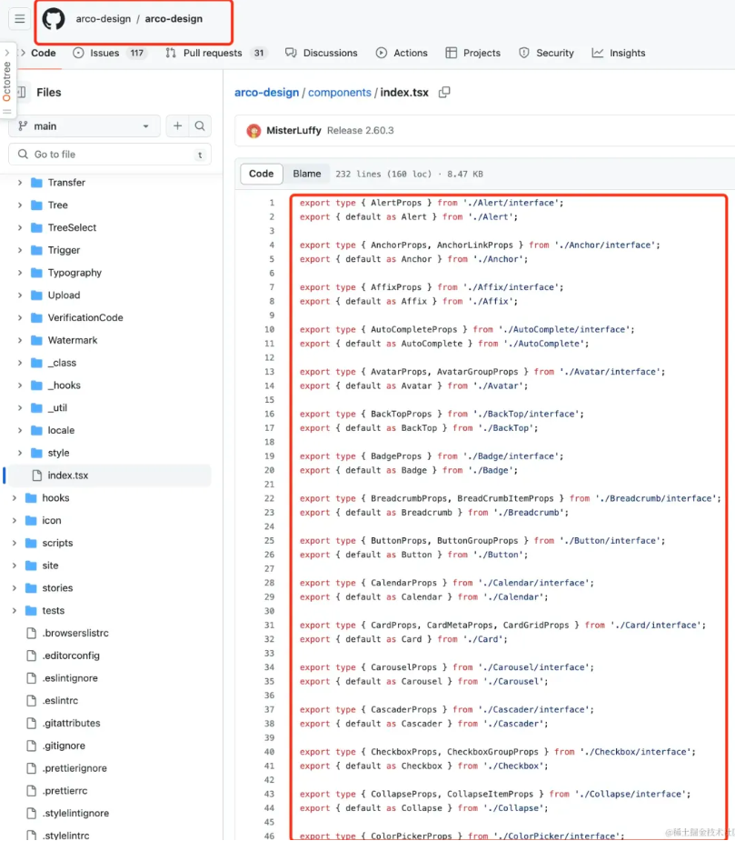

本文内容：
- 产生大量import语句的原因
- 可能带来的问题
- 如何优化和管理import语句

## import是如何“占领满屏“的？
### ~~拒绝~~使用模块重导（Re-export）
模块重导是一种通用的技术。

如：字节的arco-design组件库中的组件：

通过重导在comonents/index.tsx文件暴露所有组件，在使用时一个import就可以使用N个组件了。
```js
// 不使用重导
import Modal from '@arco-design/web-react/es/Modal'
import Checkbox from '@arco-design/web-react/es/Checkbox'
import Message from '@arco-design/web-react/es/Message'
...

// 使用模块重导
import { Modal, Checkbox, Message} from '@arco-design/web-react'
```


Re-export一般用于收拢同类型的模块、一般都是以文件夹为单位，如components、routes、utils、hooks、stories等都通过各自的index.tsx暴露，这样就能极大程度的简化导入路径、提升代码可读性、可维护性。

Re-export的几种形式

**1. 直接重导出**
直接从另一个模块重导出特定的成员。
```js
export { foo, bar } from './moduleA';
```

**2. 重命名并重导出（含默认导出）**

从另一个模块导入成员，可能会重命名它们，然后再导出。

默认导出也可以重命名并重导出
```js
// 通过export导出的
export { foo as newFoo, bar as newBar } from './moduleA';
// 通过export default导出的
export { default as ModuleDDefault } from './moduleD';
```
**3. 重导出整个模块（不含默认导出）**

将另一个模块的所有导出成员作为单个对象重导出。（注意：整个导出不会包含export default）
```js
export * from './moduleA';
```
**4. 收拢、结合导入与重导出**
首先导入模块中的成员，然后使用它们，最后将其重导出。
```js
import { foo, bar } from './moduleA';
export { foo, bar };
```

通过这些形式，我们可以灵活地组织和管理代码模块。每种形式都有其适用场景，选择合适的方式可以帮助我们构建出更清晰、更高效的代码结构。

### ~~从不~~使用require.context
require.context 是一个非常有用的功能，它允许我们动态地导入一组模块，而不需要显式地一个接一个地导入。

只需一段代码让你只管增加文件、组件,将自动收拢重导。

在项目路由、状态管理等固定场景下极其好使（能提效、尽可能避免了增加一个配置要动N个文件的情况）

尤其是在配置路由时、产生大批量的import（多少个页面就得导入多少个import😅）
```js
// 不使用require.context
import A form '@/pages/A'
import B form '@/pages/B'
...
```

```js
// routes/index.ts文件统一处理
// 创建一个context来导入routes目录下所有的 .ts 文件
const routesContext = require.context('./routes', false, /.ts$/);
const routes = [];
// 遍历 context 中的每个模块
routesContext.keys().forEach(modulePath => {
  // 获取模块的导出
  const route = routesContext(modulePath);
  // 获取组件名称【如果需要话】，例如：从 "./Header.ts" 提取 "Header"
  // const routeName = modulePath.replace(/^./(.*).\w+$/, '$1');
  // 将组件存储在组件对象中
  routes.push(route.default || route)
});

export default routes;
```

在大项目、多路由的情况下，使用 require.context 在处理路由导入上大有可为。

### ~~从不~~使用import动态导入
动态import也能实现类似require.context的功能、动态收拢模块。关于import动态导入的更多内容可以看下这篇文章内的介绍[《如何在Vite5➕React➕Ts项目中优雅的使用Mock数据？》](https://juejin.cn/post/7344571292354838591)

### 对ProvidePlugin~~不感兴趣~~
webpack.ProvidePlugin是个好东西，但也不能滥用。

项目中用到的变量/函数/库或工具，只要配置后就可以在任何地方使用了。

相信我--看完这个示例，如果你没用过、那你肯定会迫不及待的想要尝试了🤗
```js
const webpack = require('webpack');
module.exports = {
  // 其他配置...
  plugins: [
    new webpack.ProvidePlugin({
      React: 'react',
      _: 'lodash',
      dayjs: 'dayjs',
      // 假设项目中自己定义的utils.js在src目录下
      Utils: path.resolve(__dirname, 'src/utils.js')
})
    })
  ]
  // 其他配置...
};
```
现在你可以在任何地方使用 dayjs、lodash、Utils等，而不需要导入它

### 小结：

webpack.ProvidePlugin是一个强大的工具，它可以帮助我们减少重复的导入语句，使代码更加干净整洁。但是，它不会减少构建大小，因为这些库仍然会被包含在你的最终打包文件中。正确使用这个插件可以提高开发效率，但需要谨慎使用，以避免隐藏依赖关系，导致代码难以理解和维护。


对于需要按需加载的模块或组件，考虑使用动态 import() 语法，这样可以更有效地控制代码的加载时机和减小打包体积。


谨慎使用 ProvidePlugin，只为那些确实需要在多个地方使用的模块配置全局变量，以避免不必要的代码打包。

### vite项目: vite-plugin-inject
另外，如果是Vite项目可以使用vite-plugin-inject代替ProvidePlugin的功能
```js
// 配置
import inject from 'vite-plugin-inject'; 
...
plugins: [
    inject({
    // 键是你想要提供的全局变量，值是你要提供的模块
    dayjs: 'dayjs', // 例如，这将在全局范围内提供 'dayjs'，可以通过 dayjs 访问
    // 你可以继续添加其他需要全局提供的模块
    }),
]
...
```
### 使用了TS
如果使用了TS，记得配置下类型：
```js
// globals.d.ts文件 处理全局类型
import dayjs from 'dayjs';
declare global {
  const dayjs: typeof dayjs;
}

// tsconfig.json文件 也配置一下
{ 
"compilerOptions": { 
// 编译选项... 
}, 
"include": [ "src/**/*", "globals.d.ts" // 确保 TypeScript 包括这个文件 ] 
}
```

### ~~大量~~使用Typescript导入类型
在TS项目中，满屏import肯定少不了TS的份。但如果合理配置，必定能急剧减少import的导入

这里介绍下自己在项目中使用最多的方法：TS命名空间。有了它既能让类型模块化，更过分的是在使用时可以直接不导入类型😅。

使用示例：
```js
// accout.ts
declare namespace IAccount {
  type IList<T = IItem> = {
    count: number
    list: T[]
  }
  interface IUser {
    id: number;
    name: string;
    avatar: string;
  }
}

// 任意文件直接使用，无需导入
const [list, setList] = useState<IAccount.IList|undefined>();
const [user, setUser] = useState<IAccount.IUser|undefined>();
```

注意⚠️eslint可能需要配置下开启使用命名空间

### 《~~不去~~充分利用bable特性》
React似乎也意识到不妥：在17版本之前，由于jsx的特性每个组件都需要明文引入import React from 'react'，但在这之后由编译器自行转换，无需引入 React。如果你使用的React17之前的版本也可以通过修改babel达到这个目的，更多细节可参考React官网[3]，有非常详细的说明。（也提供了自动去除引入的脚本）

## 其它
### 1. 设置webpack、ts别名。
既能缩短导入路径、也能更有语义化
```js
resolve: {
  alias: {
    "@src": path.resolve(__dirname, 'src/'),
    "@components": path.resolve(__dirname, 'src/components/'),
    "@utils": path.resolve(__dirname, 'src/utils/')
  }
}

// 使用别名前
import MyComponent from '../../../../components/MyComponent';

// 使用别名后
import MyComponent from '@components/MyComponent';
```

### 2. 设置格式化prettier.printWidth
值设置的太小可能会导致频繁换行、给够难以阅读（看团队实际的使用情况）。
```js
{
  "printWidth": 120,
  ...
}
```
### 3. 按条件动态全局加载组件
在入口文件引入全局组件，使用require.ensure或import根据条件动态加载组件，既能便于维护、减少引用、也能减少性能开销
```js
// 异步加载全局弹窗，减少性能开销
Vue.component('IMessage', function (resolve) {
  // 指定条件全局加载，无需在具体页面中引用
  if (/^\/pagea|pageb/.test(location.pathname)) {
  require.ensure(['./components/message/index.vue'], function() {
    resolve(require('./components/message/index.vue'));
  });
  }
});
```
### 4. babel-plugin-import的使用
babel-plugin-import不是直接减少 import 的数量，而是通过优化 import 语句来减少打包体积，提高项目的加载性能。这对于使用了大型第三方库的项目来说是一个非常有价值的优化手段。

以arco-design为例：
```js
// .bablerc配置
{
  "plugins": [
    ["import", {
      "libraryName": "@arco-design/web-react",
      "libraryDirectory": "es", // 或者 "lib"，依赖于具体使用的模块系统
      "style": true // 加载 CSS
    }, "@arco-design/web-react"]
  ]
}
```
这个配置告诉 babel-plugin-import 自动将类似 import { Button } from '@arco-design/web-react'; 的导入语句转换为按需导入的形式，并且加载对应的 CSS 文件。
```js
// 业务中使用
import { Button } from '@arco-design/web-react';
// 将被bable编译成
import Button from '@arco-design/web-react/es/button';
import '@arco-design/web-react/es/button/style/css.js'; // 如果 style 配置为 true
```

## 总结
导致import占满全屏的原因有很多。但不用模块重导、require.context、import动态导入、webpack.ProvidePlugin等手段，一定会让我们写出满屏的import😂🤣😅😇。


参考资料
[1]
https://github.com/arco-design/arco-design/blob/main/components/index.tsx: https://link.juejin.cn?target=https%3A%2F%2Fgithub.com%2Farco-design%2Farco-design%2Fblob%2Fmain%2Fcomponents%2Findex.tsx

[2]
: https://juejin.cn/post/7344571292354838591

[3]
https://zh-hans.legacy.reactjs.org/blog/2020/09/22/introducing-the-new-jsx-transform.html: https://link.juejin.cn?target=https%3A%2F%2Fzh-hans.legacy.reactjs.org%2Fblog%2F2020%2F09%2F22%2Fintroducing-the-new-jsx-transform.html


