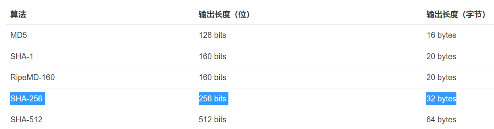

## 哈希算法
为了确保密码的安全，通常使用哈希算法来加密后存储密码。


哈希算法是一种单向加密过程，**不可逆** 的

### 常见的哈希算法


根据碰撞概率，哈希算法的输出长度越长，就越难产生碰撞，也就越安全。

以SHA-256算法为例，如果你的密码 "Password123" 通过SHA-256哈希后，将会得到一个64位的哈希值，如：
```js
5e884898da28047151d0e56f8dc6292773603d0d6aabbdd62a11ef721d1542d8
```
这个哈希是唯一值是唯一的，由于哈希算法的特性，相同的密码生成相同的哈希值。


网站将生成的哈希值存储在数据库中，而不是存储原始密码

### 特性
- 不可逆：哈希值很难几乎不可能推算出原始数据
- 确定行：同样的输入，使用同样的算法，得到的是同样的哈希值
- 高度散列：即使很小的变化，也能导致哈希值巨大的变化

### 使用盐值
理论上哈希算法仍存在哈希碰撞的可能，即两个不同的输入可能产生相同的哈希值。为了减少这种风险，可以使用盐值(salt)技术,盐值：随机生成的数据片段，拼接在输入数据后面在进行哈希处理


假如你的密码"Pwd123456"再加上一个盐值"random",结合成"Pwd123456random"，这个字符串再次进行哈希处理，得到一个新的哈希值。


这样即使两个相同的密码，由于盐值不同，他们的哈希值也会不同，从而进一步增强密码的安全性。（存储的时候需要存储盐值吗？校验的时候怎么验证密码？）


### 登录密码的验证
因为安全性，存储在数据库的不是原始密码，而是哈希算法后的哈希值；

1. 用户输入密码
2. 系统对接受到的密码，添加盐值（如果有的话），并执行与数据库中相同的哈希算法
3. 系统得到一个新的哈希值
4. 将这个哈希值与数据库的哈希值进行比较

如果匹配上，那么系统输入的是正确的，只有正确的原始密码通过相同的哈希过程才能得到相同的哈希值。确保密码的安全性

### ∴
由于网站存储的是哈希值而非原始密码，所以只有引导用户修改或者重置密码，无法从数据库中通过哈希得到原始密码。设置密码后得到新的密码存入数据库