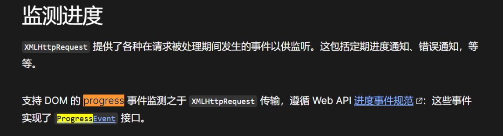
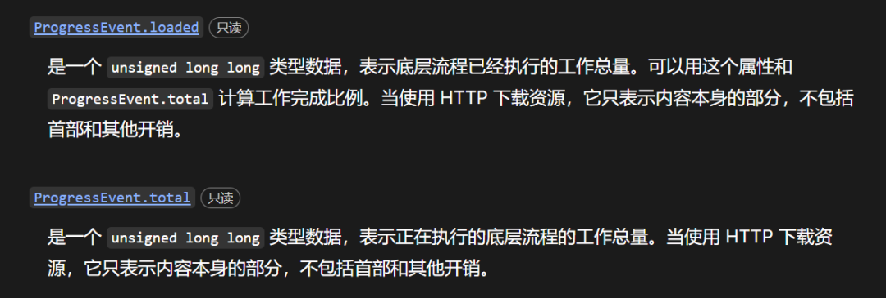
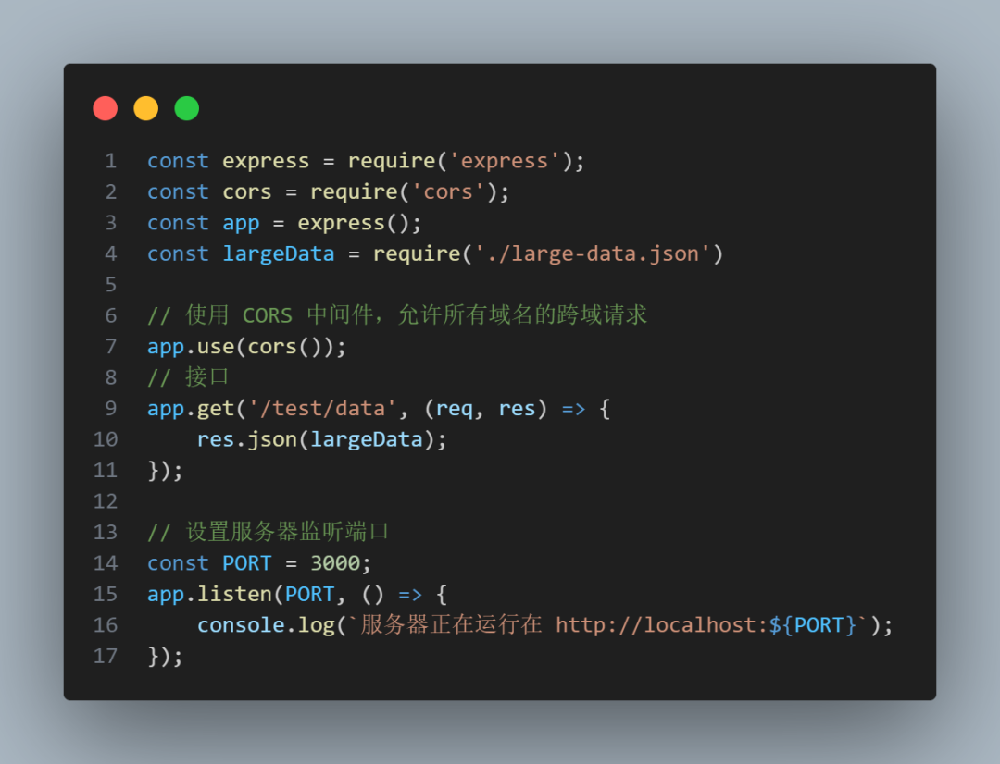
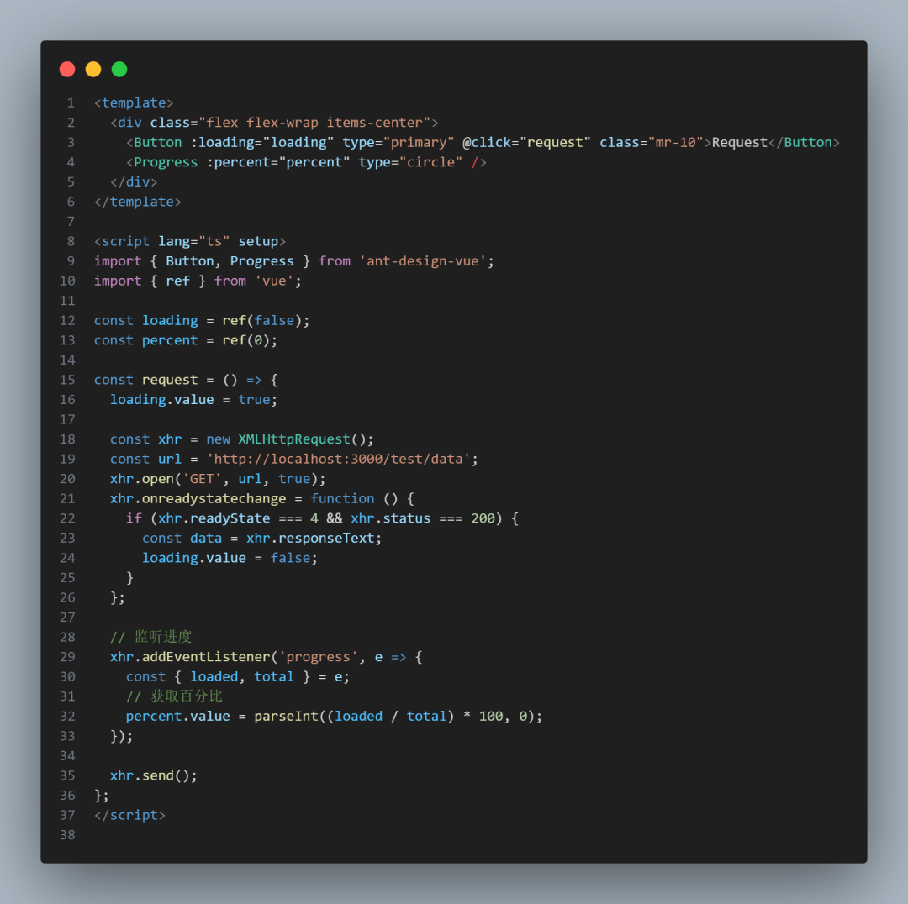
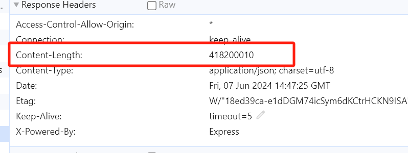
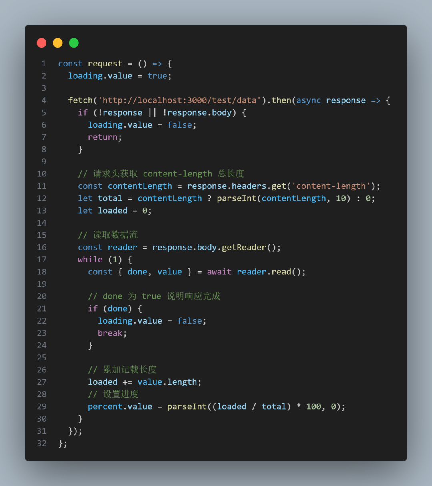
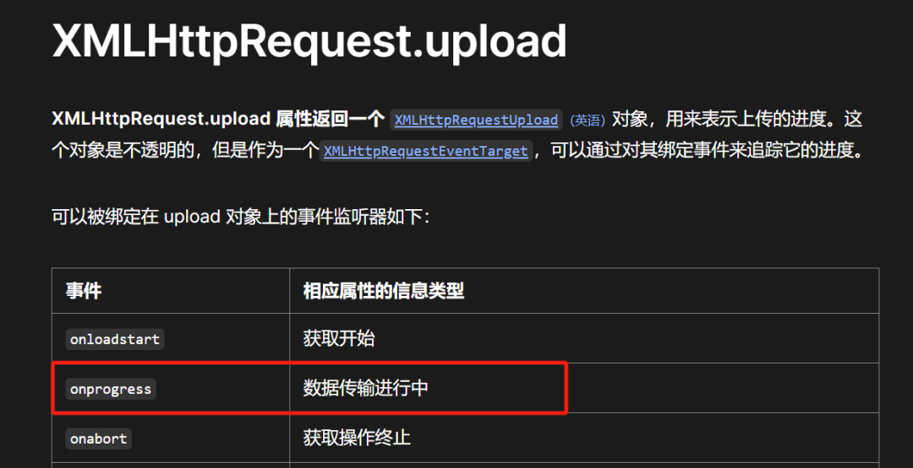
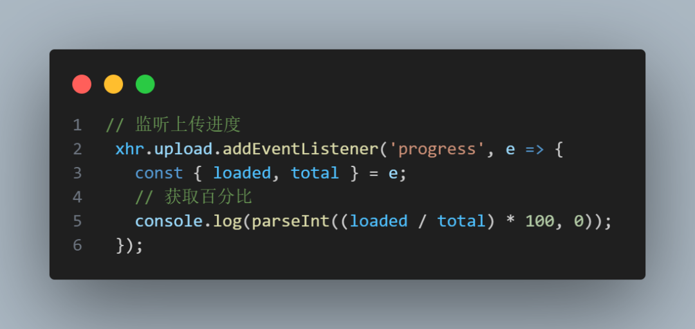

# 如何获取请求的进度，并展示给用户看
两种请求：一 xhr 二 fetch

## 如何实时获取请求响应的进度？
### xhr
Xhr 的响应进度其实是比较好获取的，因为 JavaScript 官方提供了一个监听函数 progress来对响应进度进行监听

并且这个方法接收一个对象，对象中有两个属性很重要：

total： 总响应数据的长度
loaded： 已加载的响应数据的长度

所以我们可以根据这两个字段来算出百分比，进而展示出来~

在此之间我先自己用 express 在本地起了一个本地服务，用来演示发起请求

接着回到前端页面，我们使用组件库，写出一个页面

当我们点击按钮发起请求并收到响应后，会监听到每次的百分比，代码

### Fetch
其实 Fetch 也是同理，只要我们能拿到 total 和 loaded ，也就是 数据总长度 和 已加载长度，就能算出百分比

但是 Fetch 没有监听函数，所以得换一种方式去获取，大概思路就是

先从请求头获取到 content-length 总长度
再用数据流的 API body.getReader 去读取响应体当前已加载的长度

最终也能达到我们想要的结果

## 上传进度
说完响应进度，我们再来说说上传进度应该怎么去监听呢？

### xhr
XHR 可以使用XMLHttpRequest.upload自带的监听函数progress去做

### Fetch
目前还未有办法可以监听