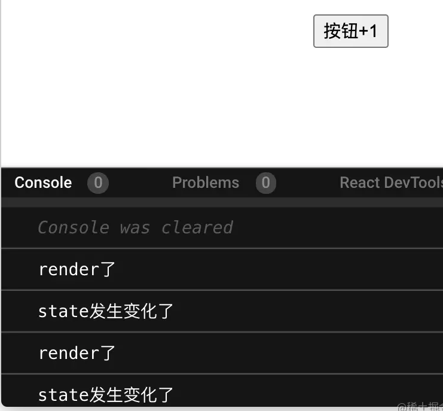

## 什么是Effect
effect（副作用）是react函数组件用来替代生命周期的函数。你可以把 useEffect Hook 看做 componentDidMount，componentDidUpdate 和 componentWillUnmount 这三个函数的组合。

## 用法
它的参数如下： 
> useEffect(callback[,[]])

第一个参数接受一个callback回调函数，里面可以写执行业务代码
第二个参数可省略，它接受一个数组，可以是空数组，也包含了state数据

## 说明
当不传递第二个参数时，每次render都会执行一遍callback函数，相当于包含第一遍
render的componentDidUpdate

当传递第二个参数且是空数组时，只有第一次render才会执行callback，类似于componentDidMount

不管是否传递第二个参数，只要在callback中return 一个函数，就相当于告诉react此组件挂掉之前执行什么操作，类似于componentWillUnMount


## 示例
### 模拟componentDidMount
```js
export default function App() {
  const [state, setState] = useState(0);
  useEffect(() => {
    console.log("第一次render了");
  }, []); //这里传递了空数组
  return (
    <div className="App">
      <h1>{state}</h1>
      <button
        onClick={() => {
          setState((x) => x + 1);
        }}
      >
        按钮+1
      </button>
    </div>
  );
}
```

上面的例子中，我们在第二个参数中传递了数组，这个数组表示让react监控数组内部的数据，当其发生变化时，执行useEffect函数。输出

- 第一次render了

当传递的是空数组时，就只会触发第一次渲染. 

### 模拟componentDidUpdate
当我把上面的例子改成
```js
React.useEffect(() => {
    console.log("state发生变化了");
  }, [state]); //这里传递了数组，里面是监控的数据
```

如果state发生变化，就会执行此段函数。
这里注意，useEffect总是后于render函数的，所以不管怎样，都会通过render函数把页面更新完成，才会执行useEffect内的代码 



小tips： 上面的代码实际上并不能模拟componentDidUpdate，因为当state第一次初始化时，也会执行Effect内部的代码

如果要监控所有数据，可以不传第二个参数

### 模拟componentWillUnMount
在useEffect参数的callback函数中直接return一个函数，就相当于告诉react，我要在这个组件死之前 执行一段代码
```js
import React from "react";
export default function App() {
  const [state, setState] = React.useState(0);

  return (
    <div className="App">
      {state === 1 ? null : <Child />}
      <h1>{state}</h1>
      <button
        onClick={() => {
          setState((x) => x + 1);
        }}
      >
        按钮+1
      </button>
    </div>
  );
}
const Child = () => {
  React.useEffect(() => {
    console.log("这个child组件第一次render了")//这里是第一次进入时执行的代码
    return () => { // **注意看这里的代码**
      console.log("这个div灭亡前的代码");
    };
  }, []);
  return <div>孩子组件</div>;
};
```

上面的代码设置了一个button，当点击时，触发state+1，然后页面不再渲染Child组件，就相当于删除了Child组件,在Child灭亡前，会执行console.log("这个div灭亡前的代码")

## LayoutEffect
要了解layoutEffect和useEffect的区别，需要看下面这张图 


react函数组件执行过程是先执行函数组件代码，变成虚拟dom，再经过编译后转化成真实dom，让render函数去渲染并更新视图。是一个从上到下数据变换的过程。

useEffect发生在视图更新后，而layoutEffect发生在编译成dom元素之后视图更新之前

useLayoutEffect比useEffect先执行

```js
export default function App() {
  const [state, setState] = React.useState(0);
  useEffect(() => {
    console.log("第一次render时执行");
  }, []);
  useEffect(() => {
    if (state > 0) {
      console.log("第二次之后render时执行");
    }
  }, [state]);
  useLayoutEffect(() => {
    console.log("我比useEffect先执行");
  });
  return (
    <div className="App">
      <h1>{state}</h1>
      <button
        onClick={() => {
          setState((x) => x + 1);
        }}
      >
        按钮+1
      </button>
    </div>
  );
}
```
上面的代码第一次渲染后是这样的
- 我比useEffect先执行 
- 第一次render时执行 

点击button后的控制台变成了这样
- 我比useEffect先执行 
- 第一次render时执行 
- 我比useEffect先执行 
- 第二次之后render时执行

## 结论
* useEffect的代码是按照顺序执行的，但useLayoutEffect总是比useEffect先执行。
* 由于useLayoutEffect的代码是跟DOM操作相关的，所以最好在里面写跟DOM相关的代码
### useEffect和useLayoutEffect如何抉择
- 两者的执行顺序不同，定位也不同，由于操作DOM需要一定时间，我们最好优先使用useEffect，以保证用户页面第一时间渲染出来。
- 如果业务需求是先要进行DOM操作或者跟页面布局相关的，那么就可以使用useLayoutEffect。

## 总结
由于函数组件没有生命周期，所以react创造了useEffect，以保证支持一定的生命周期操作，我们从上面的例子中了解到useEffect总是后于render执行，也熟悉了useEffect的传参与生命周期的关系，如果说都无法满足需求，且需要操作DOM布局的情况那么可以尝试使用useLayoutEffect
