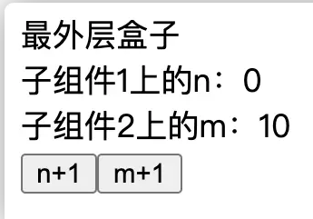
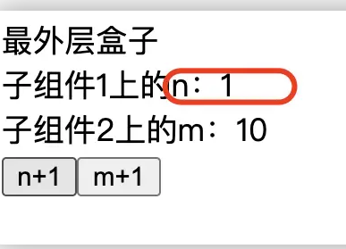

react.memo 此方法是浅比较。
## 特点
* 接受两个参数，第一个参数为()=>value,（函数，有return
* 第二个参数是依赖，为[m,n]。
* 只有当依赖变化时，才会计算新的value。
* 如果依赖不变，那么就会重用之前的value。
* 就像Vue2中的计算属性computed一样。。

## 注意事项
* 如果value是一个函数，那这个Hook就要写成下面这种看着都麻烦的形式：
```js
useMemo( ( ) => (x) => console.log( x ))
```
* 这是一个返回函数的函数。
* 因为不好用，于是React的开发团队又添加了一个useCallback。
useCallback用法
* useCallback(x=>console.log(x), [m])等价于useMemo(()=>x=>console.log(x),[m])


## Memo
在class的时代，我们一般是通过pureComponent来对数据进行一次浅比较，引入Hook特性后，我们可以使用Memo进行性能提升。
在此之前，我们来做一个实验
```js
import React, { useState } from "react";
import ReactDOM from "react-dom";

import "./styles.css";

function App() {
  const [n, setN] = useState(0);
  const [m, setM] = useState(10);
  console.log("执行最外层盒子了");
  return (
    <>
      <div>
        最外层盒子
        <Child1 value={n} />
        <Child2 value={m} />
        <button
          onClick={() => {
            setN(n + 1);
          }}
        >
          n+1
        </button>
        <button
          onClick={() => {
            setM(m + 1);
          }}
        >
          m+1
        </button>
      </div>
    </>
  );
}
function Child1(props) {
  console.log("执行子组件1了");
  return <div>子组件1上的n：{props.value}</div>;
}
function Child2(props) {
  console.log("执行子组件2了");
  return <div>子组件2上的m：{props.value}</div>;
}

const rootElement = document.getElementById("root");
ReactDOM.render(<App />, rootElement);
```
上面的代码我设置了两个子组件，分别读取父组件上的n跟m，然后父组件上面设置两个点击按钮，当点击后分别让设置的n、m加1。以下是第一次渲染时log控制台的顺序:
- 执行最外层盒子了
- 执行子组件1了
- 执行子组件2了


跟想象中一样，render时先进入App函数，执行，发现里面的两个child函数，执行，创建虚拟dom，创建实体dom，最后将画面渲染到页面上。 




## 使用Memo优化
当我点击n+1按钮时，此时state里面的n必然+1，也会重新引发render渲染，并把新的n更新到视图中。  


我们再看控制台
- 执行最外层盒子了
- 执行子组件1了
- 执行子组件2了
+ 执行最外层盒子了
+ 执行子组件1了
+ 执行子组件2了 //为什么组件2也渲染了，里面的m没有变化

你会发现子组件2也渲染了，显然react重新把所有的函数都执行了一遍，把未曾有n数据的子组件2也重新执行了。

### 如何优化？我们可以使用memo把子组件改成以下代码
```js
const Child1 = React.memo((props) => {
  console.log("执行子组件1了");
  return <div>子组件1上的n：{props.value}</div>;
});

const Child2 = React.memo((props) => {
  console.log("执行子组件2了");
  return <div>子组件2上的m：{props.value}</div>;
});
```
再重新点击试试？
- 执行最外层盒子了
- 执行子组件1了
- 执行子组件2了
+ 执行最外层盒子了
+ 执行子组件1了

会发现没有执行子组件2了

这样的话react就会只执行对应state变化的组件，而没有变化的组件，则复用上一次的函数，也许memo也有memory的意思，代表记忆上一次的函数，不重新执行（我瞎猜的- -！！）

## 出现bug
上面的代码虽然已经优化好了性能，但是会有一个bug
上面的代码是由父组件控制button的，如果我把控制state的函数传递给子组件，会怎样呢？
```js
<Child2 value={m} onClick={addM} /> //addM是修改M的函数
```
点击按钮让n+1
- 执行最外层盒子了
- 执行子组件1了
- 执行子组件2了
+ 执行最外层盒子了
+ 执行子组件1了
+ 执行子组件2了

又重新执行子组件2。

为什么会这样？因为App重新执行了，它会修改addM函数的地址（函数是复杂数据类型），而addM又作为props传递给子组件2，那么就会引发子组件2函数的重新执行。

## useMemo
这时候就要用useMemo解决问题。
> useMemo(()=>{},[])

useMemo接收两个参数，分别是函数和一个数组（实际上是依赖），函数里return 函数,数组内存放依赖。
```js
const addM = useMemo(() => {
    return () => {
      setM({ m: m.m + 1 });
    };
  }, [m]); //表示监控m变化
```
使用方式就跟useEffect似的。

## useCallback
上面的代码很奇怪有没有
```js
useMemo(() => {
    return () => {
      setM({ m: m.m + 1 });
    };
  }, [m])
```
react就给我们准备了语法糖，useCallback。它是这样写的
```js
  const addM = useCallback(() => {
    setM({ m: m.m + 1 });
  }, [m]);
```
是不是看上去正常多了？

```js
import React, { useCallback, useMemo, useState } from "react";
import ReactDOM from "react-dom";

import "./styles.css";

function App() {
  const [n, setN] = useState(0);
  const [m, setM] = useState({ m: 1 });
  console.log("执行最外层盒子了");
  const addN = useMemo(() => {
    return () => {
      setN(n + 1);
    };
  }, [n]);
  const addM = useCallback(() => {
    setM({ m: m.m + 1 });
  }, [m]);
  return (
    <>
      <div>
        最外层盒子
        <Child1 value={n} click={addN} />
        <Child2 value={m} click={addM} />
        <button onClick={addN}>n+1</button>
        <button onClick={addM}>m+1</button>
      </div>
    </>
  );
}
const Child1 = React.memo((props) => {
  console.log("执行子组件1了");
  return <div>子组件1上的n：{props.value}</div>;
});

const Child2 = React.memo((props) => {
  console.log("执行子组件2了");
  return <div>子组件2上的m：{props.value.m}</div>;
});

const rootElement = document.getElementById("root");
ReactDOM.render(<App />, rootElement);
```

## 实现比较深的策略：

### 1、使用Json.stringify()
```js
import React, { useMemo } from 'react';

const MyComponent = ({ data }) => {
  const stringifiedData = JSON.stringify(data);
  const memoizedValue = useMemo(() => {
    // 执行昂贵的计算或逻辑
    return 计算结果;
  }, [stringifiedData]);
  return (
    <div>

      {/* 这里使用缓存的值 */}

      <p>{memoizedValue}</p>

    </div>
  );
};
```
，但需要注意的是，如果数据结构发生变化，即使实际内容没有变化，也会导致重新计算。

### 2、使用lodash的 isEqual 
```js
import React, { useMemo, useRef } from 'react';
import _ from 'lodash';

const MyComponent = ({ data }) => {
  const ref = useRef(data);
  const memoizedValue = useMemo(() => {
    if (!_.isEqual(ref.current, data)) {
      // 执行昂贵的计算或逻辑
      ref.current = data;
    }
    return ref.current;
  }, [data]);
  return (
    <div>

      {/* 这里使用缓存的值 */}

      <p>{memoizedValue}</p>

    </div>
  );
};
```

## 总结
* 使用memo可以帮助我们优化性能，让react没必要执行不必要的函数
* 由于复杂数据类型的地址可能发生改变，于是传递给子组件的props也会发生变化，这样还是会执行不必要的函数，所以就用到了useMemo这个api
* useCallback是useMemo的语法糖
