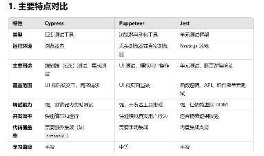
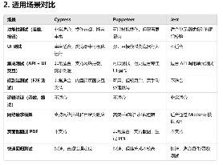
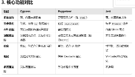
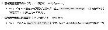

## 码覆盖率
代码覆盖率计算是衡量测试覆盖程度的一种方法，它可以评估代码中被测试覆盖的部分与总代码量（或本次迭代的增量代码）的比例。
具体来说，又可以分为“语句覆盖”“分支覆盖”“函数覆盖”。

## 插桩--覆盖率数据收集--生成报告

##
- istanbul 是一个 JavaScript 代码覆盖率工具
-  cypress（一个受欢迎的 E2E 前端测试框架）

- webpack-plugin-istanbul + nyc + cypress
- jest

cypress E2E测试工具，适合 测试完整的用户端到端体验（登录、表单、UI 渲染、跳转）
jest  

## 最终决定：使用jest

优点：
轻量且快速：适合单元测试，学习成本低，语法贴近日常 JavaScript 编程。
丰富的断言库：内置的 expect 和扩展插件满足大多数测试需求。
Mock 功能强大：可以轻松模拟函数、模块、网络请求。
缺点：
对于 E2E 测试不适合，需要结合其他工具（如 Puppeteer 或 Playwright）。
需要对 Mock 和快照测试有一定理解，初学者可能需要花时间学习如何高效使用。

- 如何高效的使用
- 那些组件/模块/函数 需要