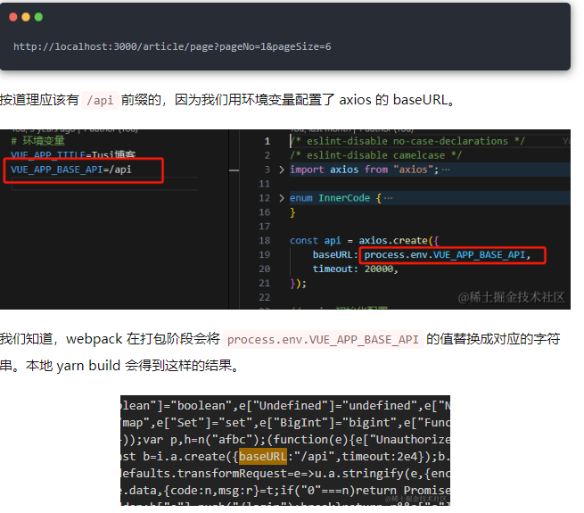
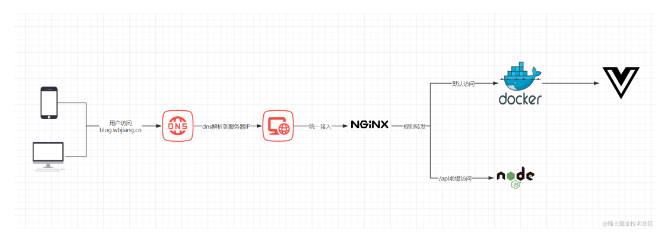

## Image Container Network Volume
- Image 就是镜像，相当于一个类，或者说是一个模板，Image 是通过 Dockerfile 定义和构建的，Dockerfile 描述了制作 Image 的过程。

- Container 是容器，它是基于镜像实例化得到的。容器是天然隔离的，容器包含了运行应用程序所需的所有东西，比如代码、依赖库、环境变量等。

- Network 是网络，允许容器之间以及容器与宿主机之间进行通信。

- Volume 是数据卷，用于挂载文件，解决容器中文件持久化的问题。

***采用CS架构，Docker Desktop 发出指令 --> Docker daemon接收***
daemon就是监听器进程，所有指令都要经过它的调度才能处理，像镜像操作、容器操作、网络操作、卷操作


下面将从vue项目换成docker镜像操作开始，认识docker

## 第一步，将vue项目换成镜像，第一步，打包,
用nodejs打包
```py
# 使用官方Node.js作为基础镜像
FROM node:16 as builder

# 设置工作目录
WORKDIR /app

# 首先复制项目的依赖配置文件
COPY package.json yarn.lock ./

# 安装项目依赖，这一步会生成一个独立的层，并且只有在package.json或yarn.lock变化时才会重新执行
RUN yarn install

# 接着复制项目所有文件，这一步会生成一个新的层
COPY . .

# 构建项目，这一步也会生成一个新的层
RUN yarn build
```

那怎么访问到这些web资源呢？需要一个web服务器。使用Nginx,把端口暴露出去，
```py
# 使用Nginx镜像来运行构建好的项目
FROM nginx:latest

# 将构建好的项目复制到Nginx镜像的/usr/share/nginx/html目录下
COPY --from=builder /app/dist/ /usr/share/nginx/html

# 暴露端口
EXPOSE 80
```
整合完，就可以打镜像了
```py
docker build -t vue3-ts-blog-frontend .
```

最后的.号代表上下文路径，Docker 会在这个路径下寻找 Dockerfile 及其他文件，根据 Dockerfile 配置打镜像。
在本地进行 镜像验证：
```py
docker run -dp 3000:80 vue3-ts-blog-frontend
```
3000:80代表把宿主机的 3000 端口转发到容器的 80 端口，vue3-ts-blog-frontend则是我们刚才打出的镜像的名字。

## 第二步，localhost:3000打开成功后，会是404

!!! 最后是 dockerignore 把.env文件给忽略了（坑）

再打开还是404，此时访问路径是正常了，但请求前缀api，需要nginx转发。

还有404的问题,改成自定义的图

那就是 404 的 fallback 处理，这个需要通过 nginx 的 try_files 配置实现。

如果要给 nginx 配置 try_files，就需要覆盖 nginx 镜像的 /etc/nginx/conf.d/default.conf 文件，我们给 Dockerfile 新增一条 COPY 指令。
```py
# 复制自定义的Nginx配置到镜像中，覆盖默认配置
COPY nginx/default.conf /etc/nginx/conf.d/default.conf
```
在项目中新建nginx/default.conf，覆盖过去
```js
server {
    listen 80;
    root /usr/share/nginx/html;
    index index.html;

    location / {
        try_files $uri $uri/ /index.html;
    }
}
```
有了 try_files 配置后，无法匹配 nginx 路由的请求就会被转到 index.html，这个 index.html 自然就是 Vue 项目的入口。如果项目中 vue-router 配置了pathMatch，就能将未被定义的路由重定向到 /404 路由。

```js
// 匹配任意路径
const FALLBACK_ROUTE = {
    name: "Fallback",
    path: "/:pathMatch(.*)*",
    redirect: "/404",
}
```

ok 完成，重新打包
```js
docker build -t vue3-ts-blog-frontend .
```

## 私有镜像仓库的使用
镜像打好了之后，总得有个地方把它存起来，然后服务器上才能去拉取这个镜像进行部署，这就是镜像仓库做的事情。

DockerHub 上有一个 registry 镜像，就是用来搭建镜像仓库的。后续抽空单独出一篇文章分享一下如何用这个 registry 镜像搭建一个私有 Docker Registry。

实践：
免费的可靠的私有镜像仓库提供商: aliyun
 在容器-容器服务这里有个容器镜像服务 ACR，我们打开它。

我们按照指引创建命名空间和仓库后，就可以进入仓库查看了，这里提供了登录 registry、推拉镜像的所有命令示例，操作起来非常简单。

https://cr.console.aliyun.com/cn-hangzhou/instances

私有镜像仓库都是要先登录才能使用的，我们先用 docker login 登录 aliyun registry。
```js
docker login --username=itaobao8023 registry.cn-hangzhou.aliyuncs.com
Password: 
Login Succeeded
```
然后使用 docker tag 给前端项目打一个 aliyun registry 专属的 tag。
```js
docker tag vue3-ts-blog-frontend registry.cn-hangzhou.aliyuncs.com/tusi_personal/blog:2.0.4
```
接着就可以使用 docker push 推送镜像了。
```js
docker push registry.cn-hangzhou.aliyuncs.com/tusi_personal/blog:2.0.4
```

## 服务器部署改造
接着我们来到服务器，在服务器上拉取这个镜像。当然在服务器上也要先登录，才能 pull 镜像，我们先执行上面的 docker login 操作。

接着进行 pull 操作拉取镜像。
```js
docker pull registry.cn-hangzhou.aliyuncs.com/tusi_personal/blog:2.0.4
```

镜像拉取成功后，通过 docker run 把容器跑起来。
```js
docker run -dp 3000:80 registry.cn-hangzhou.aliyuncs.com/tusi_personal/blog:2.0.4
```

容器的 80 端口映射到了宿主机器的 3000 端口，此时可以通过 curl 测试一下可访问性。
```js
curl localhost:3000
```


## 
配置nginx的代理，将接口请求到后端，所以就成了
