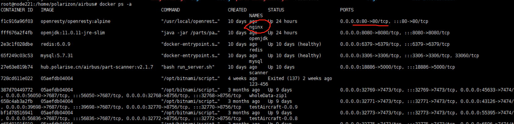

## 
前端打包的结果web，放在了相应位置上，这个不算在docker镜像里，怎么算是发布到docker中？

### 构建镜像
```yaml
docker build -t front-web .
```
-t front-web: 给镜像命名
. : 基于目前的 Dockerfile目录来构建镜像 ---？？当前没有dockerfile文件，在根目录上只有 前端打包的web，和docker-compose.yaml

### 查看镜像
```yaml
 docker image ls | grep front-web
```

### 推送镜像
```yaml
docker push
```

### 查看容器名 
```yaml
docker ps -a
```
（空客前端容器为 nginx
根据nginx设置的80端口，找到容器名


### 运行容器
```yaml
docker run -d -p 3000:80 --name nginx front-web
```
-d 设置容器在后台运行
-p 表示端口映射，把本机的 3000 端口映射到 container 的 80 端口（这样外网就能通过本机的 3000 端口访问了。
--name 设置容器名 nginx
front-web 是上面构建的镜像名字

- 打tags
```yaml
docker tag <image> <username>/<repository>:<tag>
```

### docker-compose.yaml
```yaml
version: '3.3'
      
services:
  app:
    image: openresty/openresty:alpine       镜像
    container_name: nginx                   容器名
    restart: always                         服务器重启行为
    ports:
      - 80:80                               端口
    volumes:
      - ./web:/usr/share/nginx/html
      - ./nginx/nginx.conf:/etc/nginx/nginx.conf
      - ./nginx/default.conf:/etc/nginx/conf.d/default.conf
    depends_on:
      - openjdk

```
```js
 cd docker
    docker-compose config
    docker-compose up -d
    docker-compose ps
```

#### restart: always 的具体行为：
当容器因为任何原因退出时，Docker 会自动尝试重新启动该容器。
如果 Docker 主机（运行容器的服务器或虚拟机）重启，Docker 也会自动重新启动容器。
该重启策略忽略容器退出码（即无论容器是正常退出还是由于异常退出），都会重启容器。

- 其他值：
1、no（默认值）：
Docker 不会自动重启容器。容器一旦停止就会保持停止状态，除非手动重新启动。

2、on-failure：
只有在容器非正常退出（退出码非 0）时，Docker 才会重启容器。如果容器正常退出（退出码为 0），则不会重启。
可以通过指定次数来限制最大重启次数，例如 on-failure: 5 表示最大重启 5 次。

3、unless-stopped：
容器在意外停止或 Docker 主机重启时会重启，和 always 类似。
不同的是，如果容器被手动停止（如 docker stop），则不会再自动重启。

- 什么时候不适合使用 restart: always
虽然 restart: always 可以保证高可用性，但也有一些情况下不适合使用：

如果容器不断崩溃，而 restart: always 可能导致容器无限重启，无法排查问题。
在开发环境中，频繁自动重启可能会干扰调试过程。
### cd docker：
切换到名为 docker 的目录。该目录应该包含与 Docker 相关的配置文件，例如 docker-compose.yml。

### docker-compose config：
检查 docker-compose.yml 文件的语法和配置。它会解析 docker-compose.yml，并显示最终生成的配置（包括继承或覆盖的部分）。可以用于验证配置是否正确。

### docker-compose up -d：
启动定义在 docker-compose.yml 中的所有服务容器，并在后台运行（-d 表示“分离模式”，容器会在后台运行）。
如果相关的镜像不存在，Docker 会自动拉取并构建镜像。
该命令还会根据需要创建网络和挂载卷。

### docker-compose ps：
列出由 docker-compose 管理的正在运行的容器，显示每个容器的状态和端口映射等信息。


## 空客要做什么
1、需要加上docker文件夹，里面有nginx，需不需要把nginx文件移到前端来? -- 在服务器中移动了
2、打包后放到这个docker文件夹中，然后进行镜像构建和发布，是写start.sh 脚本?  -- start脚本跟其他项目一样，但没有环境变量，只有一行代码，再写一个build脚本，用于构建和发布，需要手动去执行这个脚本
3、这里的docker-compose跟外面的冲突了，怎么处理里面的内容？这两个文件需要保留一个还是两个都可以保留 -- 直接使用外面的就行，修改掉前端的镜像

## 已解决
1、如果加上版本控制，即：打包结果不是web，而是xx-xx-xx@front-web,服务器怎么去识别展示这个内容呢？
- docker-compose中的镜像名，可以指定已发布的镜像
但是如果每次版本改变，这个值需要用变量，
像空客中没有dockerfile和jenkins，怎么去放这个变量呢

2、其他项目有docker文件，但是没有看到是在哪里进行了复制和移动？
看物联网项目：
yarn install /yarn build的时候，直接在git上的整个项目进行操作，然后把dist放到docker文件夹中，文件夹中含有dockerfile和docker-compose,所以可以直接进行docker build 和push 操作

3、构建的时候，没有dockerfile文件，可以构建吗？
- 直接加上dockerfile文件，里面没有像物联网的copy nginx等操作，那dockerfile里面除了指定某from，还需要做什么呢？？
- 好像也不需要指定from，(玄同没有)

每个dockerfile文件夹都有
```bash
COPY ./web.zip /usr/share/nginx/html/
COPY ./nginx/nginx.conf /usr/local/openresty/nginx/conf/nginx.conf
COPY ./nginx/default.conf /etc/nginx/conf.d/default.conf
COPY ./start.sh /usr/bin/start.sh

RUN mkdir /var/log/nginx    ## 必须要，否则会报错
RUN unzip /usr/share/nginx/html/web.zip -d /usr/share/nginx/html/
```
但是空客中/usr/share/没有nginx这个文件夹，还需要吗？？

-- 后面的文件夹不是在服务器主机上的，而是docker上的，每个应用都需要
这里是物联网把压缩后的包放入，然后再解压，如果直接是文件夹，也可以直接放入


4、构建了镜像后，这个容器还需要吗？ 空客这边的container_name: :nginx
A: 可以留着，不影响

5、改完后，每次操作，我需要去
```bash
docker build -t front-web:0.0.1 .
docker push front-web:0.0.1
``` 
还需要去重启容器吗，
还有其他操作吗
这两个操作可以写一个脚本？还是不麻烦的话直接操作也行 - 都可，

A: 现在是写在build.sh中，要切换版本 
需要去docker-compose.yaml里，把镜像版本换一下，然后重新执行docker-compose up

6、depends_on 还需要吗？
depends_on 用于设置服务的启动顺序，但并不保证服务完全可用

7、
docker save 保存到本机归档tar
docker load 在其他机器加载

docker push airbus-web:0.1.2 推到仓库


### 实践中问题及解决方案
#### Q:docker build 的时候 sending build context to Docker daemon  1.748GB
A:根目录的文件夹太多，会一起打包了，使用.dockerignore文件来排除不需要的文件和文件夹 或者把需要的放到一个文件夹中，然后再去打包
添加ignore不知道会不会影响到其他的服务

#### Q:复制命令 
A：cp -r ./web ./docker

#### Q:执行脚本，没有权限
chmod +x build.sh

chmod +x 给文件添加执行权限

每次只需要改变里面的内容，不需要把build文件删除

#### Q:例如双创项目232，docker-compose文件中设置了镜像版本是变量，这个变量在哪里来的？
A：第一种，命令行设置；第二种：根目录下.env文件，使用ll 或 ls -al 查看隐藏的文件

#### Q:查看日志
docker exec -it <container_name_or_id> /bin/sh

container_name_or_id 镜像名字或id，查看docker ps
/bin/sh 不同服务器可能某些原因不同，公司服务器可以直接 sh
执行 docker exec -it nginx sh
进入这个容器，就可以查看nginx日志