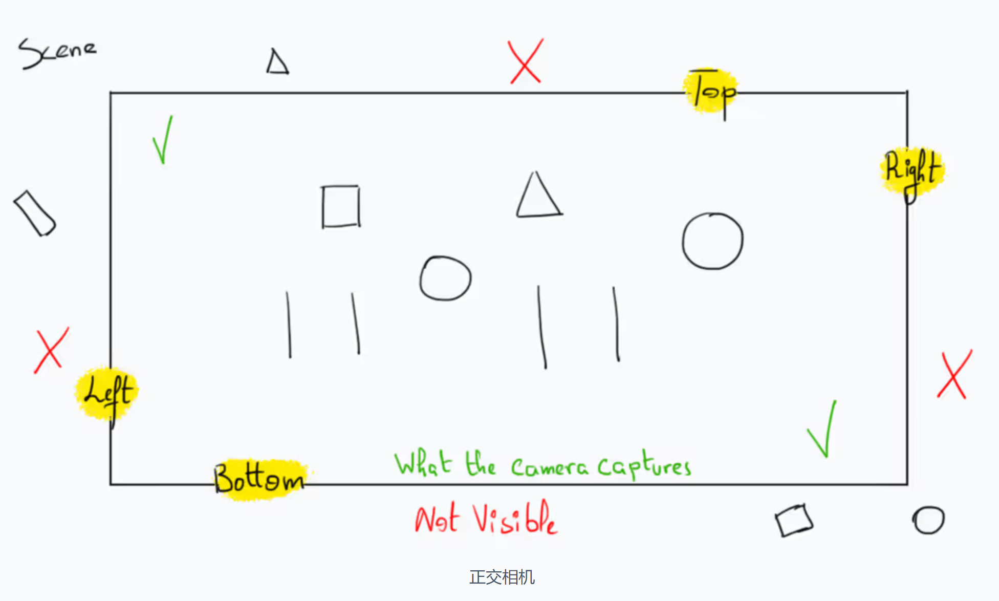

https://waelyasmina.net/articles/three-js-tutorial-for-absolute-beginners/#final_thoughts

链接项目：threejs/threeTUT

## 使用的是parcel 
安装 Parcel 打包工具的命令。Parcel 是一个现代的 web 应用程序打包工具，它可以帮助开发者将多个文件打包成单个文件，以便在浏览器中加载。使用 Parcel，您可以轻松地处理 JavaScript、CSS、HTML、图像等各种类型的文件，并且不需要复杂的配置。

## 新建src/script.js index.html
## 运行 npx parcel ./src/index.html


## threejs的基本构建
首先，当我们讨论 3D 概念时，我们指的是由三个轴组成的坐标系：X、Y 和 Z。这些轴提供用于定义 3D 空间内点的坐标或位置的值。

### 坐标系


### 场景 Scene
假设我们想录制一个节目；显然，我们需要合适的地点来录制，也就是场景。我们还需要一台相机。然后，我们需要在场景外准备好组件后添加它们。我所说的组件是指灯光、场景对象和演员。我所说的准备工作是指为相机选择合适的镜头并为背景选择合适的物体等等......


这些完全相同的事情需要使用 Three.js 来完成。首先，我们通过实例化该类来创建一个场景Scene。然后，我们选择适当的相机类型并创建它的实例。一旦这两个重要部分准备就绪，我们就可以将元素引入到场景中。

### 相机 Cameras
threejs几种相机，常见的有：透视相机
#### 透视相机
其功能与现实生活中的相机类似，因此适用于大多数项目。
要在 Three.js 中创建透视相机，我们需要 4 个值。

- 视野。它是通过相机镜头可以看到的最大角度。
- 纵横比。这个代表的是相机拍摄到的图像的宽度和高度的比例。通常是通过画布宽度除以画布高度来计算的。
- 近剪裁平面和远剪裁平面。这两个代表了可见和渲染内容的边界。场景中任何位置距离相机比近剪裁平面更近的物体都不会被渲染。除此之外，任何比远剪裁平面更远的东西都不会被渲染。


#### 正交相机
正交相机用于以 2D 视角渲染 3D 场景，因为在此场景中不考虑深度。我很快就会对这两种类型的相机进行比较，但首先，让我们探讨一下正交相机的组件。

正交相机由 6 个值定义。

- 左、右、上、下。这些是相机可以在场景之外拍摄的图像的边缘或限制。
- 近剪裁平面和远剪裁平面。（同上）


#### 透视相机和正交相机的区别


使用透视相机时，物体的大小会根据距相机的距离而变化。物体靠近相机时显得较大，远离相机时显得较小。

另一方面，对于正交相机，无论物体与相机的距离如何，其大小都保持一致，因为在这种情况下深度不是一个因素。


## 创建基本场景
script.js中：
```js
import * as THREE from 'three';
```

接下来，我们将创建WebGLRenderer.在此阶段，将渲染器视为 Three.js 用于在网页上分配空间的工具，我们可以在其中显示和操作 3D 内容

话虽如此，要设置渲染空间的大小，我们需要调用该setSize()方法并将宽度和高度作为参数传递。在本例中，我希望通过使用window.innerWidth和属性让空间覆盖整个页面window.innerHeight。
```js
const renderer = new THREE.WebGLRenderer();
renderer.setSize(window.innerWidth, window.innerHeight);
```
我们需要做的下一件事是将我们刚刚创建的空间注入canvas元素到页面中，它基本上是一个元素。
```js
document.body.appendChild(renderer.domElement);
```
现在，当您查看页面时，您会注意到一个白色屏幕，其中有垂直和水平滚动空间。这表明我们的代码设置是正确的。但是，您可能想要删除可滚动空间，因为它不是画布的一部分；它是由浏览器默认添加的。要删除它，我们需要将元素margin的CSS 设置body为 0。

```html
<style>
        body {
            margin: 0;
        }
    </style>
```
开始创建场景：
```js
const scene = new THREE.Scene();
```
接下来，我们需要通过实例化该类来添加相机PerspectiveCamera。它的构造函数有四个参数，每个参数代表我们之前讨论的属性之一。
```js
const camera = new THREE.PerspectiveCamera(
    75,
    window.innerWidth / window.innerHeight,
    0.1,
    1000
);
```
视野取决于具体项目，但通常 40 到 80 之间的值就足够了。
宽高比是通过将窗口的宽度除以高度来计算的，因为我们的画布与窗口的大小相匹配。

我们将近剪裁平面和远剪裁平面分别设置为 0.1 和 1000。请务必注意，这两个值之间的范围会对应用程序的性能产生相反的影响。较小的范围通常会带来更好的性能，而较大的范围可能会降低性能。
完成后，我们使用渲染器的render()方法将场景链接到相机，将Scene和Camera实例作为参数传递，以从相机的角度渲染场景。

```js
renderer.render(scene, camera); // 此代码放在最后一行
```
此时画布为黑色的，正常


## 帮手 helper
### 坐标轴助手 AxesHelper
```js
// 5 here represents the length of the axes.
const axesHelper = new THREE.AxesHelper(5);
```
现在我们已经准备好了AxesHelper，我们使用 方法将其添加到场景中add()。

这就是我们在 Three.js 中向场景添加对象的方式：创建对象的实例，然后使用方法将其引入场景add()。
```js
scene.add(axesHelper);
```
如果您没有看到任何新内容，请不要担心；相机最初位于场景的原点（坐标为 (0, 0, 0) 的点）并看着同一点。要查看助手，我们需要移动相机。

我将通过将 z 位置值设置为 5 来拉回相机，以便我们在场景中看到助手。
```js
camera.position.z = 5;
```
当助手出现时，它只显示两个轴而不是三个。这是因为相机的位置直接面向 z 轴。为了显示第三个轴，我们需要调整相机的 x 或 y 值。
```js
camera.position.z = 5;
camera.position.y = 2;
```


顺便说一句，我们可以通过**调用该方法用一行代码来更改相机或场景中任何元素的位置set()**。第一个参数指的是 x 轴，第二个参数指的是 y 轴，第三个参数指的是 z 轴。
> camera.position.set(0, 2, 5);

### 网格助手 GridHelper
在 Three.js 中，aGridHelper是一种辅助对象，用于在 3D 场景中创建网格。该网格有助于可视化空间关系、对齐对象或提供定位和缩放参考。
```js
const gridHelper = new THREE.GridHelper();
scene.add(gridHelper);
```
上面的代码生成的网格是 10 个单位 x 10 个单位。要更改其大小，我们可以将所需的大小值传递给构造函数
```js
const gridHelper = new THREE.GridHelper(15);
```
如果需要，我们还可以将第二个参数传递给构造函数，将网格划分为更小的正方形。
```js
const gridHelper = new THREE.GridHelper(15, 50);
```

## 动画循环
让我们在场景中添加一个盒子。(稍后会有专门讨论此主题的整个部分。)
```js
const geometry = new THREE.BoxGeometry();
const material = new THREE.MeshBasicMaterial({color: 0x00FF00});
const box = new THREE.Mesh(geometry, material);
scene.add(box);
```
现在我们有了盒子，我们可以对其进行几何变换。这种变换的一个例子是旋转。在本例中，我们在 x 轴和 y 轴上执行 5 弧度旋转。
```js
box.rotation.x = 5;
box.rotation.y = 5;
```
您可能知道，动画由随时间推移发生的一系列变换组成。因此，要为该框设置动画，我们需要随着时间的推移自动应用旋转。

我们将创建一个名为animate的函数来封装旋转代码，确保旋转值每秒增加多次。

此外，我们需要在每次变换操作后渲染场景。我们将通过在函数render()内部调用来实现这一点animate()。
```js
function animate() {
    box.rotation.x += 0.01;
    box.rotation.y += 0.01;
    renderer.render(scene, camera);
}
```
本质上，这意味着立方体每秒将在 x 轴和 y 轴上旋转 0.01 弧度。

完成后，我们需要将其animate()作为参数传递给该setAnimationLoop()方法。
```js
// This will create a loop 
// that causes the renderer to draw the scene 
// every time the screen is refreshed.
// On a typical screen this means 60 times per second
renderer.setAnimationLoop(animate);
```
请记住，我们有一个时间输入来更好地控制动画的速度。该时间参数表示自动画循环开始以来经过的时间，由 Three.js 作为动画循环机制的一部分自动提供。
```js
function animate(time) {
    box.rotation.x = time / 1000;
    box.rotation.y = time / 1000;
    renderer.render(scene, camera);
}
```