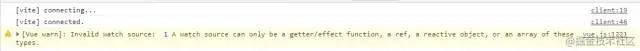

今天咱们也捋捋Reactivity。

在vue3当中，它是把数据响应式Api全都暴露出来了，
在vue2中是没有这样做的，那vue2是怎么做的呢？它是将数据配置到data当中，data中的数据会自动变成响应式数据，我们把这个过程叫做注入，它会注入到组件实例当中去，如下：
```js
{
    //data中的数据都是响应式的，会被注入到组件实例当中
    data(){
        return{
            name:"法医",
            idol:"乔布斯",
            publicNumber:"前端猎手"
        }
    }
}
```

然而在vue3中，它不再是data了，而是setup函数，我们把它称之为composition Api，我们要在setup函数中使用响应式数据，就不可避免需要暴露出响应式的Api供我们使用，接下来，我们来看看vue3提供了哪些跟数据响应式相关的函数。

## 获取响应式数据🍇
可以获取响应式数据的api：
### <font color=#FF000 >reactive</font>
这个api会传入一个对象，然后返回一个对象代理proxy，并且它是可以深度代理对象中的所有成员的，也就是说对象里面再嵌套一个对象，也是响应式的数据

```js
import { reactive } from'vue'
const state = reactive({name:"法医",age:18})
window.state = state;
```

效果展示：
 

现在这个对象就变成响应式的了，对对象进行操作，vue就可以收到通知了
```js
let book = reactive({
  name: 'Learn Vue',
  year: 2020,
  title: 'Chapter one'
})
let {
  name,
} = book

name = 'new Learn'
// Learn Vue
console.log(book.name);

// 但是很遗憾，这样会消除它的响应式，需要使用toRefs()转化
let {
  name,
} = toRefs(book)

// 注意这里解构出来的name是ref对象
// 需要通过value来取值赋值
name.value = 'new Learn'
// new Learn
console.log(book.name);
```

### <font color=#FF000 >readonly</font>
这个api需要传入一个对象或者是一个代理，同样也会返回一个对象代理，它只能读取代理对象中的成员，而不能修改，也就是只能get，不可以set，它也是可以深度代理对象中所有成员的。
```js
import { reactive,readonly } from'vue'
const imState = readonly({name:"法医",age:18})
window.imState = imState;
```

效果展示:
 


报了一个错误，提示说要修改的目标是只读的，修改失败
readonly可以传一个对象，也可以传一个代理，我们再看看传一个代理会怎么样

```js
import { reactive,readonly } from'vue'
const state = reactive({name:"法医",age:18})
const imState = readonly(state);//传一个代理进去
window.imState = imState;
```

效果展示：


传一个代理的时候也是不可以进行赋值操作的，反正只要经过readonly后就只能读不能赋值，但是，我们可以在readonly之前修改值，然后让它进行代理就可以了。

> 📢注意：reactive和readonly，这两个api是代理对象的，是没办法代理普通值的，会报错

```js
import { reactive,readonly } from'vue'
const state = reactive("法医")
```

效果展示：


报了一个警告，原始值是没法代理的，那么如果需要代理普通值，那该咋办呢？
那就要用到ref api了

### <font color=#FF000 >ref</font>
ref中可以传入任何数据，最终会将数据放到一个对象中的value中，比如这种{ value : ...}，对value的访问是响应式的，如果给value的值是一个对象的话，它会通过reactive函数进行代理
举个栗子🌰：
```js
import { reactive,readonly,ref } from'vue'
const state = ref({name:"法医",age:18})
window.state = state;
```
效果展示：
 

还有一种情况是：如果说传入的value值已经是代理了，那么会直接使用代理
举个栗子🌰：
```js
import { reactive,readonly,ref } from'vue'
const state = reactive({name:"法医",age:18});
const imState = ref(state)
window.imState = imState;
```
效果展示：
 

### <font color=#FF000 >computed</font>
computed需要传入一个函数function，它返回的值跟ref一样，也是{value:...}，当读取value值的时候，它会根据情况决定是否要运行函数，这个情况就是有没有用到这个函数，并且它是有缓存的，当依赖的响应式数据没有变化的时候，拿到的是缓存里面的值，只有当state.name或者state.age发生改变时才会重新运行。
举个栗子🌰：
```js
import { reactive,readonly,ref ,computed} from'vue'
const state = reactive({name:"法医",age:18})

const result = computed(()=>{
    console.log("computed");
    return state.name + state.age
})
console.log(result.value);
```
效果展示：
 


### 总结
反正以上四个api不管它怎么进行处理，就一个目的，那就是把数据变成响应式数据。
那么在开发中到底用哪个？
> 📢 注意：用ref的时候要拿到数据必须是ref.value哈，不然拿不到，切记！😁
1. 如果想要一个对象变为响应式数据，可以使用reactive或者ref
2. 如果说让对象所有属性只能读，就用readonly
3. 如果想让一个非对象数据变成响应式数据，就用ref
4. 如果想要根据已知的响应式数据得到一个新的响应式数据，就用computed

接受一个getter函数，并为getter返回的值创建了一个「不可变」的响应式ref对象：
```js
const num = ref(0);
const double = computed(() => num.value * 2);
num.value++;
// 2
console.log(double.value);
// Warning: computed value is readonly
double.value = 4
```

可用get set函数创建一个可读写的ref对象：
```js
const num = ref(0);
const double = computed({
  get: () => num.value * 2,
  set: (val) => (num.value = val / 2),
});

num.value++;
// 2
console.log(double.value);

double.value = 8
// 4
console.log(num.value);
```


## 监听数据变化🍉
### <font color=#FF000 >watchEffect</font>
```js
const stop = watchEffect(() => {
    //watchEffect 函数会立即执行，然后监听函数中会用到的响应式数据，响应式数据变化后会再次执行
})

//通过调用stop函数就会停止监听
stop();//停止监听
```
举个栗子🌰：

```js
import { reactive, ref, watchEffect } from"vue";
  const state = reactive({a: 1,b: 2,});
  const count = ref(0);
  watchEffect(() =>{
      console.log(state.a,count.value);//先会立即执行一次
  })
  state.a++;//这里依赖数据改变再次执行一次
  ```

效果展示：
 

watchEffect函数之所以知道依赖变化了，是因为里面的数据是响应式的，当读取数据的时候用的是get方法，get会收集依赖。还要注意的是如果说依赖的数据同时改变很多次，最终结果是会显示一次，因为运行过程是<font color=#FF000 >异步的，是会到微队列中执行的，等数据变完之后才会运行</font>，如下例子：
举个栗子🌰：
```js
import { reactive, ref, watchEffect } from"vue";
  const state = reactive({a: 1,b: 2,});
  const count = ref(0);
  watchEffect(() =>{
      console.log(state.a,count.value);
  })

  //运行多次
  state.a++;
  state.a++;
  state.a++;
  state.a++;
  state.a++;
  state.a++;
  state.a++;
  state.a++;
```
效果展示：
 

从最终结果可以看出最终只运行两次，一次是立即执行，第二次是数据改变后

### <font color=#FF000 >watch</font>
这个watch相当于vue2的$watch，这个watch有点麻烦，因为它需要手动去指定监控哪些值的变化，当变化的时候，它会把新的值和旧的值同时给你
举个栗子🌰：
```js
import { reactive, ref, watch } from"vue";
  const state = reactive({a: 1,b: 2,});
  const count = ref(0);
  watch(()=>state.a,(newValue,oldValue) =>{
      console.log("新值",newValue,"旧值",oldValue);
  })
  state.a++;//修改依赖
  ```

效果展示：
 

📢 注意：在这里需要注意的是watch跟watchEffect不同的是watch不会立即运行函数，只有当依赖的值改变时才会执行，watch中会传两个参数，在上面例子中传的是()=>state.a，那为什么不直接传state.a呢？如果直接传state.a的话，那么相当于传了一个1进去，这样数据就不是响应式的了，如下：
举个栗子🌰： 直接传state.a
```js
import { reactive, ref, watch } from"vue";
  const state = reactive({a: 1,b: 2,});
  const count = ref(0);
  watch(state.a,(newValue,oldValue) =>{
      console.log("新值",newValue,"旧值",oldValue);
  })
  state.a++;//修改依赖
  ```
效果展示：
 

如果直接传state.a，这里就会报警告，翻译过来是：无效的监视源：1监视源只能是getter/effect函数、ref、被动对象或这些类型的数组，意思就是说这里参数只能是响应式数据。
当传一个()=>state.a函数进去，它是在watch里面运行的，这样就会收集依赖。当使用reactiveapi的时候就要传一个这样函数进去，当使用refapi的时候，watch中第一个参数可以写成count，因为count是一个对象，如下：
举个栗子🌰： 直接传count
```js
import { reactive, ref, watch } from"vue";
  const state = reactive({a: 1,b: 2,});
  const count = ref(0);
  watch(count,(newValue,oldValue) =>{
      console.log("新值",newValue,"旧值",oldValue);
  })
  count.value++;//修改依赖
```
效果展示：
 <!--  -->


如果说传了一个count.value进去，那么也会报错，因为count.value拿到的也是属性值了，如下：
举个栗子🌰： 直接传count
```js
import { reactive, ref, watch } from"vue";
  const state = reactive({a: 1,b: 2,});
  const count = ref(0);

  watch(count.value,(newValue,oldValue) =>{
      console.log("新值",newValue,"旧值",oldValue);
  })
  count.value++;//修改依赖
  ```
效果展示：
 <!--  -->


从运行结果看，也报了一个警告，所以说这块得注意下😚
对了，差点忘了，watch是可以监控多个数据的，如下：
举个栗子🌰： 传count和()=>state.a
```js
import { reactive, ref, watch } from"vue";
  const state = reactive({a: 1,b: 2,});
  const count = ref(0);

  watch([()=>state.a,count],([newValue1,newValue2],[oldValue1,oldValue2]) =>{
      console.log("新值",newValue1,newValue2,"旧值",oldValue1,oldValue2);
  })
  count.value++;
  state.a++;
  ```
效果展示：
 <!--  -->


📢 注意：无论是watch还是watchEffect，当依赖变化时，回调函数都是异步执行的，当然也会到微队列等待执行。
传数组：
```js
const state = reactive({
  count: 1,
});
const count = ref(2);
watch([() => state.count, count], (newVal, oldVal) => {
  // 新值 旧值
  //[3, 2]  [1, 2]。state.count变 count不变
  //[3, 4]  [3, 2]。state.count不变，count变
  console.log(newVal, oldVal);
});
state.count = 3;

count.value = 4;
```
Deep: true 侦听深度嵌套的
```js
const deepObj = reactive({
  a: {
    b: {
      c: "hello",
    },
  },
});

watch(
  () => deepObj,
  (val, old) => {
    // new hello new hello
    console.log(val.a.b.c, old.a.b.c);
  },
  { deep: true }
);

deepObj.a.b.c = "new hello”;

```
最后的打印结果可以发现都是改变后的值，这是因为侦听一个响应式对象始终返回该对象的引用，因此我们需要对值进行深拷贝：
```js
import _ from "lodash”;
...
watch(
  () => _.cloneDeep(deepObj),
  (val, old) => {
    // new hello new hello
    console.log(val.a.b.c, old.a.b.c);
  },
  { deep: true }
);


deepObj.a.b.c = "new hello";
手动停止监听
stop = watch(…)

// 销毁监听
Stop()
```

总得来说watchEffect是最方便的，因为它会自动跟踪依赖的变化，不需要手动指定，但是有时候却不得不使用watch，比如说：1、我们不希望回调函数一开始就执行，只想让它当数据改变的时候才执行，这时候就只能用watch了，2、还有一种就是数据改变时，我们需要知道旧值是什么？这时也需要使用watch，3、最后一种就是我们需要监控一些回调函数中用不到的数据，比方说，输出console.log("我要变了")，这在watchEffect中是做不到的
* watchEffect 不需要指定监听的属性，他会自动的收集依赖，只要在回调函数中引用到了响应式的属性，那么当这些属性变动的时候，这个回调都会执行，而 watch 只能监听指定的属性而作出变动(v3开始能够同时指定多个)
* watch 能够获取到新值与旧值（更新前的值），而 watchEffect 是拿不到的
* watchEffect 在组件初始化的时候就会执行一次用以收集依赖，收集到的依赖发生变化时再执行。而 watch 则是直接指定依赖项

## 判断🍋
在获取响应式数据的时候有四种api，分别是reactive、readonly、ref、computed，返回有两种形式，一个是对象代理，另一个是{value:...}这种形式,于是vue3提供了4种api用于区分到底是哪种方式获取的响应式数据：
* isProxy : 用于判断某个数据是否是由reactive或readonly获取的
* isReative : 判断某个数据是否是通过reative创建的
* isReadonly ：判断某个数据是否是通过readonly创建的
* isRef ：判断某个数据是否是一个ref对象

## 转换🍆
有时候我们拿到一个数据，不知道它是啥。
这时我们可以用unref

### <font color=#FF000 >unref</font>
unref 等同于：isRef(val) ? val.value : val，如果是ref的话那就把val.value值拿出来，如果不是就拿val值
举个栗子🌰：
```js
function useNewTodo(todos){
     todos = unref(todos);
     //...其它代码
 }
 ```
### <font color=#FF000 >toRef</font>

toRef会把一个响应式对象中的某个属性变成ref格式的数据
举个栗子🌰：
```js
import { reactive,  toRef } from"vue";
const state = reactive({ name: "法医", age: 18 });
const nameRef = toRef(state,"name");
console.log(nameRef);//最终是 {value:...}这种形式
nameRef.value = "前端猎手";//当修改这个值后，state里面的数据也会受到影响
console.log(state.name);
```

### <font color=#FF000 >toRefs</font>
把一个响应式对象的所有属性转换为ref格式，然后包装到plain-object普通对象中返回：
```js
import { reactive, toRefs } from"vue";
const state = reactive({ name: "法医", age: 18 });
const stateAsRefs = toRefs(state);
console.log(stateAsRefs);
/*
stateAsRefs 它不是一个代理对象了，而是一个普通对象，如下格式：
{
   name:{value:ObjectRefImpl},
   age:{value:ObjectRefImpl}
}
*/
```

为什么要这么做？
我们需要把两个响应式数据混合在一起，如果直接使用展开运算符那么就完蛋了，数据会失去响应式
```js
setup() {

   const state1 = reactive({a:1,b:2});
   const state2 = reactive({c:3,d:4});
   return {
     ...state1,// 失去响应式，相当于在这写了一个a:1,b:2
     ...state2,// 失去响应式，相当于在这写了一个c:3,d:4
   };
 },
 ```
那么如何解决呢？外面套一个toRefs就好了
```js
setup() {
  const state1 = reactive({a:1,b:2});
  const state2 = reactive({c:3,d:4});
  return {
    ...toRefs(state1),// 具有响应式
    ...toRefs(state2),// 具有响应式
  };
},
```

