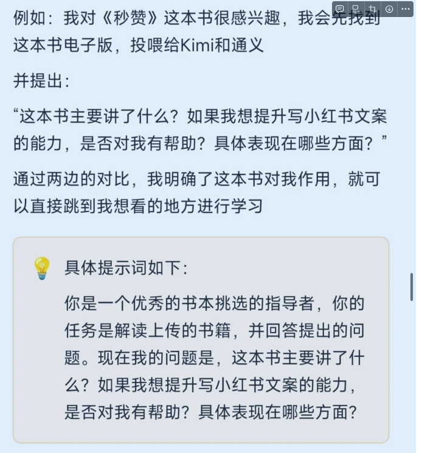
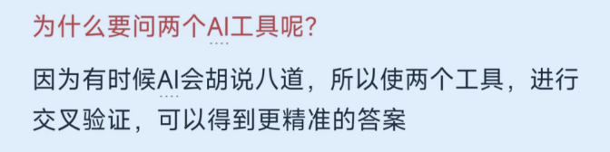
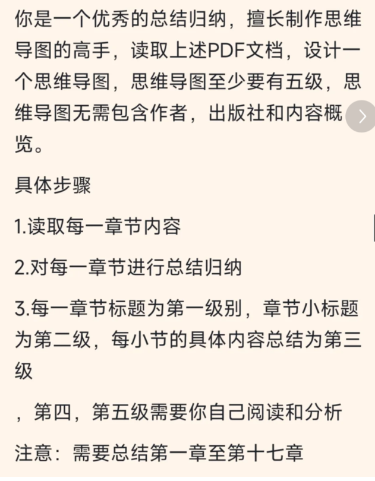
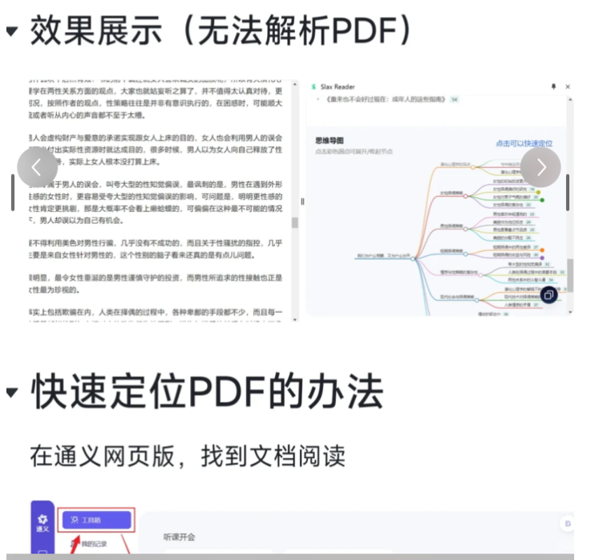
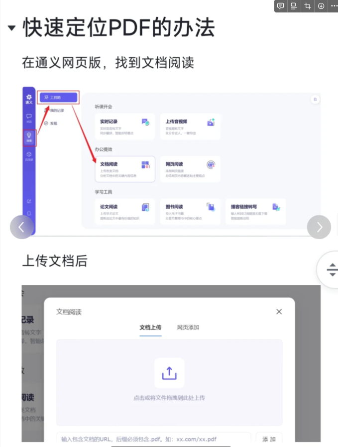

这里用到了kimi和通义两个工具

第一步，获得这本书的电子版或者大纲

第二步，结合你的具体问题去问AI具体的答案

第三步，至少两个工具去做交叉验证的

第四步，让AI制作大纲，快速定位到感兴趣的内容（图7图8）

为什么要用两种工具交叉验证呢？

因为有时候Ai会胡说八道，所以用两种工具可以进行检验

可以快速做思维导图插件推荐：Slax Reader（图9）

快速阅读PDF工具推荐（图10图11）

把上面的文字，根据图书的信息，给kimi和通义千问

## 一个可以快速解析在线文章的插件 - Slax Reader

