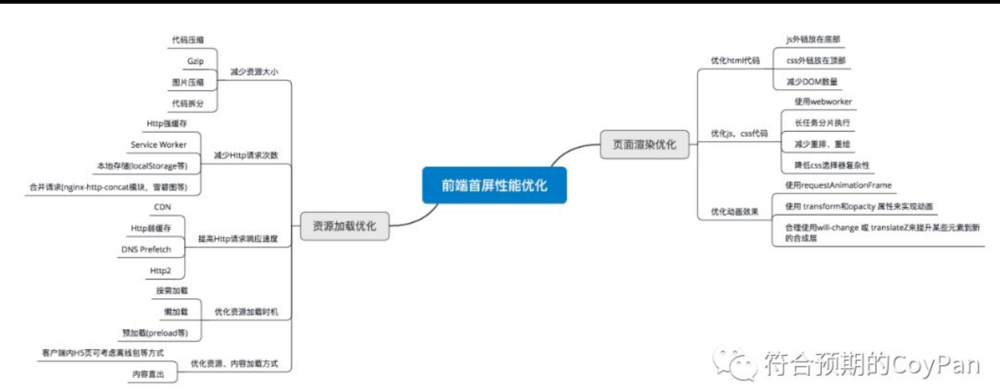
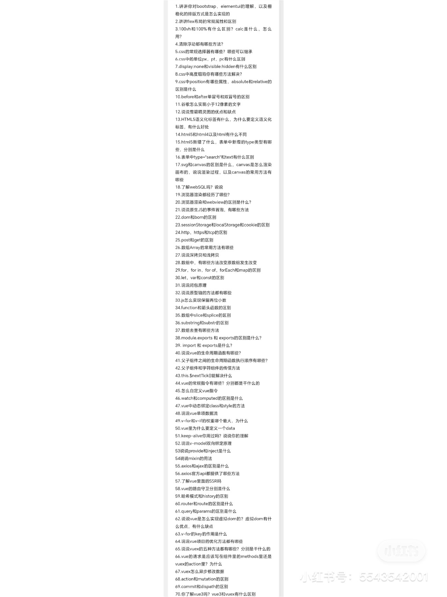
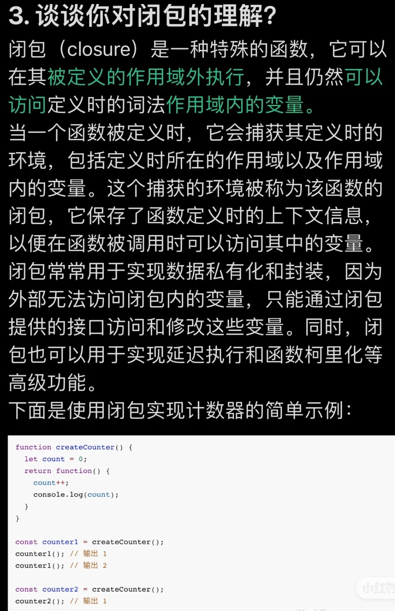
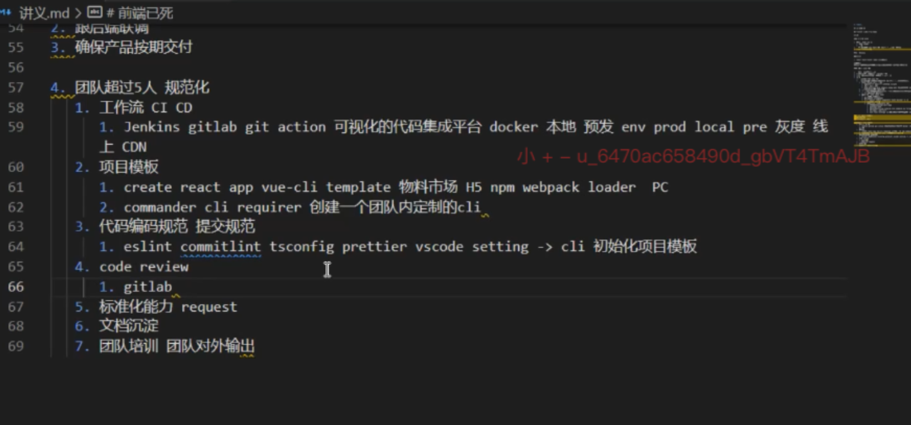
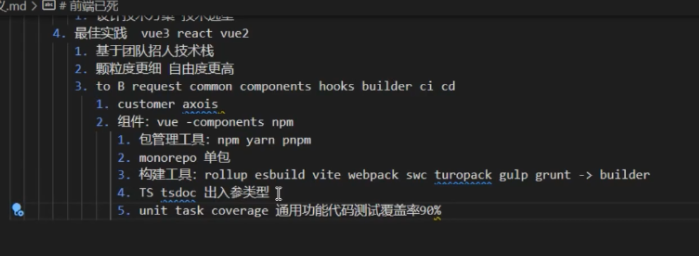
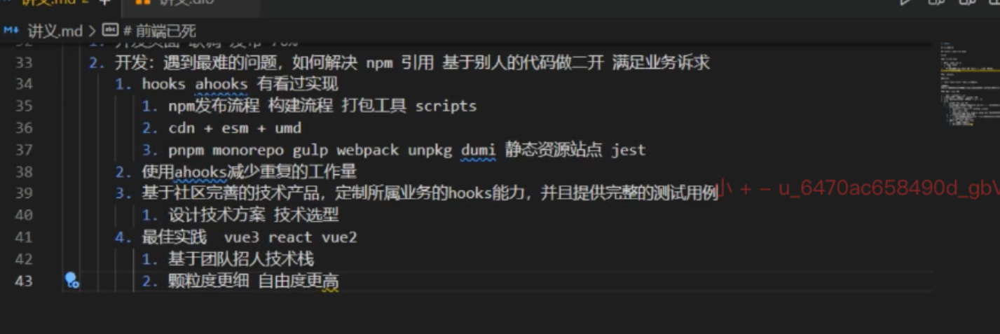
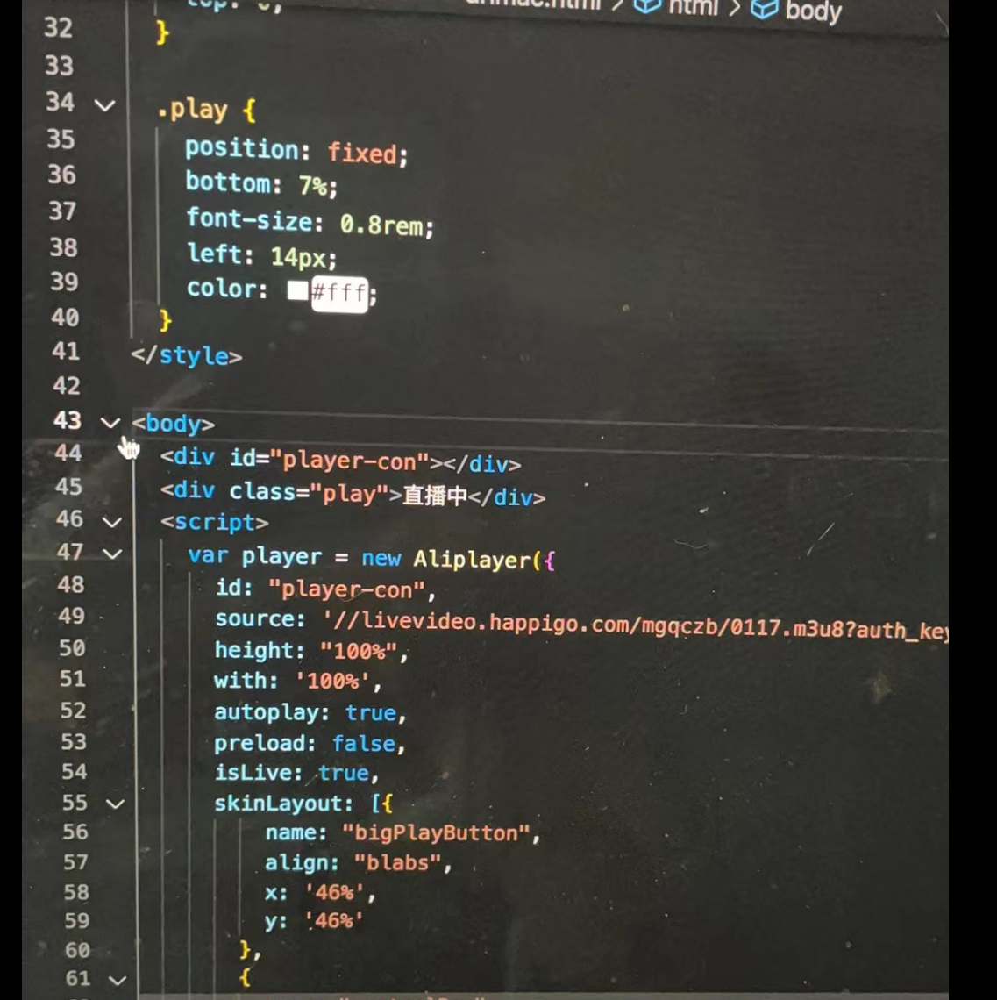
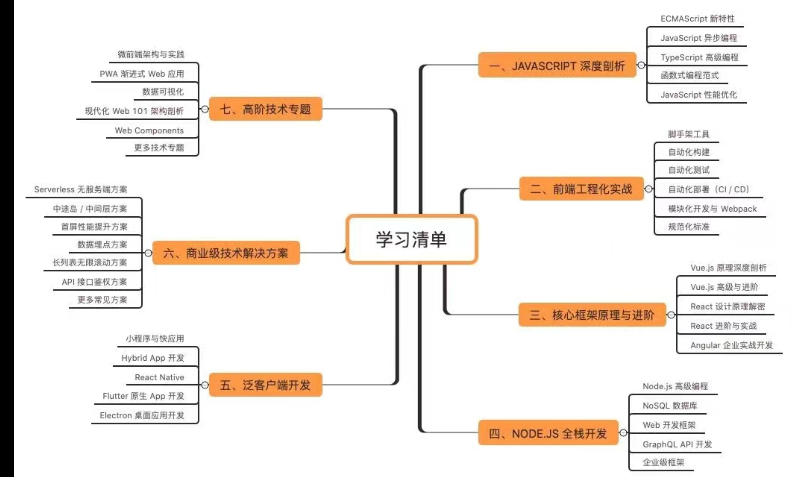

京东一面：浏览器跨标签页通信的方式都有什么？

https://mp.weixin.qq.com/s/pYsWnIHWcUXCsrHK7mU91g

VUE中常用的4种高级特性！

https://mp.weixin.qq.com/s/ToUI80SLSO9FaXEWvWZoKA

## 4.17
实现Vue3响应式系统核心-MVP 模型

https://juejin.cn/post/7342427366092210210

Vue3 + Three.js 商城可视化实战

https://juejin.cn/post/7137192060045492231

TypeScript很麻烦💔，不想使用！

https://juejin.cn/post/7344282440725577765

## 4.18
别忘了前端是靠什么起家的
https://mp.weixin.qq.com/s/ip4B-UY40CIMtWScScjHtA
https://mp.weixin.qq.com/s/KlsdXG5Q_8Ql4Y29kvcqkw

【5000字】带你了解透彻浏览器缓存！

https://mp.weixin.qq.com/s/oR_S1P22TBfMuUPaXjvcnQ

https://juejin.cn/post/7221750009141526565

2024 年如何选择 Node 包管理器？

https://mp.weixin.qq.com/s/AohLZOxm31ku1otqw2YmNw

面试官：只知道v-model是modelValue语法糖，那你可以走了

https://mp.weixin.qq.com/s/nRRvLgx1SMI1abuRegpHJw

面试官：来说说vue3是怎么处理内置的v-for、v-model等指令？

https://mp.weixin.qq.com/s/FAPzNAAzta9TkZh4BnJbjQ

写html页面没意思，来挑战chrome插件开发

https://mp.weixin.qq.com/s/oPQBQK5JQ9SKEZMH3KRL3w

vue3自定义组建使用v-model, 在render函数中创建v-model功能

https://juejin.cn/post/7021951965277978654

自定义Hook会很难吗？

https://juejin.cn/post/7022777747722207269

从 16 个方向逐步搭建基于 vue3 的前端架构

https://juejin.cn/post/7025524870842679310#heading-10

## 4.23
TypeScript很麻烦，不想使用！

https://mp.weixin.qq.com/s/W3W-xhyVq4UxuYJJN2Kdcg

探探各个微前端框架

https://mp.weixin.qq.com/s/PKe76qYW72JoCyRIWhm6cg

第3243期】告别繁琐的数据校验：用JSON Schema简化你的代码

https://mp.weixin.qq.com/s/6lTPoHUy0RP627N8EqafYw

await 能有什么风险？JavaScript 世界的隐忧

https://mp.weixin.qq.com/s/vdDFTXR2-jhAMvsaGjP8VA

## 4.25
基于源码的 Webpack 结构分析

https://mp.weixin.qq.com/s/Q1QuT1qplouNbfXc4xXm2w

关于视频你需要知道的基本概念：码率（Bitrate）、帧率（FPS）、分辨率和清晰度

https://mp.weixin.qq.com/s/bAsiDMB53SZI26-Nvzntig

rust 正在全面入侵前端

https://mp.weixin.qq.com/s/a8ZaJXSXkR-mijE5PCfO6Q

你不知道的 10 个 JavaScript 技巧

https://mp.weixin.qq.com/s/qqPpkpp7D5_EaaR0z8_m4g

## 4.26
https://mp.weixin.qq.com/s/DpfTxtWSX3YsD20Arf5kBA

https://mp.weixin.qq.com/s/XoFmsL4qPO3vzvxPUCIvRQ

https://mp.weixin.qq.com/s/wb9Y4OwD81kLKAVyYnAdSA

https://mp.weixin.qq.com/s/jPAvC1fzZY3RlKk-ShiM8g

## 4.28
超级火爆的前端视频方案 FFmpeg ，带你体验一下~

https://mp.weixin.qq.com/s/xldF_FiPtyZqitgbqDbYsg

## 4.30
前端权限开发——设计到实践（保姆级）

https://mp.weixin.qq.com/s/hxBd2uwjVgr98NnsHEeihA

近几年很火的「浏览器指纹」是怎么回事？

https://mp.weixin.qq.com/s/Sl0I-jZN_60DU55bA4Xz5A

通过debug搞清楚.vue文件怎么变成.js文件

https://mp.weixin.qq.com/s/9JUOG4XxcyUsrKFEq5Y8VQ

前端科普：什么是API网关？ 为什么它有用？

https://mp.weixin.qq.com/s/IIhAmLGgDCL0buoSlke1ww

## 5.6
【第3251期】Webcodecs音视频编解码与封装技术探索
https://mp.weixin.qq.com/s/W-1xR8XCH-T4AqLY3JhgIw

三分钟，掌握 3 种前端埋点方式！
https://mp.weixin.qq.com/s/FYgLjK83WVOnwdTWeTew7Q

前端简历项目没亮点怎么办？那就编啊！！
https://mp.weixin.qq.com/s/DfPqLIbXbAHsDFxigSephw

有人抵触ref？有人抵触reactive？
https://mp.weixin.qq.com/s/urCk9U8EjS8PYTApKBVz1w

Web Components 取代 Vue？我觉得不太行~
https://mp.weixin.qq.com/s/c_3sxLMJi5tnRWEOhd16CA

Vite 4.3 为何性能爆表？（第一次知道 Node 竟还有这个冷门性能问题...）
https://mp.weixin.qq.com/s/Rsckm8aK9TPymDBpVz2AoQ

JavaScript 可视化：Promise执行彻底搞懂
https://mp.weixin.qq.com/s/zCFUfCaAxCVn3poFtyZR0A

前端开发中大并发量如何控制并发数
https://mp.weixin.qq.com/s/lT4gXnXsuVlBir3-jdoxTQ

## 5.8
vue3早已具备抛弃虚拟DOM的能力了
https://mp.weixin.qq.com/s/5VAzF5C-KceluQhUNR_25Q
为什么？是怎么有这样的说法，证明？
不需要虚拟DOM，性能问题呢？
那已经具备，为什么不现在抛弃呢？

【Vue3】如何封装一个超级好用的 Hook ！
https://mp.weixin.qq.com/s/6R34jVJBxLUa-Erq5MM08g

## 5.9
leader
https://mp.weixin.qq.com/s/sUxK_J_SzH0SuJhoWavW-A

滥用watch
https://mp.weixin.qq.com/s/ht0gudk4r6QyQcf7i2C7rQ

hook
https://mp.weixin.qq.com/s/qd17ShoNMyR2Gik7LcUuMQ

后台管理-提升：
https://juejin.cn/post/7360528073631318027

https://juejin.cn/post/7329126541320536074

https://juejin.cn/post/7357976193271857203

https://zhuanlan.zhihu.com/p/71385053

nodejs:建议看完learn
https://nodejs.org/en/learn/getting-started/introduction-to-nodejs

## 5.23
源码浅析：vue3的 generate 是生成 render 函数的过程
https://mp.weixin.qq.com/s/Zejkcs_3-UJtVOnYWxy0SQ

vue 救命技巧：你可能需要强制更新组件！
https://mp.weixin.qq.com/s/sfoV9ijdGGPfmpKUqfOQyw

如何为前端项目一键自动添加eslint和prettier的支持
https://mp.weixin.qq.com/s/-1s5gT--J9PaIqnsgZx89g

前端权限开发——设计到实践（保姆级）
https://mp.weixin.qq.com/s/Odc-oFuA6Am0zDjsZGkX3g

JS 分片任务的高阶函数封装
https://mp.weixin.qq.com/s/OUpbzotUAiG8wHREH7hBww

vue3自定义hooks大集合，你要的都在这！
https://mp.weixin.qq.com/s/qd17ShoNMyR2Gik7LcUuMQ

视频秒播优化实践
https://mp.weixin.qq.com/s/0qUH6lMINqi1bEgMgEVJig

Vite 为何短短几年内变成这样？
https://mp.weixin.qq.com/s/hxuGDuYSNhpZxpQ2Gi-rig

前端到底要怎么去性能优化？
https://mp.weixin.qq.com/s/osp-YcbUjwUlxNP1vT9qhQ

为什么React Hooks优于hoc ？
https://mp.weixin.qq.com/s/WY4wgELQQTkjPT_eskUM6A

Vue 存储插件的底层原理，你不知道的 localStorage API
https://mp.weixin.qq.com/s/AvtayxRQBST8fXg40LX0pA

开发一个组件库，需要学哪些技术栈呢？
https://mp.weixin.qq.com/s/xxdy5ATvSPMhxNB-dcmsuA

总是做后台管理系统，到底要怎么提升自己呢？
https://mp.weixin.qq.com/s/_c9Wf-DewhQtxTbSk-zXKQ

5分钟带你了解【前端装饰器】，“高大上”的“基础知识”
https://mp.weixin.qq.com/s/TWyPh3uHuv711UnGW68z0Q

如何【中止】一个 Promise 呢？一个有意思的问题~
https://mp.weixin.qq.com/s/HGIgYc7F3MnRT936CwHJpA

分享能提高开发效率，提高代码质量的八个前端装饰器函数~
https://mp.weixin.qq.com/s/QvM2UPkWW8Lc4pfr_jzrog

阿里面试：写一个倒计时功能刷掉了80% 的人
https://mp.weixin.qq.com/s/E6H0VGGynx38f5qcfJ5JIQ

揭秘 JavaScript 代码整洁技巧，让你的项目更出众
https://mp.weixin.qq.com/s/x6Mjq2RFLY-93WppLKP4Pw

只写后台管理的前端要怎么提升自己
https://mp.weixin.qq.com/s/Am83tKaLtOcSN2x5sSBykA

# 7.10 
浏览器插件：
https://mp.weixin.qq.com/s/J_Ky4STtOPZuaQvXhq6IQQ
b站的一个主页修改插件（可以找来当学习）https://github.com/BewlyBewly/BewlyBewly

前端部署：不需要服务器、域名（可以用来部署该项目）
 3 种无需服务器和域名并且完全免费的前端项目快速部署方式 —— Vercel、Github Pages 和 Netlify，
https://mp.weixin.qq.com/s/j8o30Zl1iDbgEu46m3Ek2g

在从面试官视角分析之前，我们先看下面试官对于候选人不同岗位大致要求，因为不同面试岗位的问题也不一样。
- 资深前端工程师，P6:独当一面，辅助团队
    技术本身比较扎实
    拥有良好的基础知识及运用能力o
    能够独立负责业务，对业务和技术有局部的O优化或者驱动
    在专业领域具备辅导他人的能力。
- 前端专家，P7:领域专家，影响团队
    技术上是某个领域的专家
        主导对应的前端架构设计
    拥有系统化思维o
    能定义和推动解决该领域的问题，最终拿到0结果
- 高级前端专家，P8:领域突破，业务增值
    是核心技术或者业务的负责人o
    拥有创新思维和全局意识o
    能识别业务核心问题0
    突破现有框架，有效解决问题并实现业务增0值;

只有亲身经历的坑才是经验，总结过去我希望这些点对每个阶段的你都能有所帮助:
- 专注--10000 小时定律。
做任何事都需要持续的专注，我最开始也说了技术是一门手艺活，如果吃不了苦要提前改行。当然现在各种新兴媒体涌现，比如:得到、极客时间、凯叔讲故事、樊登读书、社群圈子等，打破了 10000 小时定律。你应该庆幸，因为这些媒体的出现，让你有更多的时间获得更多的知识。
- 专家思维:碰到问题一定要打破砂锅问到底。只有这样你才能深刻理解这个问题背后的真实原因，后续再碰到能快速解决，并沉淀经验帮助其他人。
- 不要急于证明自己:频繁跳槽，短时间内薪水看起来会比较高，但可能无法长远。如果你不厚积薄发，突破那个天花板，你的薪水也只会是那个上限，突破了才能有更大的未来，
- 建立个人品牌:不要害怕吃亏，多帮助别人，成为别人口中的靠谱先生。
- 坚持写作:日课、总结。比如玉伯等大佬都保持写日课的习惯。经常总结，反省得失，
- 写 PPT:大家可能会觉得 PPT大神很虚。我不提
- 刨根问底:在一个单点知识上，一定要刨根问底，知其然知其所以然，进行深入的研究和思考，掌握它的原理和本质，多问几个为什么，成为单点领域技术专家。
- 触类旁通:把相关的知识进行融合汇总，得到全面透彻的理解，从而实现举一反三，把几个相关的东西放在一起，看它们的相同点和差异点。
- 多看多总结多复盘。可以多看源码、看书、他人分享，看看他人优点，弥补自己不足。
- 点线面体:从单个知识点汇成线，再到面和体，逐渐会有系统化、全面性的总结和思考出来。构建自己的技术图谱或思维导图，将所学知识承载进去，这也是建立快速索引的过程，这是一个画版图、吹牛的过程，这个牛要持续吹(知识不断完善)，光吹牛当然不行，还需把吹过的牛都实现，这就是持续总结、复盘和沉淀过程。
- 系统输出:所学知识点系统地通过博客、分享或培训等方式对外输出，除了影响他人，更重要的用自己的思维和语言来表达自己。
    索引查找:尽可能的记住脑图里的关键词以及和关键词有联系的知识。
    复述知识点:模拟要跟别人讲一遍，遇到不。会的知识点后，回到思维导图里，再去看一遍，再回来继续将把它讲的特别的顺畅
    以教为学，用白己话说出来:以别人听得懂

【vue面试】
1.Vue 的基本原理
2.双向数据绑定的原理
3.MVVM、MVC、MVP的区别
4.slot 是什么?有什么作用?原理是什么?
5.$nextTick 原理及作用
6.Vue 单页应用与多页应用的区别
7.简述 mixin、extends 的覆盖逻辑
8.子组件可以直接改变父组件的数据吗?9.对 React 和 Vue 的理解，它们的异同
10.Vue 的优点
11.assets和 static 的区别
12.delete 和 Vue.delete 删除数组的区别
13.Vue 模版编译原理
14.vue 初始化页面闪动问题
15.MVVM 的优缺点?
16.对 Vue 组件化的理解
17.对 vue 设计原则的理解
18.说一下 Vue 的生命周期
19.Vue 子组件和父组件执行顺序
20.created和 mounted的区别
21.一般在哪个生命周期请求异步数据
22.keep-alive 中的生命周期哪些
23.路由的 hash 和 history 模式的区别24.Vue-router 跳转和 location.href 有什么区别25.Vuex 的原理
26.Vuex和localStorage 的区别
27.Redux 和 Vuex 有什么区别，它们的共同思想28.为什么要用 Vuex 或者 Redux29.Vuex 有哪几种属性?
30.Vuex和单纯的全局对象有什么区别?
31.为什么 Vuex的 mutation 中不能做异步操作
32.Vue3.0 有什么更新
33.defineProperty 和 proxy 的区别
34.Vue3.0 为什么要用 proxy?
35.虚拟 DOM 的解析过程
36.DIFF 算法的原理
37.Vue中 key的作用
38.Vue中如何做样式穿透39.ref是什么?
40.nextTick是什么?
41.scoped原理
42.Vuex是单向数据流还是双向数据流?43.Vue项目打包上线
44.介绍一下 SPA以及 SPA有什么缺点45.路由导航守卫有哪些
46.Vue动态路由47.什么是虚拟DOM48.为什么 data属性是一个函数而不是一个对象49.组件通信有哪些方式
50.scoped作用与原理

[ajax]
1.ajax 返回的状态
2.实现一个 Ajax
3.如何实现 ajax 请求，假如我有多个请求，我需要让这些 ajax 请求按照某种顺序一次执行，有什么办法呢?如何处理 ajax
4.写出原生 Ajax
5.如何实现一个 ajax 请求?如果我想发出两个有顺序的 ajax 需要怎么做?
6.Fetch 和 Ajqx 比有什么优缺点?
7.原生 JS 的 ajax.

【性能部分】
路由组件异步加载
动态加载一些初始不需要用到的资源
频繁切换的组件使用KeepAlive进行缓存
缓存复杂或常用的计算结果
对实时性不高的接口进行缓存
同一个接口多次请求时取消上一次没有完成的请求
页面中存在很多接口时进行优先级排序，优先请求页面重要信息的接口，并关注同一时刻请求的接口数量，如果过多进行分批请求
对于一些确实比较慢的接口使用loading或骨架屏懒加载列表，懒加载图片，对移出可视区的图片和dom进行销毁
关注页面中使用到的图片大小，推动后端进行图片压缩
地图撒点时使用聚合减少地图引擎渲染压力
对于一些频繁的操作使用防抖或节流
使用三方库或组件库尽量采用按需加载，减少打包体积
组件卸载时取消事件的监听、取消组件中的定时器、销毁一些三方库的实例

【小程序】
(1)自我介绍
(2)小程序怎么适配
(3)yni&pp,怎么发送请求
(4)小程序的登录怎么实现的
(5)小程序的支付功能
(6)小程序下拉刷新怎么实现的
(7)小程序的缓存方式
(8)Vue2的生命周期
(9)Vue2中修改 dom是在哪个钩子函数执行的
(10)Vue2组件通信的方式
(11)yuex.的五大属性,分别的作用
(12)Vue2的模板解析
(13)Keepalive的理解
(14)v-model双向数据绑定的原理

![react]
1.angulars 和 React 区别
2.redux 中间件
3.redux 有什么缺点
4.React 组件的划分业务组件技术组件?
5.React生命周期函数
6.React 性能优化是哪个周期函数?
7.为什么虚拟 dom 会提高性能?
8.diff 算法?
9.React 性能优化方案
10.简述 flux 思想
11.React 项目用过什么脚手架?Mern?Yeoman?
12.你了解 React 吗?
13.React 解决了什么问题?
14.React 的协议?
15.了解 shouldComponentUpdate 吗?
16.React 的工作原理?
17.使用 React 有何优点?
18.展示组件(Presentationalcomponent)和容器
组件(Container component)之间有何不同?19.类组件(Class component)和函数式组件
(Functional component)之间有何不同?20.(组件的)状态(state)和属性(props)之间有何
不同?
21.应该在 React 组件的何处发起 Ajax请求?
22.在 React 中，refs 的作用是什么?
23.何为高阶组件(higher order component)?

24.使用箭头函数(arrow functions)的优点是什么?
25.为什么建议传递给 setState 的参数是一个callback 而不是一个对象?
26.除了在构造函数中绑定 this，还有其它方式吗?
27.怎么阻止组件的渲染?
28.当渲染一个列表时，何为 key?设置 key 的目的是什么?29.何为 JSX?

![简历项目】
项目背景:基于 Docker、Kubernetes 容器的私有云管理平台。
实现功能:用于管理和优化企业内部的网站服务器等网络资源
实现原理:将服务器资源以 Kubernetes 集群的方式进行统一管理，将传统应用程进行容器化部署，从而实现自动调度、扩容、负载均等功能。
工作职责:
技术选型及项目搭建。AngularS +1.TypeScript+Gulp，按需加载模块，在既保证用户体验的情况下又满足项目的扪展需求，支持千页级单页应用
业务功能模块开发。包括镜像管理、服务管理、集权管理、网络域名等。
代码质量保证。完善单元测试(覆盖率90%，通过率 100%)，利用jsdoc 生成代码文档，采用 git fow 分支管理流程。
项目经历要注重质量，数量控制在 3~5 个，排序优先级:
![工作经验】
下面定段工作经历介绍，按照时间顺序由近及远。
x公司/x岗位
带领团队成员完成公司各项开发任务。
参与一些 Web 项目的技术选型及架构设计制定培训计划和学习任务帮助团队成员快速成长。
开发一些团队内部工具，并制定工作规范，
y 公司/y 岗位
编写高质量高性能的代码，运用不同技术框架实现 Web 前端页面开发。
制定代码管理流程和 API 设计规范并选择合适的工具。
使用 Docker 容器构建开发环境及部署
微信小程序的开发，
Node.js 服务端开发。
z 公司/z 岗位
微信 Web 页面开发
PC 端 Web 页面开发。
利用脚本以及 Node.js 优化一些工具和开发流程。

【面试题】
2.平时是怎么做web优化?
3.浏览器的缓存策略是什么?
4.CDN原理
5.DNS如何查询域名的
7.node中间件原理
8.跨域解决方案
9.作用域
10.一个页面白屏，分析原因
11.数据结构链表
12.怎么判断链表有环。
13.cookie了解吗
14.cookie的属性，怎么存储
15.web安全，xss csrf原理以及防御手段
16.css响应式布局
17.token生成过程
18.前端新技术
19.PWA讲一讲
20.serviceworker
21.h5 worker原理
22.两个火车相对而行，知道彼此的速度，中间有一个小鸟来回飞 知道小鸟的速度 求相撞的时候的小鸟飞行的距离
23.10瓶药，每瓶药有10颗药片，每片10克，其中一瓶药里的所有药片是坏的 每片重量为 11克,现在给你一个秤，如何一次性称出来。

数组常用的api(es6,es5)
BOM对象有哪些，window，localtion，history，nagivator，screen
刷新页面的方式
iframe的顶层对象
常用的设计模式
vue用到的设计模式(proxy 代理模式，vue2响应式发布订阅模式,单例模式，工厂模式)适配器模式和桥接模式的区别，出发点不同:1)适配器:改变已有的两个接口，让他们相容。2)桥接模式:分离抽象化和实现，使两者的接口可以不同，目的是分离。
localstorage你们要封装一下吗，为什么要封装，封装给它带来了什么，解决什么业务场景怎么分析一个接口请求慢的原因
-个前端资源多大，你觉得合理，为什么，1m,10m,100m?
base64算法原理，它为什么会使数据量变大，变大了多少(3个字节变4个)
304与缓存有关，你觉得什么资源需要缓存，要怎么设置才会返回304
js的执行和页面渲染冲突怎么优化性能，怎么分析问题344
performance那几个颜色块分别代表什么，紫色rendering耗时长，怎么优化有哪些api会引起重排重绘，怎么优化
不用promise，实现第一个，第二个任务完成后，才执行第三个任务用发布订阅实现上个功能，前俩任务会同时派发吗，为什么
vue2兼容低版本ie8的策略，polify
ie8浏览器是es3还是es5
发布订阅模式和观察者模式的区别
接口的六大设计原则(单一职责原则，里式替换原则，依赖倒置原则，接口隔离原则，迪米特法则，
开闭原则)
谈一谈对bff中间层的理解
谈谈面向对象，抽象能力，在编程中的影响
你觉得高级前端怎么来体现"高级"，高级和中级的区别
10堆硬币，正常10g一个，有一堆有问题，只有9g，现在有天平和电子秤可以用，找出有问题那一堆硬币

介绍一下你的项目?及项目难点?
xx项目中白屏时间是如何计算的?打包优化?
xx大文件分片怎么做的?
im是什么?做过吗?
如果给你个项目，请谈谈你会如何从0-1进行操作
webpack用过哪些loader?用途?
从代码层面上讲讲如何优化?
谈谈小程序的web-view是啥?
做过app吗?怎么解决ios和android的差异?
你相较于其他同工龄的程序员，
你的优势是?做过直播吗?

1.一面中回答的好和不好的点
2.深挖 React fiber，底层递归原理
3.webpack做过什么优化
4.怎么减少打包时间实现方法
5.webpack的hash
6.spa怎么打包的

【申通面试】
1.webpack中的external配置原理2.协商缓存和强制缓存。
3.微任务和宏任务，node和浏览器的区别,微任务中再加一个微任务是怎么执行的。4.react实现 keep-alive组件。
5.使用了什么实现项目性能的提升。
6.BFC原理，怎么触发。
7.flex-grow，和flex-shink.8.react中定义一个变量，不使用state怎么更新。
9.防抖和节流。
10.loader和 plugin的区别。
11.class组件和function的区别。
12.async...await和promise的区别。
13.简单请求和复杂请求。
14.react fiber原理。
15.聊项目。

【依图科技】
1.react的渲染流程
2.为什么用fiber
3.ts retrunType,infer
4.interface和type的区别
5.深拷贝考虑什么
6.common.js和ES6区别
7.npm和 yarn,pnpm区别
8.webpack怎么做优化的

[jsonstringify缺点]
1.如果obj里面有时间对象，则JSON.stringify后再JSON.parse的结果，时间将只是字符串的形式，而不是对象的形式
2.如果 obj里有 RegExp(正则表达式的缩写)、Error对象，则序列化的结果将只得到空对象;
3、如果obj里有函数，undefined，则序列化的结果会把函数或 undefined丢失:
4、如果 obj里有 NaN、Infinity和-Infinity，则序列化的结果会变成null
5、JSON.stringify()只能序列化对象的可枚举的自有属性，例如 如果obj中的对象是有构造函数生成的，则使用JSON.parse(JSON.stringify(obj))深拷贝后，会丢弃对象的constructor;
6、如果对象中存在循环引用的情况也无法正确实现深拷贝;

【进程与线程】
今天分享线程和进程的关系，前端面试遇到过艹线程:不能单独存在，由进程进行启动和管理，依附于进程。
进程:一个程序的运行实例。启动一个程序的时候，操作系统会为该程序创建一个内存，用来存放代码、运行中的数据和一个执行任务的主线程。这样的运行环境就是线程竹
有四个特点:
1. 进程中的任一线程执行出错，都会导致整个进程的崩溃
2。线程之间共享进程中的数据
3 但一个进程关闭之后，操作系统会回收进程所占用的内存
4 进程之间的内容相互隔离
· 简单的说就是:进程是家庭，线程是家庭成员。家庭成员依附在这个大家庭里。可以共享内部消息。家里有个人出现问题了，家庭就集体崩溃。家庭与家庭之间是互相分离不互通的。

